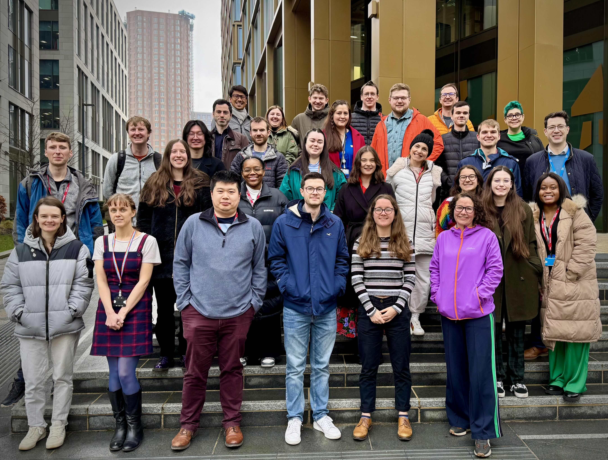

# About the Data Science Team in NHS England

{ width="450" align=right}

We are the [NHS England](https://www.england.nhs.uk/) Data Science Team.   

We are passionate about getting the most value out of the data collected by NHS England and the wider NHS through applying innovative techniques in appropriate and well-considered ways.

**Our vision is**:

> Embed ambitious yet accessible data science in health and care to help people live healthier longer lives​

[See our work](./our_work/index.md){ .md-button}

[Contact Us (datascience@nhs.net)](mailto:datascience@nhs.net){ .md-button .md-button--primary }

## Teams 

In NHSE data scientists are concentrated in the central team but also embedded across a number of other areas.

-   :material-link-variant:{ .lg .middle } __Data Linkage__

    ---

    The Data Linkage Hub aims at providing a unified and quality solution to the data linkage needs in NHS England. Data Science is central to achieving this objective, and it covers many aspects, from the mathematical models of entity resolution and record linkage, to identifying and correcting linkage errors, assessing their impact on downstream applications, and ensuring quality. 
    
    See the [Data Linkage Hub](https://nhsengland.github.io/datascience/our_work/data-linkage-hub/).

-   :material-vector-circle:{ .lg .middle } __Central Data Science Team__

    ---

    We develop and deploy data science products to make a positive impact on NHS patients and workforce.  We investigate applying novel techniques that increase the insight we get from health-related data.​  We prioritise code-first ways of working, transparency and promoting best practice. We champion quality, safety and ethics in the application of methods and use of data. ​ We have the remit to be open and collaborative and have the aim of sharing products with the wider healthcare community. 
    
    See our [Projects](https://nhsengland.github.io/datascience/our_work/).

-   :material-toolbox-outline:{ .lg .middle } __National SDE Team__

    ---

    Working with customer researchers and analysts to identify how they can do their research, overcome and rectify data issues and use the platform and data to its fullest. There is also work to create products and tools that facilitate research in the environment such as data quality and completeness visualisations, example analysis and machine learning code as well as continuous improvement and increasing automation of the processes to get data both into the SDE and out through output checking. ​ 
    
    See the [SDE website](https://digital.nhs.uk/services/secure-data-environment-service).

-   :material-toolbox-outline:{ .lg .middle } __Other Embedded Data Scientists__

    ---

    Across the organisation individual data scientists are embedded within specific team (including: Workforce, Training and Education (WT&E); Medicines; Patient Safety; AI Lab; Digital Channels etc.).   
    
    We come together through the [data science assembly](https://data-science-community.analystx.uk/assembly) to align our professional development and standards.

## Learn about Data Science in Healthcare

To support knowledge share of data science in healthcare we've put together a **monthly newsletter** with valuable **insights**, **training opportunities** and **events**.

!!! note
        
    The newsletter is targeted towards members of the NHS England Data Science team, so some links may only be accessible to those with the necessary login credentials, however the newsletter and its archive are available for all at the link above.

[NHS England Data Science Professional Development Newsletter](https://nhsengland.github.io/datascience-pd-newsletter/){ .md-button .md-button--primary target="_blank"}

We also support the [NHS Data Science Community](https://data-science-community.analystx.uk/) hosted in AnalystX, which is the home of spreading data science knowledge within the NHS.  You can also learn a lot about data science from the other communities we support:

- [Govt Data Science Community](https://www.gov.uk/service-manual/communities/data-science-community)
- [NHS R Community](https://nhsrcommunity.com/)
- [NHS Pycom](https://nhs-pycom.net/)

## Our Members
??? "Our Members"
    <table id="myTable" >
        

        <select id="columnToSearch">
        <option value="Name">Name</option>
        <option value="Role">Role</option>
        <option value="Team">Team</option>
        <option value="Github">Github</option>
        </select>
        <input type="text" id="myInput" onkeyup="tableFilter('myTable','myInput')" placeholder="Search..."> 
        

    <tr><th>Name</th><th>Role</th><th>Team</th><th>Github</th></tr>
    <tr><td>Sarah Culkin</td><td>Deputy Director</td><td>Central Data Science Team</td><td><a href="https://github.com/SCulkin-code">SCulkin-code</a></td> </tr>
    <tr><td>Rupert Chaplin</td><td>Assistant Director</td><td>Central Data Science Team</td><td><a href="https://github.com/rupchap">rupchap</a></td> </tr>
    <tr><td>Jonathan Hope</td><td>Data Science Lead</td><td>Central Data Science Team</td><td><a href="https://github.com/JonathanHope42">JonathanHope42</a></td> </tr>
    <tr><td>Jonathan Pearson</td><td>Data Science Lead</td><td>Central Data Science Team</td><td><a href="https://github.com/JRPearson500">JRPearson500</a></td> </tr>
    <tr><td>Achut Manandhar</td><td>Data Science Lead</td><td>Central Data Science Team</td><td><a href="https://github.com/achutman">achutman</a></td> </tr>
    <tr><td>Simone Chung</td><td>Principal Data Scientist (Section Head)</td><td>Central Data Science Team</td><td><a href="https://github.com/simonechung">simonechung</a></td> </tr>
    <tr><td>Efrosini Serakis</td><td>Data Science Lead</td><td>Central Data Science Team</td><td><a href="https://github.com/efrosini-s">efrosini-s</a></td> </tr>
    <tr><td>Daniel Schofield</td><td> Principal Data Scientist (Section Head)</td><td>Central Data Science Team</td><td><a href="https://github.com/danjscho">danjscho</a></td> </tr>
    <tr><td>Eladia Valles Carrera</td><td>Principal Data Scientist</td><td>Central Data Science Team</td><td><a href="https://github.com/lilianavalles">lilianavalles</a></td> </tr>
    <tr><td>Elizabeth Johnstone</td><td>Principal Data Scientist (Section Head)</td><td>Central Data Science Team</td><td><a href="https://github.com/LiziJohnstone">LiziJohnstone</a></td> </tr>
    <tr><td>Nicholas Groves-Kirkby</td><td>Principal Data Scientist (Section Head)</td><td>Central Data Science Team</td><td><a href="https://github.com/ngk009">ngk009</a></td> </tr>
    <tr><td>Divya Balasubramanian</td><td>Data Science Lead</td><td>Central Data Science Team</td><td><a href="https://github.com/divyabala09">divyabala09</a></td> </tr>
    <tr><td>Giulia Mantovani</td><td>Data Science Lead</td><td>Data Linkage Hub</td><td><a href="https://github.com/GiuliaMantovani1">GiuliaMantovani1</a></td> </tr>
    <tr><td>Angeliki Antonarou</td><td>Principal Data Scientist</td><td>National SDE Data Science Team</td><td><a href="https://github.com/AngelikiA">AnelikiA</a></td> </tr>
    <tr><td>Kevin Fasusi</td><td>Principal Data Scientist</td><td>National SDE Data Science Team</td><td><a href="https://github.com/KevinFasusi">KevinFasusi</a></td> </tr>
    <tr><td>Jonny Laidler</td><td>Senior Data Scientist</td><td>Central Data Science Team</td><td><a href="https://github.com/JonathanLaidler">JonathanLaidler</a></td> </tr>
    <tr><td>Mia Noonan</td><td>Senior Data Scientist</td><td>Central Data Science Team</td><td><a href="https://github.com/amelianoonan1-nhs">amelianoonan1-nhs</a></td> </tr>
    <tr><td>Sean Aller</td><td>Senior Data Scientist</td><td>Central Data Science Team</td><td><a href="https://github.com/seanaller">seanaller</a></td> </tr>
    <tr><td>Hadi Modarres</td><td>Senior Data Scientist</td><td>Central Data Science Team</td><td><a href="https://github.com/hadimodarres1">hadimodarres1</a></td> </tr>
    <tr><td>Michael Spence</td><td>Senior Data Scientist</td><td>Central Data Science Team</td><td><a href="https://github.com/mspence-nhs">mspence-nhs</a></td> </tr>
    <tr><td>Harriet Sands</td><td>Senior Data Scientist</td><td>Central Data Science Team</td><td><a href="https://github.com/harrietrs">harrietrs</a></td> </tr>
    <tr><td>Alice Tapper</td><td>Senior Data Scientist</td><td>Central Data Science Team</td><td><a href="https://github.com/alicetapper1">alicetapper1</a></td> </tr>
    <tr><td>Ben Wallace</td><td>Senior Data Scientist</td><td>Central Data Science Team</td><td></td> </tr>
    <tr><td>Jane Kirkpatrick</td><td>Senior Data Scientist</td><td>Central Data Science Team</td><td></td> </tr>
    <tr><td>Kenneth Quan</td><td>Senior Data Scientist</td><td>Central Data Science Team</td><td><a href="https://github.com/quan14">quan14</a></td> </tr>
    <tr><td>Shoaib Ali Ajaib</td><td>Senior Data Scientist</td><td>National SDE Team</td> <td></td></tr>
    <tr><td>Marek Salamon</td><td>Senior Data Scientist</td><td>National SDE Team</td><td></td> </tr>
    <tr><td>Adam Hollings</td><td>Senior Data Scientist</td><td>National SDE Team</td><td><a href="https://github.com/AdamHollings">AdamHollings</a></td> </tr>
    <tr><td>Oluwadamiloju Makinde</td><td>Senior Data Scientist</td><td>National SDE Team</td> <td></td></tr>
    <tr><td>Joseph Wilson</td><td>Senior Data Scientist</td><td>National SDE Team</td><td><a href="https://github.com/josephwilson8-nhs">josephwilson8-nhs</a></td> </tr>
    <tr><td>Nickie Wareing</td><td>Senior Data Scientist</td><td>National SDE Team</td><td><a href="https://github.com/nickiewareing">nickiewareing</a></td> </tr>
    <tr><td>Helen Richardson</td><td>Senior Data Scientist</td><td>National SDE Team</td><td><a href="https://github.com/helrich">helrich</a></td> </tr>
    <tr><td>Humaira Hussein</td><td>Senior Data Scientist</td><td>National SDE Team</td><td><a href="https://github.com/humairahussein1">humairahussein1</a></td> </tr>
    <tr><td>Jake Kasan</td><td>Senior Data Wrangler (contract)</td><td>National SDE Team</td> <td></td></tr>
    <tr><td>Lucy Harris</td><td>Senior Data Scientist</td><td>Meds Team</td> <td></td></tr>
    <tr><td>Vithursan Vijayachandrah</td><td>Senior Data Scientist</td><td>Workforce, Training & Education Team</td><td><a href="https://github.com/VithurshanVijayachandranNHSE">VithurshanVijayachandranNHSE</a></td> </tr>
    <tr><td>Warren Davies</td><td>Data Scientist</td><td>Central Data Science Team</td><td><a href="https://github.com/warren-davies4">warren-davies4</a></td> </tr>
    <tr><td>Sami Sultan</td><td>Data Scientist</td><td>Workforce, Training & Education Team</td><td><a href="https://github.com/SamiSultanNHSE">SamiSultanNHSE</a></td> </tr>
    <tr><td>Chaeyoon Kim</td><td>Data Scientist</td><td>Workforce, Training & Education Team</td><td><a href="https://github.com/ChaeyoonKimNHSE">ChaeyoonKimNHSE</a></td> </tr>
    <tr><td>Ilja Lomkov</td><td>Data Scientist</td><td>Workforce, Training & Education Team</td><td><a href="https://github.com/IljaLomkovNHSE">IljaLomkovNHSE</a></td> </tr>
    <tr><td>Thomas Bouchard</td><td>Data Science Officer</td><td>Central Data Science Team</td><td><a href="https://github.com/tom-bouchard">tom-bouchard</a></td> </tr>
    <tr><td>Catherine Sadler</td><td>Data Science Officer</td><td>Central Data Science Team</td><td><a href="https://github.com/CatherineSadler">CatherineSadler</a</td> </tr>
    <tr><td>William Poulett</td><td>Data Science Officer</td><td>Central Data Science Team</td><td><a href="https://github.com/willpoulett">willpoulett</a></td> </tr>
    <tr><td>Amaia Imaz Blanco</td><td>Data Science Officer</td><td>Central Data Science Team</td><td><a href="https://github.com/amaiaita">amaiaita</a></td> </tr>
    <tr><td>Xiyao Zhuang</td><td>Data Science Officer</td><td>Central Data Science Team</td><td><a href="https://github.com/xiyaozhuang">xiyaozhuang</a></td> </tr>
    <tr><td>Scarlett Kynoch</td><td>Data Science Officer</td><td>Central Data Science Team</td><td><a href="https://github.com/scarlett-k-nhs">scarlett-k-nhs</a></td> </tr>
    <tr><td>Jennifer Struthers</td><td>Data Science Officer</td><td>Central Data Science Team</td><td><a href="https://github.com/jenniferstruthers1-nhs">jenniferstruthers1-nhs</a></td> </tr>
    <tr><td>Matthew Taylor</td><td>Data Science Officer</td><td>Central Data Science Team</td><td><a href="https://github.com/mtaylor57">mtaylor57</a></td> </tr>
    <tr><td>Elizabeth Kelly</td><td>Data Science Officer</td><td>National SDE Team</td><td><a href="https://github.com/ejkcode">ejkcode</a></td> </tr>
    <tr><td bgcolor='lightgrey'>Sam Hollings</td><td bgcolor='lightgrey'>(former) Principal Data Scientist</td><td bgcolor='lightgrey'>Central Data Science Team</td><td bgcolor='lightgrey'><a href="https://github.com/SamHollings">SamHollings</a></td> </tr>
    <tr><td bgcolor='lightgrey'>Alistair Jones</td><td bgcolor='lightgrey'> (former) Senior Data Scientist</td><td bgcolor='lightgrey'>National SDE Team</td><td bgcolor='lightgrey'><a href="https://github.com/alistair-jones">alistair-jones</a></td> </tr>
    <tr><td bgcolor='lightgrey'>Daniel Goldwater</td><td bgcolor='lightgrey'>(former) Senior Data Scientist</td><td bgcolor='lightgrey'>Central Data Science Team</td><td bgcolor='lightgrey'><a href="https://github.com/DanGoldwater1">DanGoldwater1</a></td> </tr>
    <tr><td bgcolor='lightgrey'>Jennifer Hall</td><td bgcolor='lightgrey'>(former) Data Science Lead</td><td bgcolor='lightgrey'>Data Linking Hub</td><td bgcolor='lightgrey'></td> </tr>
    <tr><td bgcolor='lightgrey'>Paul Carroll</td><td bgcolor='lightgrey'> (former) Principal Data Scientist (Section Head)</td><td bgcolor='lightgrey'>Central Data Science Team</td><td bgcolor='lightgrey'><a href="https://github.com/pauldcarroll">pauldcarroll</a></td> </tr>
    <tr></tr>
</table>