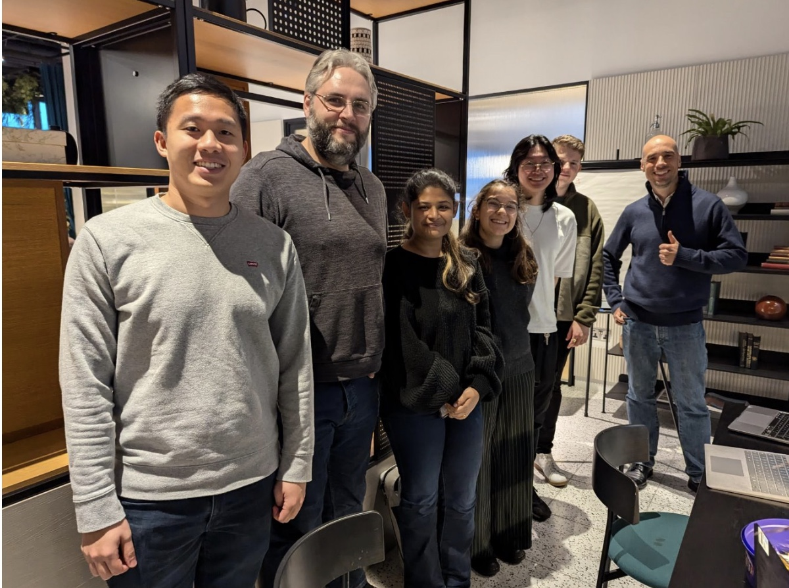
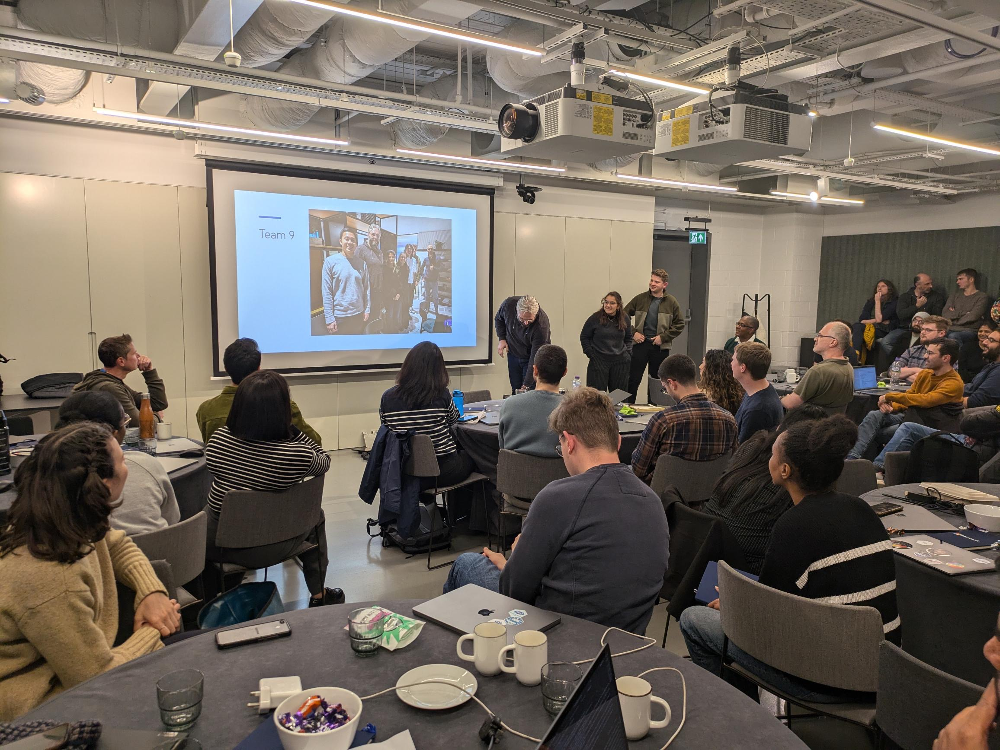

> The NHS England Data Science team, as well as a range of other analysts from across the organisation, attended an AI Hackathon at Microsoft, organised by the Data Science Team together with Microsoft and Kainos, with the key stakeholders being the NHS Websites Services Team. In this article, the author shares her experiences at the event. 

<!-- more -->

Last week, the long awaited Hack for Health hosted at the beautiful Story Club, in Paddington London, by Microsoft and NHSE finally happened! At the hackathon, every team had either a Kainos or Microsoft representative, as well as a range of participants from across NHS England, including a strong Data Science Team presence, with several of our team members in each group. And unlike a usual hackathon, this one had stakeholders and well defined use cases, we were all working to one common goal. 

The use cases were outlined as: 

1. **Search & Summarise**: using an extract of the NHS Corpus developed by one of our PhD interns, Sam Hollands, (we used two websites worth of data, out of 600 NHS websites, and it was already 25GB worth of data!), we had to develop an LLM that used RAG (see the Data Science Team's [RAG Project Website Page](https://nhsengland.github.io/datascience/our_work/ds251_RAG/)) to sift through that data and retrieve answers to queries based on these NHS websites.
2. **Explaining to a 12 year old**: Adapting the search and summarise for different personas, one of which being a 12 year old child
3. **Duplication & Conflict Detection**: Comparing the two sites and identifying duplicate information and conflicting information.

The aim was to develop generative AI solutions for website services, who could adapt and improve them for their own use cases. Having use cases meant that it was so much easier to split work up, and get our heads down, with everyone having something to actively work on. It also meant we had a structured approach, making the experience so much more fulfilling. I was delighted by the creativity and range of approaches that the different teams took when it came to presenting at the end of the two days. We ranged from teams that had taken a thin slice approach to all three usecases, to teams that had gone really in depth in just one of them, to teams that had taken use case number three and made it into a tool that could be used by the websites team to improve the websites on the backend, removing conflict and duplication. 

Overall, I was left in awe by the creativity and technical skills of our team, as well as of all the other attendees. Hopefully the work gets used in the future by the websites team, and I hope that any hackathons I attend in the future are of this high quality! (Of course it did help that my team won)

The final results were: 

*First Place*: A thin slice approach of all three usecases, a project which included 4 of our very own data scientists: Sean Aller, Sudeshna Mallik, Xiyao Zhuang, and myself, as well as Rob Mansfield, Veta Ngammekchay, and our wonderful Kainos helper Peter Bodnar. 

*Second Place*: Data Scientists Chaeyoon Kim and Warren Davis, with Mary Amanuel, Piyali Dutta, and Farwah Kazmi from elsewhere in the NHS, together with Microsoft's Dan Watkinson and Josh Mercurio developed an AI career coach that was able to draw from and cite relevant information from the HEE website, and was easily customisable to improve communication towards different user personas.

*Third Place*: Contradiction Finder by Data Science's Ben Wallace, Matt Taylor, and Jenny Chim, as well as Andrew Walker and Microsoft's Hannah Howell and Hanna Riaz. Focused on use case 3, making a usable tool for the websites team to find contraditions. 

Quotes from some of the attendees about their experience: 

**Bashir Abubakar**
> The hackathon was an incredible experience that not only allowed me to learn how to use Azure AI Foundry but also deepened my understanding of how large language models (LLMs) can transform healthcare, particularly within the NHS. My fascination with transformers began when I first read Attention is All You Need paper, which revolutionised the NLP space with its groundbreaking approach to self-attention. Seeing this theory in action, from research papers to practical applications, has been nothing short of inspiring.
The hackathon felt like a full-circle moment, as it opened new pathways for applying LLMs in healthcare, a vision I’ve long held for the future of AI professionals (Industry 4.0). It also reinforced the transformative role of prompt engineering, a skill I believe is pivotal in unlocking the potential of AI in creating meaningful solutions. 

**Will Poulett**:
> The variety of professions within each team was great, it's not often that GP's and data scientists can work together using generative AI. The solutions developed by each team were varied and interesting, I'm looking forward to seeing how they are implemented in the future!