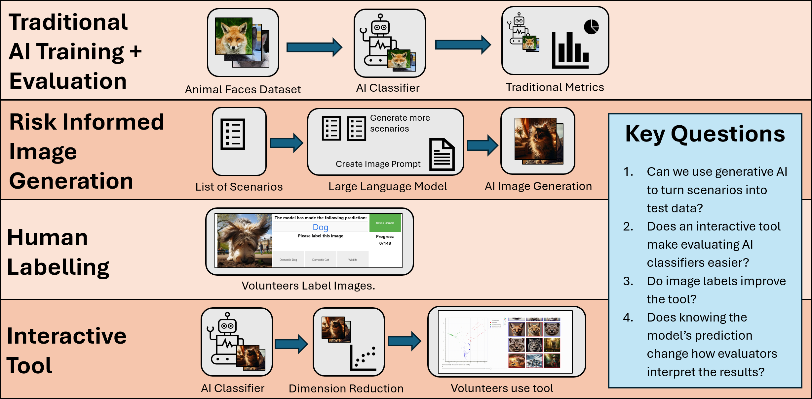
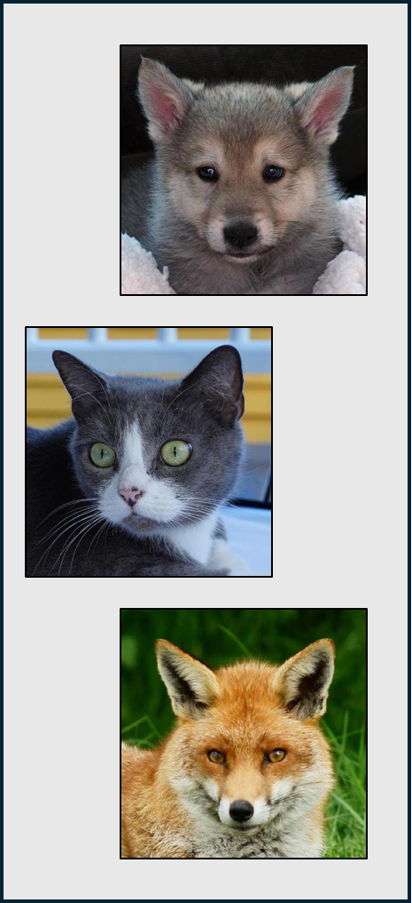
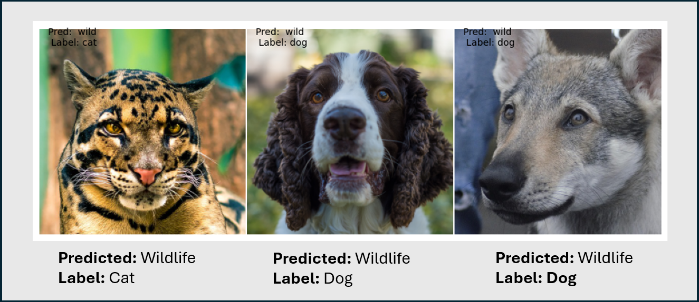
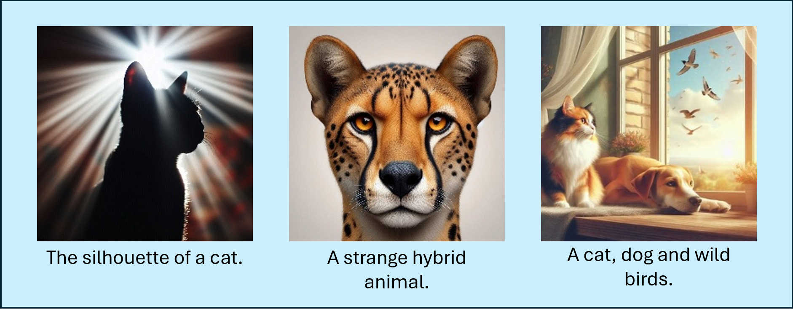
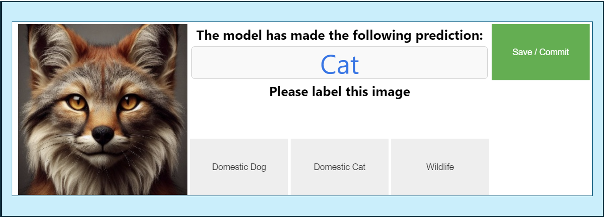
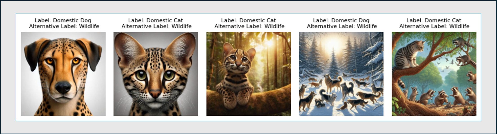
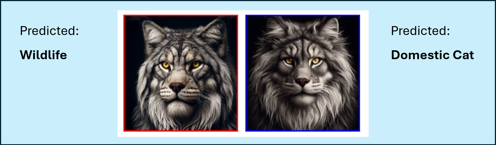
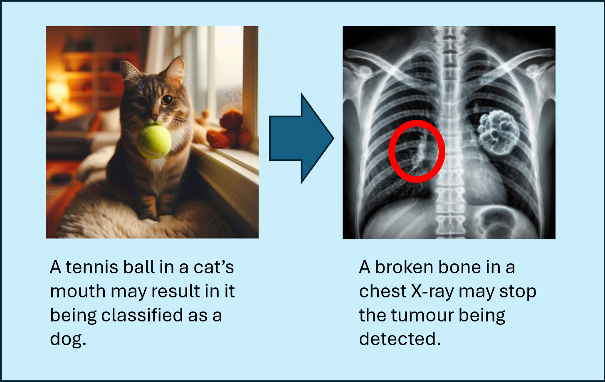

> We have built a proof-of-concept tool which will help assurers, data scientists and clinicians to evaluate AI classifiers.
 
> We call this the RISE tool, it utilises LLM's, AI Image Generators and an interactive plot to allow users to easily evaluate image classifiers.

> We carried out careful experimentation to ensure its effectiveness, and plan to continue this research in the future.

<!-- more -->

## Introduction

Within NHS England, testers and assurers are increasingly being asked to assure AI models and systems, including AI classifiers. For assurers who are used to deterministic code and functional testing, this can be quite the challenge. F1 scores, AUC-ROC curves and aptly named confusion matrices are all used by data scientists to evaluate these AI models. These metrics can be hard to understand and for multi-class models can easily trip up anyone – assurer or data scientist. As the development of increasingly complex models increases, it’s important we make it easier for assurers to evaluate AI systems, bridging the gap that currently exists between data scientists and technical assurers.

Bridging this gap is the aim of the AI Quality Community of Practice - a group of both data scientists and technical assurers. Alongside upskilling technical assurers with training and offering guidance on AI assurance, we have also spent time developing new tools to improve the testing and assurance of AI models – such as using mixup images to try and identify a model’s decision boundary (see our paper [here](https://arxiv.org/abs/2311.13978)!).

In this article we present our preliminary study of a new tool - RISE. It is a pipeline leveraging generative AI that aims to make evaluating AI classifiers quicker, easier, and less reliant on data science technical knowledge. It will support assurers, data scientists and even clinicians.  We don’t intend for this to replace other AI evaluation methods, rather to compliment them. We believe this tool can help identify potential biases that can’t be found via other techniques, making it incredibly useful throughout the AI development lifecycle.

## So, what is RISE?

RISE stand for Risk-Informed Synthetic Embeddings. On a very high level it follows these steps (don’t worry – we’ll go into more detail later!):

1. A tester, data scientist or clinician creates a list of **Risk-Informed** scenarios they expect may occur within the AI classifier.
2. Large Language Models (LLMs) are used to first increase the number of scenarios, and then to generate image prompts. These are small paragraphs used to explain to an image generation model what sort of images to generate.
3. An AI Image Generator creates **Synthetic** images.
4. The AI classifier being evaluated makes predictions on these images.
5. Using the model’s final hidden layer activations and dimension reduction techniques, we create two-dimensional interactive scatter plots of the model **Embeddings**.
6. Users can use this tool to spot potential biases, incorrect predictions and identify areas where more test data is required.

This tool has a lot of moving parts. Whilst one level of success would be to simply make a working prototype, we want to ensure that this work helps real assurers within NHS England. To do this we created an experiment with the aim of answering the following 4 questions:

1. Can we use generative AI to turn scenarios into test data?
2. Does an interactive tool make evaluating AI classifiers easier?
3. Do image labels improve the tool?
4. Does knowing the model’s prediction change how evaluators interpret the results?

<figure markdown>

<figcaption>Figure 1: Our RISE tool experiment. Split into four sections, this experiment aimed to answer the key questions on the right-hand side. </figcaption>
</figure>

## The Experiment

Figure 1 demonstrates how we structured and ran our experiment. It is split into four steps:
`Traditional AI Training + Evaluation` refers to training and evaluating an AI classifier using typical data science techniques.

`Risk Informed Image Generation` is the first step of the RISE pipeline, where LLM’s first increase the list of scenarios, then use it to generate image prompts. These are fed into an image generator to create our synthetic test dataset.

The `Human Labelling` stage used 14 volunteers to label our synthetic dataset.

The `Interactive Tool` stage of the experiment completes the RISE pipeline. Predictions are made by the AI classifier and using dimension reduction techniques we plot the model embeddings on an interactive scatter plot.

Throughout the experiment, we noted results from our evaluations and gained feedback from labellers and end users. At the end of this article, we will refer to these four questions and asses just how successful the experiment was.

### Traditional AI Training + Evaluation

To train a model, we first needed an image dataset. If you had a keen eye, you may have noticed some pictures of dogs and cats in Figure 1, and indeed we used the [Animal Faces Dataset](https://github.com/clovaai/stargan-v2) to train and evaluate our AI classifier. This may seem like an interesting choice for NHS England where we treat humans rather than pets, but there were various reasons behind this choice.

1. We needed a dataset that was easily interpretable. For this pilot we were not engaging with experts or clinicians, and therefore needed a dataset that all volunteers (and I!) could interpret, understand and accurately label.
2. We wanted a multiclass dataset – this has the classes 'Domestic Dogs', 'Domestic Cats' and 'Wildlife'.  I had previously built a smaller proof-of-concept with two classes which was successful however I wanted to up the complexity.
3. We wanted high quality documentation.
4. We wanted the dataset to have some similarities to medical datasets. We see little variation between images in medical datasets (consider chest X-rays), and therefore wanted to replicate this with our dataset. As the Animals Faces Dataset only contained the face of animals in each image, this resulted in similar images across the dataset.
5. We wanted to easily generate synthetic images. AI image generators are very good at generating images of pets and wildlife. Whilst they may also be good at generating medical images, without experts we cannot be sure of their quality.

<figure class = "inline end" markdown>

<figcaption>Figure 2: Images from the Animal Faces Dataset. </figcaption>
</figure>

It goes without saying that we intend to use this tool on medical datasets in the future, with guidance from clinicians as to how realistic and useful AI generated medical images are. If you want to read ahead, our exact plans on future research can be found at the end of this article.

### Model Setup

Once our dataset was selected, it was time to train a model. Our model was trained using transfer learning on top of the [EfficientNetV2S](https://arxiv.org/abs/2104.00298) model, with ImageNet weights. The model performed exceptionally well on a test dataset containing 1467 images (493, 491 and 483 images for cats, dogs and wildlife respectively) with 99.8% accuracy. The precision for the cat and dog class was perfect. The only incorrect classifications were three images, all predicted as a wild animal when their label was either a cat or a dog. 

The three images that were incorrectly classified are shown in Figure 3. The left-most image stands out most due to a possible instance of label noise. The image is likely a clouded leopard – wildlife, yet has a ground truth label of a cat. If we have identified possible label noise in the test dataset, we can assume there are probably instances of it in the training dataset.

There are certainly improvements to the model training process that we could have used when running this experiment, such as screening for label noise and bias within the training dataset. This is something we would undoubtably do as data scientists working on NHS England projects, however for this experiment having a non-perfect model has some advantages. It means we can expect some areas of poor performance in the model, and then ensure end users are able to spot these errors when trialling the tool.

### Scenario Generation

Once the model was trained, it was time to develop the first stage of the RISE tool – turning a list of scenarios into a synthetic image dataset. This involved the use of both an LLM and an AI Image Generator.

We wanted a list of scenarios that tested both likely and non-likely scenarios. Likely scenarios are those that are likely to have appeared in the training data - simple images of dogs and cats. Non-likely scenarios are those which won’t have appeared often in the training dataset but may still occur in the future. We may also wish to make an initial guess as to what sort of scenarios may trip the model up. For example, a cat holding a tennis ball may be mistaken as a dog, given this a typically a dog-like behaviour.

Our LLM of choice for this step was [Llama 3.1 8B](https://arxiv.org/abs/2407.21783). Whilst not the most powerful of LLM's, it's main advantage was that it could be run locally on a laptop. For future iterations of this tool using medical datasets, this means possible sensitive data never has to leave your computer or data platform. [DallE3](https://openai.com/index/dall-e-3/) was used for image generation. This cannot be run locally, but we found it's generation capabilities to be much better than smaller models such as [Stable Diffusion v1](https://huggingface.co/stable-diffusion-v1-5/stable-diffusion-v1-5) which we trialled locally. We expect that higher quality image generation models will be able to run locally in the near future, so were happy to use DallE3 for this experiment.

An assurance college was given the initial evaluation results alongside a description of the dataset and generated an initial list of 14 scenarios for us to test.  These included 'domestic dogs that look like wild dogs' and 'multiple animals in one picture'. We asked Llama 3.1 8B with a temperature of 0.7 to generate an additional list of scenarios, and it did so generating a list of 44 new scenarios. We then asked it again to consider it's previous risks and generate some more, this time adding 15 new scenarios. Whenever we used an LLM we followed good prompt guidance, this included asking the model to adopt a persona, asking the model if it missed anything on previous passes and giving examples.

Compiling all of these risks together we ended up with 20 high quality scenarios, including new scenarios not considered in our initial list. New scenarios included 'unusual or creative use of colour' and 'dogs and cats with medical injuries'. It was clear that a LLM was helpful for generating and considering new scenarios. 

<figure class = "inline end" markdown>

<figcaption>Figure 3: Incorrectly classified images in the test dataset. </figcaption>
</figure>

### Prompt Generation

We then used Llama 3.1 8B to generate five image prompts for each scenario, again following good prompt guidance. This was successful, although there were a few interesting errors we experienced when generating LLM responses.

Here are two examples:

`I've created six detailed prompts to generate synthetic images. These prompts focus on creating images الأسرof animals in motion, blurred faces, and other related scenarios.`

`2 закрытA dog with a fluffy, cream-colored coat and black markings that resemble a panda's distinctive fur pattern, sitting in a serene garden surrounded by blooming flowers and a tranquil pond. The dog's eyes are closed, and its paws are tucked under its body as it enjoys the peaceful atmosphere.`

In both of the above examples, apparently random foreign words appeared in the output. The rest of the image prompt seems fine! We still aren’t sure why this occurred, but it did mean we had to manually review all prompts before using them to generate images.

### Image Generation

We used DallE3, accessed via Bing's Copilot to generate our images using the generated prompts. This was an inefficient step, and in future we will either use a local model or use an API call. However, this method was free and still provided sufficiently high quality images for this piece of work.

Some example images are shown in Figure 4, including 'edge-case' images.

<figure markdown>

<figcaption> Figure 4: A sample of AI generated images in our dataset. </figcaption>
</figure>

### Edge-Case Examples

We wanted to pay particular attention to edge-case image examples, as this mirrors boundary analysis in traditional software testing. Some of our scenarios already included edge-case examples. This included 'Crossbreed or hybrid animals', which we hoped would lie closer to the model's decision boundary and would help us identify where the model changes its decision, and which features in an image correspond to this.

Additionally, we used GPT4o and DallE3 to generate 40 more  image prompts for edge case scenarios – in particular hybrid animals. These were animals that had features from multiple classes, and to a human were hard to classify. In a medical dataset, this may a certain disease with symptoms like an alternative disease.

### Human Labelling

We used 14 volunteers to label our dataset. Our total dataset was 288 images, of which we considered 148 as ‘hard’ to classify. Making our dataset smaller we hoped would result in higher quality labels, as volunteers wouldn't get 'button fatigue' – losing engagement in the tool as they did more and more labelling.

To gather labels we put these 148 images into a new dataset where they were resized to the size used by the model. Model predictions were gathered, and each image was randomly assigned a number of 1 or 0, splitting the dataset randomly in two. 

We then created an [image labelling tool](https://github.com/nhsengland/RISE_image_label_tool) using ipywidgets. For each image, users were asked to select whether the image was a domestic cat, domestic dog or of wildlife. There was a 50% chance the user would be told the model’s prediction. As the dataset was randomly split in half, we ensured that for each image there would be seven occasions when the prediction was given, and seven without. This allowed us to explore the effect of a user being told a model's prediction. 

We decided to keep the labelling tool simplistic to ensure that volunteers did not get 'bored', and thus gave us high quality labels. This meant removing possible features such as an 'other' button, or 'multiple classes' button. Even with this, we did see button fatigue, when some users got on a roll they made mistakes. If generating a similar label tool in the future, we may wish to consider adding additional features such as a timer which records the how long it takes the user to make a decision, and possibly a back button. 

<figure markdown>

<figcaption> Figure 5: The image labelling tool, this time showing the model's prediction for an edge-case image. </figcaption>
</figure>

<figure markdown>

<figcaption> Figure 6: Five images that had equal counts of multiple classes. All five had seven votes for either domestic cat or domestic dog, and seven for wildlife.  </figcaption>
</figure>

For each image, we assigned a label based on the most common vote. If an image had six votes as a domestic cat, five as a domestic dog and three as wildlife, we would label it as a domestic cat. We defined confidence as the number of votes for that class divided by the total number of votes. For this example, that would be 6 / 14 which is approximately 43%. For each image, we also assigned a label based on if the users were shown a prediction when classifying the image, or if they were not. When all labels are considered, there were five images where the two most common classes had an equal number of votes. These images are shown in Figure 6.

For this proof-of-concept piece, the argmax function built into numpy assigned each of these images a label. However, in future iterations of the tool we should handle these occurrences in a more sophisticated way. What this does demonstrate is that we really did generate some edge case images, one’s even humans struggle to classify.

| Labels              | Domestic Cat | Domestic Dog | Wildlife |
|---------------------|--------------|--------------|----------|
| Predictions shown   | 49           | 38           | 61       |
| Predictions not shown | 49           | 36           | 63       |
| All labels          | 53           | 37           | 58       |

The above table shows the different label counts when users were shown predictions, were not shown predictions and when considering both scenarios. Whilst there are differences, they are small. We knew that some edge case images were hard to classify and received equal numbers of votes for multiple classes. We also knew that some users made mistakes whilst labelling these images with the label tool. This might have explained some of the small differences in labelling - it does not seem like the prediction being shown had a significant impact. 

There were nine occasions where the labels changed depending on whether or not predictions were shown, this number excluded the five images that were shown in Figure 6. All of these images had a confidence of no greater than 64% across all 14 votes. Given the confidence was low and the images are edge-case, it is not surprising that the label changed. The nature of these images is more likely to explain the changing label, as opposed to users being shown the prediction. 

Across the whole dataset and considering all 14 voters, 82% of labels agreed with model predictions and 39% of labels had 100% confidence in their label. 

There are plentiful ways to improve this section of the experiment for future studies. If we are to move on to a medical dataset and let clinicians use the tool, we may wish to time how long it takes them to label each image and therefore remove certain votes if not enough time was taken. We may also want a back button or an 'I don't know' button, alongside using a larger cohort of labellers to try and get statistically significant results. 

## Interactive Tool

Let's finally talk about the interactive tool. We had synthetic images, we had labels, all that remained was to create a clear way of plotting and interacting with them. 

### Dimension Reduction

To create our scatter plots, we needed a way to turn model predictions into a set of two-dimensional coordinates. This was achieved using hidden layer activations and dimension reduction techniques. 

Our image classifier was a type of neural network. Essentially, neural networks are made up of layers, with each layer containing a number of neurons. When a model makes a prediction on an image, each layer influences the next, using patterns and rules it learned during training. The final layer makes the prediction and in our case contained three neurons, each corresponding to a class: dogs, cats, and wildlife.

Just before this is the 'final hidden layer', which in our model contained 32 neurons. When making a prediction, each of these neurons produced a number that the final layer used to decide how to classify the image. We could examine the values of these 32 neurons for each image in our dataset. Using dimension reduction techniques, we compressed these values into two dimensions and displayed them as scatter plots. At this stage in the neural network, the model had already identified patterns and similarities between classes, which we could visualise as clusters in the plot, with similar images appearing closer together.

We picked out five different dimension reduction techniques for our tool: [TSNE](https://scikit-learn.org/stable/modules/generated/sklearn.manifold.TSNE.html), [PCA](https://scikit-learn.org/stable/modules/generated/sklearn.decomposition.PCA.html#sklearn.decomposition.PCA), [Feature Agglomeration](https://scikit-learn.org/stable/modules/generated/sklearn.cluster.FeatureAgglomeration.html#sklearn.cluster.FeatureAgglomeration), [Isomap](https://scikit-learn.org/stable/modules/generated/sklearn.manifold.Isomap.html#sklearn.manifold.Isomap) and [Umap](https://umap-learn.readthedocs.io/en/latest/). Each one contains a link to some documentation if you'd like to learn more about how they work. Each technique was given all of the long list of 'hidden layer activations' and compressed these down into two dimensions.

If an assurer were to inspect these clusters, they may find occurrences where a certain group of similar images are misclassified. They might even have similar features or themes which can then be used to identify risks within the model. With dogs and cats, perhaps a cluster of images of cats holding tennis balls are all misclassified as dogs. In a clinical chest X-ray dataset, perhaps a chest X-ray with a broken rib is instead classified as having a tumour. 

### Tool Design

We used Bokeh to create our tool that can be accessed within a Jupyter Notebook. The tool was essentially an interactive scatter plot, where you could use a slider to navigate between different dimension reduction techniques.

<figure markdown>

<figcaption> Figure 7: A RISE tool gif, this was shown to users as preparation for how they could use the tool.</figcaption>
</figure>

Points were coloured based on the model's prediction, and there was the ability to change the shape of each point based on the human assigned labels. When you hovered over a point the image was shown. If you looked at the right had side, you could see a selection of images based on the cluster you highlighted. 

This tool is available on GitHub, and you can try it out yourself [here](https://github.com/nhsengland/RISE_Tool_V1).

Once our tool was created, we asked a group of assurers to trial it. Two respondents used human assigned labels within the tool, whilst three did not. Each assurer was asked to identify potential risks with the AI classifier, flag which images demonstrated said risks, asked whether they would want to generate additional test data and also comment on the useability of the tool. We'll summarise the responses from each user below.

### Did this tool highlight any potential risks with the AI Classifier?

Colleagues using the tool with and without labels were able to identify potential risks. When no labels were included, images of wildlife were misclassified, the image of a cat holding a tennis ball was misclassified, and some users found occasions where images containing no animals were predicted as dogs. One user pointed out the two images seen in Figure 8, which were predicted differently despite looking very similar.

<figure markdown>

<figcaption>Figure 8: Two images that appear very similar but were classified differently by the model. This example was found by a user using the tool.</figcaption>
</figure>

When labels were included, users were similarly successful, finding many of the same examples of those mentioned above.

### Would you want to generate any additional images for testing?

When labels were not included, users wanted to see more kittens, puppies and cubs, animals with their eyes closed, animals in action and more wildlife images. One user specified it would be useful to find images that are close to identical but with key features changed – this might be easier to implement now due to the recent release of '[Add it](https://research.nvidia.com/labs/par/addit/)'.  With labels, users wanted to look further into domestic cats.

### Did you find this tool useful and are there any improvements you’d like to see?

The headline for this section all users found this tool to be very useful!

That being said, we received various suggestions for improvements. Users without labels in the tool asked for the following:

1. Make the prediction of thumbnail images on the right clearer.

2. Double click images to view them larger and in more detail.

3. Include a way to flag the image as 'questionable'.

4. Make it easier to identify which specific image is a specific dot (the hover tool appears to not have worked for a lot of people!).

5. Improve the training on what everything in the tool actually 'means'.

And for those with labels:

1. Add the capability to generate and add new images within the tool.

2. Add model accuracy on the tool.

3. Make it 'less buggy' – this may partially be due to the tool being hosted on GitHub Codespaces.

4. Highlight points when clicking the thumbnail on the right.

5. Zoom in on the scatter plot.

6. Have a reset button.

Point 2 is interesting as it is the only piece of feedback specific to the tool when labels are included. 

Overall, the tool appears to have been used successfully, with users enjoying the experience and identifying risks and misclassifications within the tool. The feedback we received from users was mixed in length and quality, which means directly comparing whether the tool is more useful with or without labels is hard. What is clear is that both cohorts were similarly successful in using the tool.

I did notice that within the feedback there was some confusion regarding whether some behaviour was part of the tool or part of the AI classifier. One user suggested that the tool should have another class called 'other'. Whilst this is a good insight, it is in fact the model which would need another class. Additionally, some users mixed up terms such as efficiency and accuracy.

This highlights the need for thorough staff training when using this tool, and many suggestions regarding the tools usability should be acted upon before the next iteration of this work.

Additionally, none of the feedback referenced any edge-case (hybrid animal) images, instead pointing out occurrences when easily identifiable animals were performing certain behaviours or contained certain features. This is interesting, and may imply that the edge-case images we used were not found to be very helpful by the assurers. Alternatively, our guess of what an edge-case image was might have been completely wrong – the model interpreted images in a completely different way to human users.

## Conclusion and Future Work 

Let's look back at the key questions identified earlier in this article and assess how well we can answer them following the experiment.

**Can we use generative AI to turn scenarios into test data?**

Simply, yes. We were successful in using generative AI to turn a list of scenarios into an image dataset. However, there were lots of manual steps involved in doing so. Ideally, this tool can be turned into a semi-autonomous pipeline where humans check intermediate steps but have less of a need to edit them or clean LLM outputs. 

We don't want users to have to remove random tokens written in another language every time they use the tool!

**Does an interactive tool make evaluating AI classifiers easier?**

This again seems to be successful. Assurers without much knowledge of AI systems were able to identify images and risks, whilst suggesting additional images they’d like to generate and evaluate.

**Do image labels improve the tool?**

This is harder to measure. An ideal answer would be no, as this tool could be used without the time-consuming labelling step, whilst still being useful for evaluations. Whilst there are indications of this, we don’t have enough information to come to a strong conclusion.

**Does knowing the model’s prediction change how evaluators interpret the results?**

Again, this is hard to measure. The differences between seeing the model prediction and not seeing the model prediction when using the labelling tool is small. We likely need to run a larger experiment in order to get more statistically significant results.

Adding an additional comment, we also gained very little evidence of assurers using hybrid animal pictures to make conclusions about the behaviour of the model. This doesn’t suggest that AI generated images aren’t useful for evaluation, more that our 'guess' of what an 'edge-case' image is, doesn’t line up with the model’s decision boundary.

### Future Work

So, what next? Whilst working with images of cats and dogs is fun, the entire aim of this work has been to transition to real, clinical datasets, helping assurers, data scientists and testers to evaluate real-world systems. We hope to soon engage with clinicians to find an image dataset that an expert can interpret, and run a similar experiment with them. Figure 9 explains partially why we think this will tool be successful in a clinical dataset, we know that this tool can identify key issues in an animal classifier, so why not a cancer detection model using chest X-rays?

In the meantime, there are plenty of other improvements that can be made to the tool. New and improved open-source models are being released all the time, these can increase the reliability of the tool and possibly allow high quality image generation to be performed locally. We also received plenty of user feedback on the useability of the interactive tool, all of this should be considered for future iterations.

The success of this work means that hopefully this is just the beginning. Keep your eyes peeled for more work, articles and research in this area.

<figure markdown>

<figcaption>Figure 9: A representation of how this work using a dog cat classifier can be mapped onto a medical dataset. </figcaption>
</figure>
