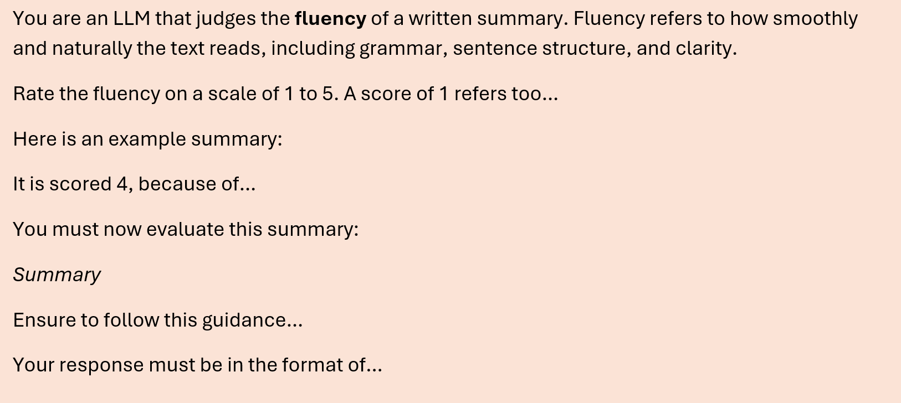

> We have been exploring using an LLM to evaluate and assess LLM summaries. This utilises the speed and language understanding of LLMs to score summaries, but how much trust can we put into an 'LLM-as-a-Judge'?

<!-- more -->

# LLM-as-a-Judge

<figure class="inline end" markdown>

<figcaption>Figure 1: An AI Generated cartoon depiction of 'LLM-as-a-Judge'</a></figcaption>
</figure>

The rise of Large Language Models (LLMs) has resulted in AI summarisation tools popping up across the NHS. These tools essentially compress information found across multiple documents into a smaller and more concise summary. Given the amount of text data that exists across the NHS – these are very useful! Examples of their use include:

- A clinician might hand-pick documents and ask for a specific type of summary, saving them hours on a task that now takes a matter of minutes.
- Someone might want to learn more about a specific policy, which is written about on multiple online documents. A system could both retrieve the most relevant documents to this policy, and then use an LLM to summarise the key points.

Regardless of the use-case, any system using AI needs to be meticulously evaluated, especially when used in a healthcare setting. With free text summaries, this can be quite challenging.

## How would you evaluate a summary?

Imagine you were given a list of 1000 AI-generated summaries to evaluate, alongside the documents used to create them. Even without being an expert in the field, you'd probably do quite a good job:

- First, you could first check whether all the facts included in the summary are from the reference documents. This checks whether the summary is **grounded**, and also whether the LLM has hallucinated.
- Then, you could check whether any key information was missed from each of the documents.
- You could also check whether the summary is well written for its target audience, is it **cohesive** and **relevant**?
- If you had human gold-standard summaries, you could do direct comparisons to see whether the two summaries convey the same information. Are AI generated summaries equally **grounded**, **cohesive** and **relevant**?

Whilst this method of evaluation is very thorough and often considered the gold-standard, it’s also incredibly time consuming.

## Surely there is a quicker way?

There are alternative automatic evaluations to human feedback. If you have both human and AI summaries there are some quick similarity metrics you can run. BLUE [[1](https://medium.com/nlplanet/two-minutes-nlp-learn-the-bleu-metric-by-examples-df015ca73a86)] and ROUGE [[2](https://medium.com/nlplanet/two-minutes-nlp-learn-the-rouge-metric-by-examples-f179cc285499)] compare whether words or short phrases overlap in the two summaries. This can be useful, but a lack of language understanding means if the exact same information is written in different ways, these algorithms wouldn’t pick up the summaries are equally valid.

This brings us on to the star of the show: **LLM-as-a-Judge**. We want an evaluation method that understands the intricacies of language and is significantly quicker than humans.

An LLM-as-a-Judge uses an LLM to score certain characteristics of a summary. Typically, each characteristic is numerically scored based on instructions set out in a schema, and these characteristics can include groundedness, cohesiveness and relevance – metrics that can also be measured by humans.

What's great about LLM-as-a-Judge is that you can score on characteristic you’d like. Figure 2 shows an example a schema written to measure a new characteristic: fluency.

<figure markdown>

<figcaption>Figure 2: This is an example schema used for an LLM judge that evaluates the fluency of a review. Fluency can be measured with only the summary; no additional information is needed. This is a shortened example, note that there are gaps where additional context would be, such as the example summary and the list of guidance.  </figcaption>
</figure>

LLM-as-a-Judge is scientifically grounded. It has been shown that LLM judgements can align to human feedback [[3](https://arxiv.org/abs/2306.05685)], and there are various articles on how to improve your LLM judges [[4](https://huggingface.co/learn/cookbook/llm_judge)].

## Who judges the judges?

Whilst LLM judges have been shown to be comparable to humans, we still need to be aware of the mistakes that LLMs can make. First, LLMs are typically non-deterministic, meaning an LLM can vary the score it gives a summary if ran multiple times. Secondly, LLM’s are known to hallucinate, so could give an entirely incorrect score.

Whilst human judges can be self-aware of their limitations and effectively self-manage themselves implicitly, our LLM-as-a-judge may not have the self-awareness to identify when it’s not up to the task. In current literature three main approaches appear to be taken to evaluate the evaluators.

1. **Comparison to Benchmark:** Several studies [[3](https://arxiv.org/pdf/2306.05685), [5](https://arxiv.org/pdf/2406.18403), [6](https://arxiv.org/pdf/2310.07641)] have explored using established benchmarks to compare the judges to.  However, all highlight various limitations of the general benchmarks and so this approach is not recommended as a final evaluation but can be useful in earlier development stages as a guide.

2. **Assessing Against Humans:** Metrics are used in several studies [[7](https://arxiv.org/pdf/2406.12624v1), [8](https://arxiv.org/pdf/2404.12272)] to compare human and LLM judges. The resulting recommendation is to use Cohen’s Kappa metric [[7](https://arxiv.org/pdf/2406.12624v1)] to take into account chance agreements but overall, the metric approach is difficult and very bespoke especially for tasks where the LLM judge is attempting to assess none prescribed outputs or when the judging has a subjective component.

3. **Identify Strategies to Improve the Judge:** This approach aims to highlight issues with the judge and then put in active strategies to mitigate them (similar to mandatory training for consistent issues recognised for human judges). There are a range of potential biases that judges can exhibit [[3](https://arxiv.org/pdf/2306.05685)], these include:

    - Position bias
    - Verbosity bias (favouring longer more verbose responses)
    - Self-Enhancement bias (prefer answers generated by themselves)
    - Knowledge Bias

    Suggested mitigations for each bias include [[11](https://arxiv.org/pdf/2310.17631)]:

    - Use a 'Swap' Augmentation to mitigate position bias
    - Reference support to mitigate knowledge bias
    - Reference drop to mitigate format bias

There is no defined or straightforward way to assess the LLM-as-a-judge. Instead, a series of comparisons is required during the development phase to test for identified biases and to create a task specific benchmark.

## Conclusions

An LLM-as-a-Judge is an exciting alternative to existing methods of evaluating summaries. It is faster than human evaluations and understands language better than traditional automatic evaluations. Whilst LLM’s are not perfect, there are steps we can take to improve and validate their use for evaluation.

## References

[1](https://medium.com/nlplanet/two-minutes-nlp-learn-the-bleu-metric-by-examples-df015ca73a86) - Two minutes NLP — Learn the BLEU metric by examples

[2](https://medium.com/nlplanet/two-minutes-nlp-learn-the-rouge-metric-by-examples-f179cc285499) - Two minutes NLP — Learn the ROUGE metric by examples

[3](https://arxiv.org/abs/2306.05685) - Judging LLM-as-a-Judge with MT-Bench and Chatbot Arena

[4](https://huggingface.co/learn/cookbook/llm_judge) - Using LLM-as-a-judge 🧑‍⚖️ for an automated and versatile evaluation

[5](https://arxiv.org/pdf/2406.18403) - LLMsinstead of Human Judges? A Large Scale Empirical Study across 20 NLP Evaluation Tasks

[6](https://arxiv.org/pdf/2310.07641) - Evaluating Large Language Models at Evaluating Instruction Following

[7](https://arxiv.org/pdf/2406.12624v1) - Judging the Judges: Evaluating Alignment and Vulnerabilities in LLMs-as-Judges

[8](https://arxiv.org/pdf/2404.12272) - Who Validates the Validators? Aligning LLM-Assisted Evaluation of LLM Outputs with Human Preferences 
