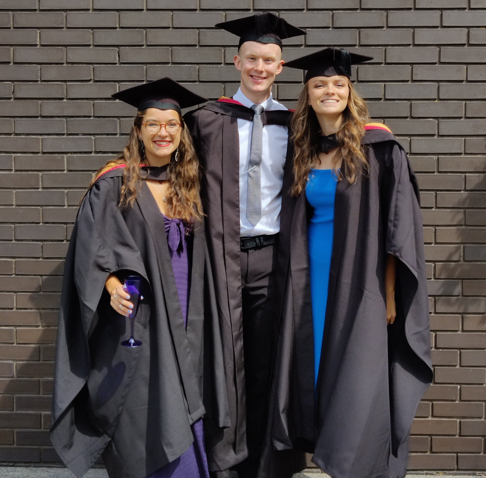

> Welcome to another insightful installment of our "Interview with a Data Scientist" series. Here, we delve into the diverse career paths and impactful work of the talented individuals who make up the NHS England Data Science team. Our goal is to shine a light on the fantastic people driving the NHS Data Science Profession forward and to offer valuable perspectives for anyone considering a career in healthcare data science.

This week our interviewee is Amaia Imaz Blanco, a Data Scientist in the Data Science Team whose love of making graphs led her to the NHS Digital Graduate Scheme and eventually into probabilistic data linkage!

<!-- more -->

<figure class="inline end" markdown style="width: 40%;">

</figure>

## How did you end up in data science at the NHS? What did you do before, and what really sparked your interest in this field?

I wouldn’t say I had a grand plan to get into data science — but looking back, it probably isn’t a huge surprise. When I was asked what I wanted to be at age 11 I said “a maths teacher”, which felt a bit out of step with the dreams of astronauts and footballers around me. That early love for numbers truly set the stage for my academic and professional life.

Fast forward to being 16, and I stumbled upon the existence of an Astrophysics degree. From that moment, that became the goal. I've always loved to describe astrophysics as "just maths with pretty pictures", and honestly, what's not to love about that combination? In 2018, fresh out of school, I embarked on a Physics, Astrophysics, and Cosmology MPhys at Lancaster University. My Masters project involved a deep dive into a dataset of 40,000 galaxies, performing extensive classification and statistical analysis. However, my very first taste of what I now recognise as data science techniques came during an internship at The University of Cambridge's Institute of Astronomy. There, I used Markov-Chain Monte Carlo modelling to understand the shapes and densities of debris and dust around exoplanets, which even led to [this published paper](https://doi.org/10.1093/mnras/stad1221).

<figure class="inline start" markdown style="width: 40%;">

</figure>
Nearing the end of my university studies, a significant realisation dawned on me: despite my enthusiasm for my degree and for astrophysics as a whole, I just wanted to contribute to something that had a tangible impact in the "real world". So, I dove into the job market, applying to almost every role that claimed to welcome physics graduates, though with limited success. It was during a moment of frustration that my mum suggested: "Amaia, you love understanding complicated topics through reading and making graphs, why don't you look for jobs where you can do that?"

That simple question was a revelation. It completely shifted my perspective, and I began searching for data-focused roles. That's how I discovered the NHS Digital graduate scheme. It felt like the perfect alignment – an opportunity to explore a data career within a broader technical scheme, which meant I wasn't locked into a single path. Crucially, it offered the chance to make a real difference for real people, within an organisation I deeply believe in.

## Once you joined the NHS, what was that experience like? What different roles and teams have you been a part of, and how have they shaped your career?

I've now been with the NHS for nearly three years, beginning my journey at NHS Digital before its merger with NHS England. Over half of this time has been dedicated to data science roles. My initial placement at NHS Digital was within an analytics team in the Secondary Care area, where I primarily worked with [Patient Reported Outcome Measures (PROMs)](https://digital.nhs.uk/data-and-information/data-tools-and-services/data-services/patient-reported-outcome-measures-proms) data.

For my second placement, I decided to venture into something completely different, joining the Run & Maintain team in the NHS App as a software developer. It quickly became clear that this wasn't my forte; I wasn't very good at it, nor did I truly enjoy it. After spending a year at the NHS, observing my fellow grad, Will, creating "**cool plots**" for the [CVD Pathways project](https://nhsengland.github.io/datascience/our_work/cvd_pathways/), I decided that the team that he was in might be a good match. For my final placement, I decided to join the Data Science Team myself. I've since successfully graduated from the grad scheme and am now a permanent member of the Data Science and Applied AI Team.

## What are you currently working on? Are there any projects that you're particularly excited about, or that you feel are making a real difference? What impact are you having?

Currently, I'm deeply involved with the **Data Linkage Hub**, specifically focusing on the [probabilistic data linkage pipeline](https://nhsengland.github.io/datascience/our_work/data-linkage-hub/linkage-projects/better-matching/). This project utilises a probabilistic model designed to accurately identify records belonging to the same patient, using their demographic information. The reason this project excites me so much is its **foundational importance** to almost all data work within our organisation. We handle immense volumes of data, and without the ability to reliably link records to individual patients, combining datasets to understand patient pathways would be fundamentally impossible. Accurate data linkage underpins the precision of our publications, the robustness of research studies, and ultimately, the efficacy of direct patient care. This is why I've been dedicated to this project since joining the team, and why I continue to be enthusiastic about its impact.

I also lead our **Marketing & Comms function team**, where we focus on making sure people know about the work we’re doing, the impact it’s having, and the wide range of skills across the team. It’s a part of the role I really enjoy: I get to shout about work I genuinely believe in. You can get a flavour of it from the data science website I help run [here](https://nhsengland.github.io/datascience/).

## If you could give someone just starting out in data science a few pieces of advice, what would they be? And what resources have you found particularly helpful along the way that you can share?

I believe that, more so now than even a couple of years ago when I started, there's a strong temptation for people to apply AI and machine learning to every single problem. And as ironic as it might sound coming from someone whose job revolves around developing these products, one of the most invaluable skills I've got is the ability to critically assess a situation and determine when data science techniques are, in fact, *not* the optimal solution. Being able to think critically about the **ethical implications** and the practical usefulness – or lack thereof – of these products, in my opinion, makes me a more valuable team member and a more effective data scientist. Therefore, I would always advise anyone starting out to not just read about the benefits of certain techniques, but to dedicate significant time to understanding their **pitfalls and limitations** first.

My second piece of advice is that genuine **enthusiasm and enjoyment** in your work are the most powerful ways to succeed. Don't pursue data science simply because it's a popular or trendy field with growing job opportunities. Instead, figure out what truly brings you joy, be it coding, maths, creating visualisations, or anything else, and then explore how that passion aligns with the role of a data scientist. By doing so, you'll naturally gravitate towards a niche within the vast landscape of data science, which in turn will make you a more attractive and unique candidate in the job market.

We hope you found this interview with Amaia Imaz Blanco inspiring. Her journey shows how following your enthusiasm and passions can lead you to doing work you love. You can also view our previous ‘Interview with a Data Scientist’ with Adam Hollings, [Dim Sum and Data Science](https://nhsengland.github.io/datascience/articles/2025/06/12/interview_with_adam_hollings/), on the [NHS England Data Science Website](https://nhsengland.github.io/datascience/).
