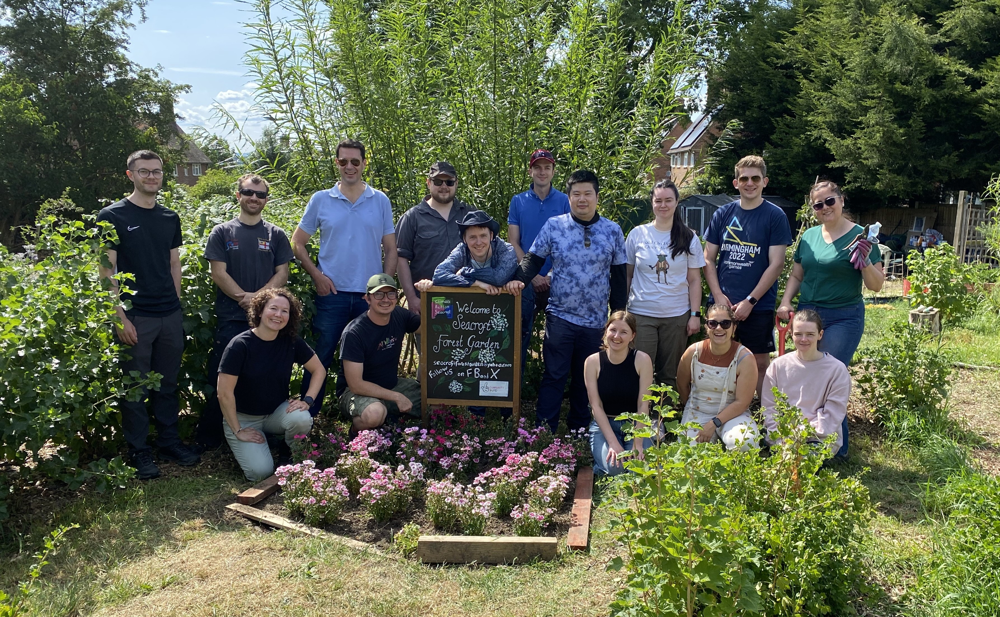
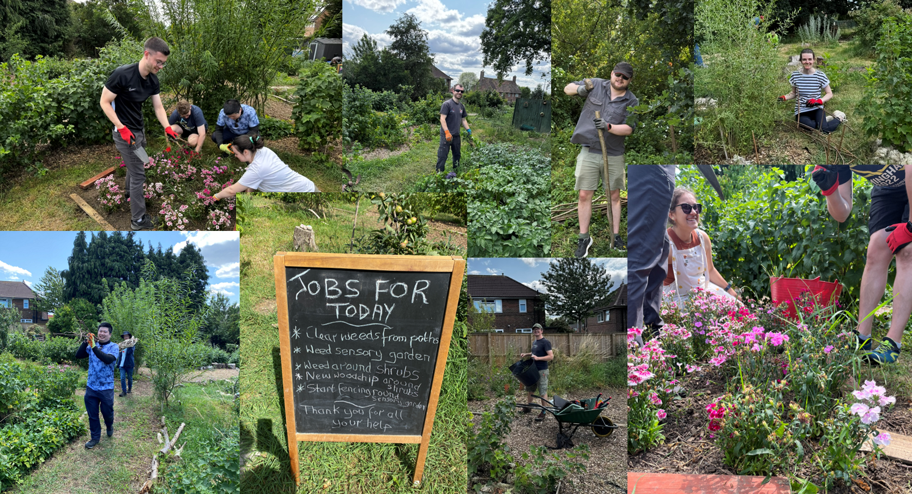

>   At NHS England, employees get a handful of days each year to volunteer - helping out with causes that align with key NHS goals like helping people live healthier lives, improving quality of life, supporting recovery, and promoting equality in health.

> The Data Science and Applied AI team recently grabbed this opportunity to give back, with a day spent volunteering at [Seacroft Forest Garden](https://www.seacroftforestgarden.co.uk/), organised by the Wellbeing and Inclusion Function Team.

<!-- more -->

## 🪴 _What’s Seacroft Forest Garden?_ 🪴

Seacroft Forest Garden started as a local climate action project. It’s built on what used to be a neglected patch of land owned by Leeds City Council Housing. The garden follows permaculture principles, meaning everything planted is either edible or useful, and it’s designed to benefit not just people, but wildlife and the environment too.

Local folks get to enjoy fresh fruit, vegetables, herbs, and a peaceful green space to unwind. Plus, the trees planted help store carbon and protect wildlife - so it’s a win-win for the community and nature.

## 🌿 _How the Day Went_ 🌿

We arrived bright and early at 10am and after a quick briefing on the jobs and tools available we got stuck in straight away. The garden team provided all the gear we needed - from gloves to drills.

There were lots of different tasks for all skill levels. Many of us started by weeding, carefully pulling out nettles by the roots so the other plants could thrive. The elbow-length gloves were a lifesaver, protecting us from countless nettle stings on our forearms (though a few still managed to sneak through!). We joked that we should have taken a “before” photo, because the difference was so striking. It was rewarding to see the impact of our efforts - clearing space, creating a safer environment, and making the garden look so much more inviting.

Others wheeled barrows of mulch across the site, spreading it over the beds to lock in moisture and suppress weeds. A few volunteers even pitched in to build a new garden path, giving the area a more accessible and welcoming feel for future visitors.

After lunch, the garden leaders taught us how to weave hazel fences—a traditional technique none of us had tried before. We planted stakes into the ground and worked together to weave each hazel rod around them, gradually creating a sturdy natural barrier for the sensory garden. The finished fence not only helped keep out small animals but also gave the space a sense of privacy and calm. It was a fun, hands-on new skill for many of us, and a great teamworking exercise!

By the end of the day, we were tired but very proud of the difference we’d made in the garden. We wrapped up with a well-deserved trip to the pub to relax over some food and drinks!

## 👩🏼‍🌾 🧑🏻‍🌾 _What the Team Thought_ 🧑🏻‍🌾 👩🏼‍🌾

>  “It was a really nice thing to do for the community and was great meeting the people who work there and learning about them. It was refreshing to not be looking at a screen all day, getting some fresh air and building team connections in a more casual environment. I think it's really important for us to remember that doing good for the community is a key part of our job, and volunteering plays a big role in that.” - **Scarlett Kynoch (Senior Data Scientist)**

> “This has been fantastic. I feel like I’ve learned something about every single person I worked with.” **– Adam Hollings (Principal Data Scientist)**

> “It’s amazing what a difference a few hours and 15 people can make to a place like this. I really enjoyed the fence weaving - it was something new and so satisfying to see what we created by the end of the day.” – **Amaia Imaz-Blanco (Senior Data Scientist)**

## 🍃 _Want to Volunteer?_ 🍃

If you work for NHSE and want to use your volunteering allowance, speak with your line manager and check out the policy on the One Stop Shop.

If you want to get involved with [Seacroft Forest Garden](https://www.seacroftforestgarden.co.uk/) directly, they’re always happy to welcome helpers on Sundays from 10am to 12pm and Wednesdays from 11am to 2pm.

