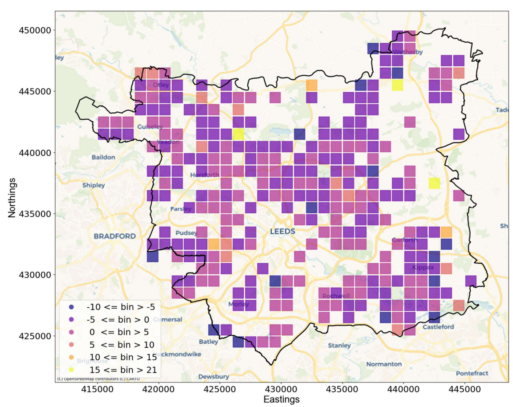

*This project was completed by Chloe Peaker, Net Zero Estates Senior Insight Manager, in the Estates - Soft FM Team, as part of the Data Science MRes at the University of Leeds.*

There is a growing mental health crisis in the UK that is exacerbating an already strained healthcare system and there is also pressure for continuous growth leading to more and more urbanisation. This study therefore explores the relationship between environmental factors and mental health referrals for Leeds for the financial year 2023/24 using two geographical scales: 1 km square grid and Lower Super Output Areas (LSOAs). 

This study shows that noise pollution alone showed a weak positive correlation when aggregated to 1 km but this was diminished when the same data was aggregated to LSOA level. A gender disparity was found warranting further investigation and potentially more proactive outreach to males. The analysis also highlighted key cleaning steps for the Patient Level Answering New Questions (PLANQ) dataset and that more expansive noise, 
air and Index of Multiple Deprivation (IMD), variables should be included for future analysis. As expected rates of mental health referrals were found to correlate with the IMD, though limitation in IMD granularity and outdated data raises concern for its use in transport and health policy. 

Air pollutants including PM2.5, PM10, ozone, carbon monoxide, benzene, sulphur dioxide and nitrogen oxides, and noise pollution, were found to account for 16% of variance in mental health referrals, suggesting there is a correlation but no causal link was investigated, a geographic map of residual errors was also presented. These results offer valuable insights for future research particularly in a new geographic domain explored using geographical statistics. The results also hold relevance for policy development across both the healthcare and transport domain.

#