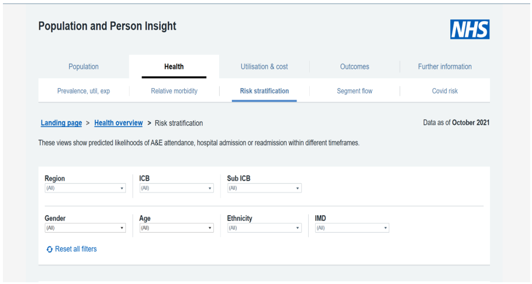
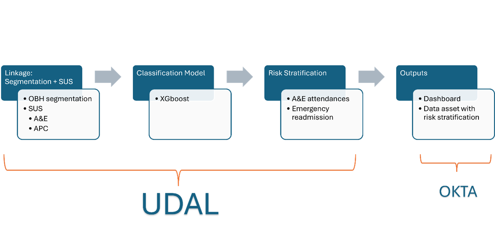

## **About PaPI**

The PaPI (Population and Person Insights) project aims to review, improve, and update the risk stratification models used in PaPI dashboards. These dashboards provide critical insights into health and care services by analysing person-level linked data, including the National Bridges to Health Segmentation Dataset. The project specifically focuses on the "risk stratification" view - predicting the likelihood of:

- A&E attendance (Type 1 departments) within 12 months
- Emergency readmission within 12 months
- Emergency readmission within 30 days

The goal is to improve the accuracy and relevance of these risk predictions, which are currently based on pre-COVID data from 2019, by retraining the models and data pipelines following a platform migration (NCDR to UDAL). This will enable national, regional, and local health and care systems to better understand and manage population health risks.

<figure markdown="span">   <figcaption>Papi Dashboard</figcaption></figure>
 

## **Why PaPI?**

PaPI offers a modern, data-driven approach to understanding population health data, enabling national, regional, and local systems to:

- **Predict and Prevent Risks:** Identify high-risk individuals and cohorts to reduce avoidable admissions and improve outcomes.
- **Support Evidence-Based Decisions:** Equip clinicians, senior leaders, and policymakers with insights tailored to their needs, ensuring informed and effective decisions.
- **Enhance Resource Efficiency:** Optimise financial and operational planning through accurate forecasting and stratification models.
- **Align with NHS Priorities:** Drive preventive care initiatives, service recovery efforts, and trust-level benchmarking to meet national healthcare objectives.

This project puts patients at the centre to ensure they receive the best care and outcomes, which is our major goal in the NHS as everything we do is for our patients. By predicting the likelihood of a patient (or multiple patients) attending A&E, we can prepare adequately to provide thereby improving resource allocation. Our risk stratification approach aids in planning and prioritizing resources to meet patients’ needs. Doing Risk Stratification aligns with the NHS’s preventive care objectives.

## **What we did – Risk stratification modelling**
<figure markdown="span">   <figcaption>Risk Stratification Modelling</figcaption></figure>

### **Data**

The data comes from two datasets, SUS and OBH Segmentation. This is pseudonymised person-level data, covering multiple sources (SUS, APC, outpatient, A&E, ECDS, community services, and mental health) from 2008 to 2023. The segmentation dataset splits the population into eight main groups (i.e., healthy, long-term conditions, serious disability, incurable cancer, organ failure, frailty/dementia, maternal and infant health and acutely ill).

For the modelling we are using features like demographic, details like age, gender, and ethnicity are included, alongside membership in the Bridges to Health (B2H) segment. We also factor in over 50 medical conditions (for instance, Asthma, Atrial_Fibrillation, COPD, and Diabetes) and information on previous healthcare activity, such as the number of A&E attendances.

### **Methods**

- The initial phase focuses on establishing baseline performance metrics. The entire dataset, combining all segments, is utilized with the original set of features. Four machine learning models—Logistic Regression (LR), Support Vector Machine (SVM), Random Forest (RF), and XGBoost (XGB)—are tested using basic class balancing strategies (1:1 and 1:2) with no hyperparameter optimization applied

- We then modelled for the six population segments as to assess performance differences across various subgroups. A minimal feature set is used, and the same four algorithms (LR, SVM, RF, XGB) are applied using the previously established balancing strategies (1:1 and 1:2). Stratified cross-validation ensures robust evaluation. Similar to Phase 1, no hyperparameter optimization is performed.

- In phase 3 we aim to refine the feature set for improved model performance. For poorly performing segments, tailored features may be added, and irrelevant features identified through segment overlap analysis or low importance rankings (e.g., using RF and XGB feature importance) may be removed. Data quality insights, such as highly correlated features, are also considered. New features identified during data exploration are integrated, and techniques such as Principal Component Analysis (PCA) may be employed for dimensionality reduction.

- The phase 4 focuses on fine-tuning the top two performing models from Phase 2 to achieve optimal performance. Hyperparameter optimization is conducted using stratified cross-validation and the best class balancing ratio (1:1 or 1:2) identified in earlier phases. The goal is to evaluate and quantify improvements in model performance due to optimization, ensuring the models are both accurate and efficient.

- The final Phase emphasizes model interpretability and explainability. SHAP (Shapley Additive Explanations) values are used to understand how features influence predictions, providing actionable insights. The best-performing model for each segment is selected based on performance metrics and explainability. This phase ensures that the models are not only accurate but also transparent, enabling informed decision-making.

## **Key Exploitable Results (KERs) & Benefits**

The Key Exploitable results of a project is an identified main interesting result, which has been selected and prioritized due to its high potential to be “exploited”. 

We have identified various KERS which can be useful to other teams, they are listed below:

- **PaPI Ways of working:** (agile methods, environment, ethics, quality processes): Demonstrates how applying the QAF and other project management/coding best practices can help organize a project effectively.
- **Code Carbon Library Integration:** Tracks CO₂ emissions when training models, serving as a benchmark for monitoring environmental impact. The code is publicly available on GitHub and can be replicated by others. 
- **Risk Stratification Data Asset:** helps to understand and manage population health risks, contributing to Population Health Management initiatives

## **Ethical Considerations & Compliance**

We have considered ethical requirements and ensured compliance with NHS policies, prioritising fairness and transparency. 

## **What’s Next?**

The Papi Project is currently in the phase 4. We have refined the feature set for improved model performance. For poorly performing segments, new features are being added, and irrelevant features identified through segment overlap analysis or low importance rankings (e.g., XGBoost feature importance ‘gains’) are being removed. Data quality insights, such as highly correlated features, were also considered.

_Project summary last updated 12/02/2025 by Michelle Nwachukwu_ 

#
