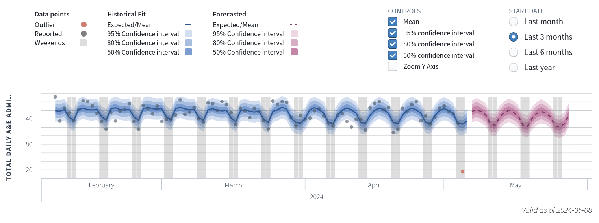
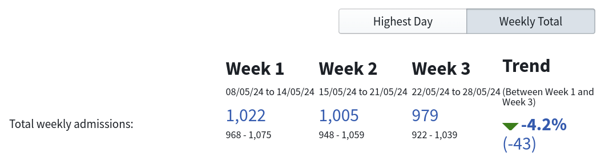
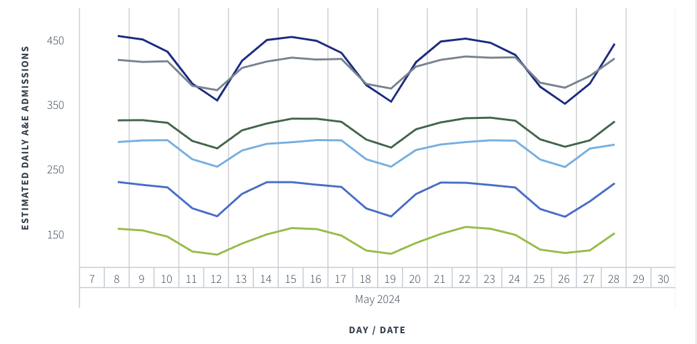

The A&E forecasting tool models historical data from A&E departments to forecast likely admissions numbers over the coming days up to three weeks in advance. This is a probabilistic model, which provides confidence intervals within which a given location's admissions numbers are likely to fall. Breakdowns are provided at the Country, Region, ICS, Trust, and Site level as well as broad age groups. The tool is intended to be used alongside local information to help trusts and ICSs plan and prepare for the demand placed on their services. 

Having this information can help departments, trusts, and ICS' plan and prepare for the demand placed on their services. Breakdowns are provided at the Country, Region, ICS, Trust, and Site level. Weekly trends are provided. 

Forecasts are created at the chosen level of granularity (site, region, and so on); and these show expected admissions numbers for the following three weeks. These forecasts come with different levels of specificity, and differing levels of confidence. Users can view different forecasts in this way. For example, the 95% confidence interval forecast makes a less specific prediction than the 50% CI forecast, but as such the predictions made here are more likely to be correct. 

If looking at a higher level of granularity, such as region, a breakdown of constituent locations is shown comparing their forecast admission rates[^1].

[^1]: Here the different lines correspond to different ICBs within a region. We have intentionally omitted the legend from this example, since the we are aiming to illustrate the functionality of the tool, and not to provide information about particular forecasts at particular site. 

The tool uses a Bayesian hierarchical time series forecasting model that is inspired by Facebook's ['prophet' model](https://github.com/facebook/prophet) and uses Monte Carlo Markov Chain (MCMC) technique to infer model parameters. Since the model can be decomposed into components, these component-level breakdowns are also provided to users in the dashboard to help explain the contribution of each component to forecasted admission numbers.

We provide links to relevant guides, documentation, and tools below.

### Links

Note that some of the following links are hosted on the Future NHS website, which requires an account and is not open to the general public.

Links| Accessible By |
---|---|
[User Guide](https://future.nhs.uk/nationaldataplatformfoundry/view?objectID=121110405)| NHS Staff |
[Product](https://nhs.sharepoint.com/:w:/r/sites/datasciencerepository/Shared%20Documents/General/03%20Doing%20the%20work/06%20Other/FDP%20Transition/Product%20Documentation%20A%26E%20Admissions%20Forecasting%20Tool.docx?d=w38397884e8a94be89e45bcc338458b99&csf=1&web=1&e=LCbt5S)| NHS Staff|
[Prophet Forecasting Repo](https://github.com/facebook/prophet)| Public |
[Accessible lecture on MCMC modelling methods](https://www.youtube.com/watch?v=rZk2FqX2XnY&ab_channel=RichardMcElreath)| Public|

[comment]: <> (The below header stops the title from being rendered (as mkdocs adds it to the page from the "title" attribute) - this way we can add it in the main.html, along with the summary.)