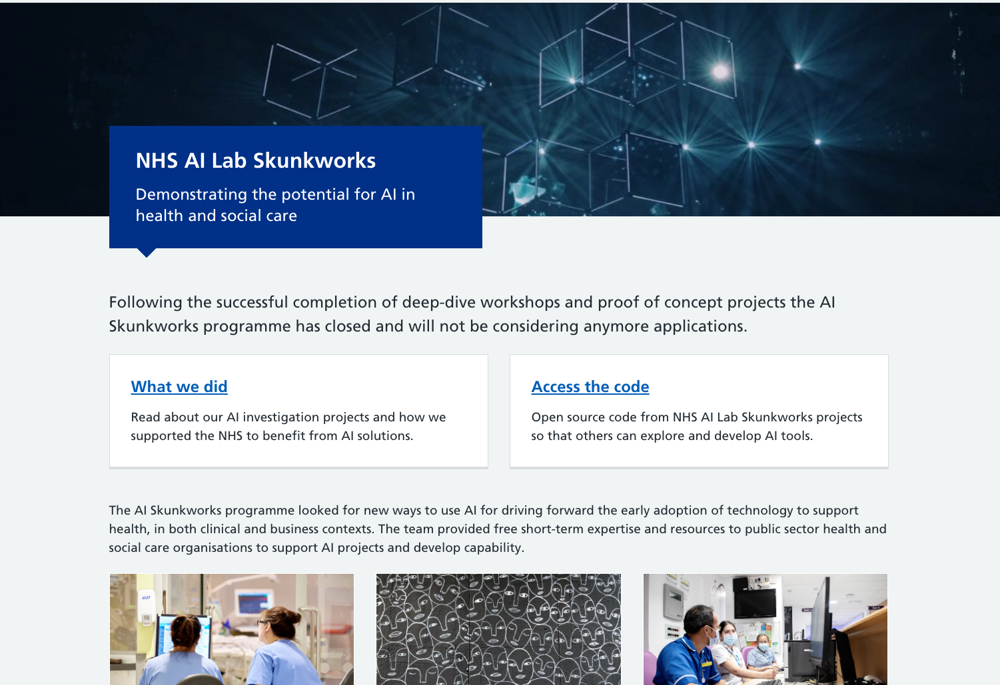

The [AI Skunkworks programme](https://nhsx.github.io/skunkworks/) was part of the NHS AI Lab. It finds new ways to use AI for driving forward the early adoption of technology to support health, in both clinical and business contexts. The team provides free short-term expertise and resources to public sector health and social care organisations to support AI projects and develop capability.

The programme was closed to new projects at the end of 2022. This website captures the findings, source code, and lessons of its activities.

## How we work

The NHS AI Lab Skunkworks team was built around the idea of short-term, rapid projects, aiming to investigate the use of AI for improving efficiency and accuracy in health and care.

The programme aimed to facilitate a robust conversation around uses of AI in health and care, encouraging the community of healthcare AI practitioners share and discuss their experiences, documenting the findings and releasing any open source code produced.

The Skunkworks' vision is that organisations in the health and care system will be able, through practical experience, to understand, build, buy, deploy, support, and challenge AI solutions. In order to achieve this, we have mostly ran projects in three ways, all centred around the idea of **co-production**:

### 1. Internal

Utilising our internal team of data scientists and data / technology leads, we are able to run small agile projects that may involve one-to-one coaching in the use of python and machine learning frameworks, through to data discoveries to help assess whether the data your organisation possesses is suitable for an AI approach.

### 2. Short term resource

We are able to sponsor individual contractors provided through the [Public Sector Resourcing framework](https://www.publicsectorresourcing.co.uk/) to assist in the conception or implementation of AI solutions for your organisation.

### 3. With a supplier

Partnering with the Home Office's [Accelerated Capability Environment (ACE)](https://www.gov.uk/government/groups/accelerated-capability-environment-ace), we are able to sponsor 12 week agile projects using a pool of cutting edge AI suppliers.

Health and care organisations can submit their proposed AI problem, and we will work with ACE to select and manage a supplier to deliver an AI proof of concept.

These projects culminate with:

* Working code, published under an Open Source license on Github
* A technical report, detailing methodology and findings

**Co-production** means that regardless of the project and the presence or absence of external contractors and partners, we would always work in a collaborative way, by bringing everyone involved around the table: data scientists, data engineers, experts of ML techniques, ethicists, regulation advisers, clinical and non-clinical NHS colleagues, and so on. The in-house AI Skunkworks team would always provide the steering and technical scrutiny to the project.

### Capability building

We also provide ad-hoc support, advice and education through initiatives such as our AI Deep Dive workshops, bringing an organisation through the opportunities and challenges of using AI, with an open mind about its implications and issues.

## Get in touch

As of 2023, you can still reach us via email at [england.aiskunkworks@nhs.net](mailto:england.aiskunkworks@nhs.net)

[comment]: <> (The below header stops the title from being rendered (as mkdocs adds it to the page from the "title" attribute) - this way we can add it in the main.html, along with the summary.)
#
