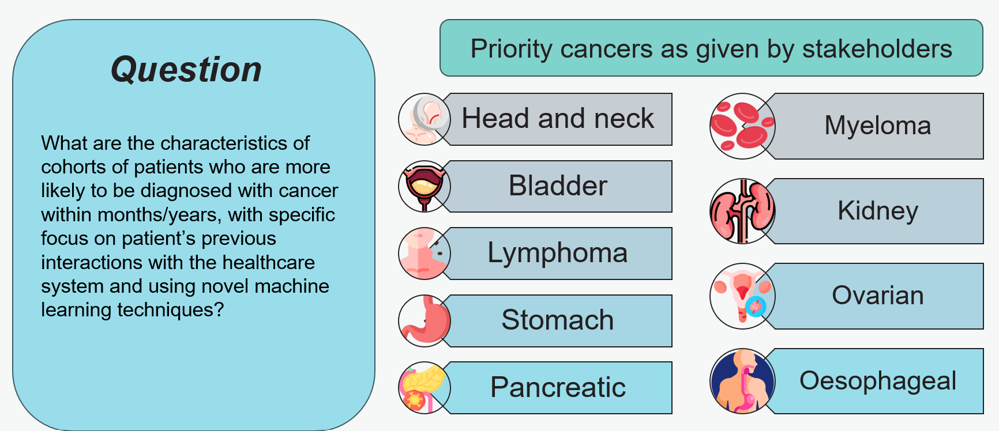

Identification of cohorts at higher risk of cancer can enable earlier diagnosis of the disease, which significantly improves patient outcomes. In this project, we use machine learning to predict cancer diagnosis in the next year. We select nine cancer sites with high incidence of late-stage diagnosis or worsening survival rates, and where there are currently no national screening programmes. We use National Health Service (NHS) data from medical helplines (NHS 111) and secondary care appointments from all hospitals in England. We present an approach of constructing cohorts at higher risk of cancer based on feature importance and considering possible bias in model results. These outputs can be used to develop highly targeted case finding services, which could help increase earlier detection rates and reduce health disparities.

## Results

A dataset comprising 23.6 million individuals aged between 40 and 74 in England was compiled, integrating various datasets including the National Bridges to Health Segmentation Dataset, Secondary Use Services (SUS) data, Emergency Care Data Set (ECDS), NHS 111 calls data, as well as ONS mortality data. Features capturing healthcare interactions (e.g. number of 111 calls, number of hospital attendances), demographic, socioeconomic, and clinical diagnosis variables were developed.

[comment]: <> (The below header stops the title from being rendered (as mkdocs adds it to the page from the "title" attribute) - this way we can add it in the main.html, along with the summary.)
#
