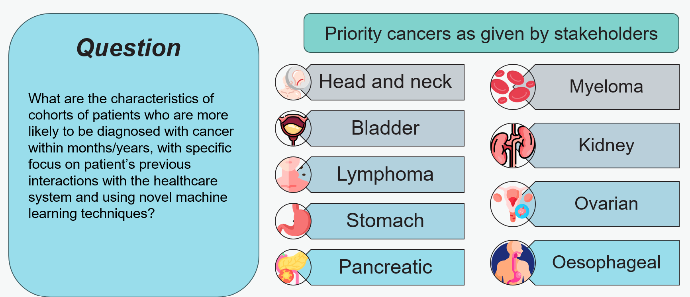
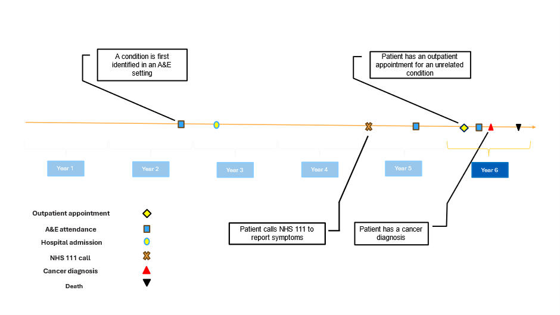
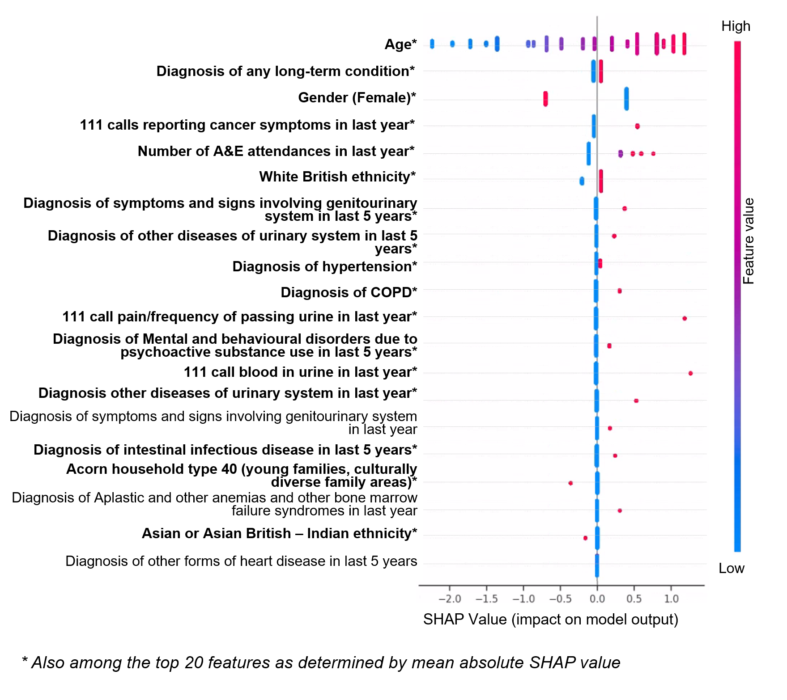

Identification of cohorts at higher risk of cancer can enable earlier diagnosis of the disease, which significantly improves patient outcomes. In this project, we use machine learning to predict cancer diagnosis in the next year. We select nine cancer sites with high incidence of late-stage diagnosis or worsening survival rates, and where there are currently no national screening programmes. We use National Health Service (NHS) data from medical helplines (NHS 111) and secondary care appointments from all hospitals in England. We present an approach of constructing cohorts at higher risk of cancer based on feature importance and considering possible bias in model results. These outputs can be used to develop highly targeted case finding services, which could help increase earlier detection rates and reduce health disparities.

## Results

A dataset comprising 23.6 million individuals aged between 40 and 74 in England was compiled, integrating various datasets including the National Bridges to Health Segmentation Dataset, Secondary Use Services (SUS) data, Emergency Care Data Set (ECDS), NHS 111 calls data, as well as ONS mortality data. Features capturing healthcare interactions (e.g. number of 111 calls, number of hospital attendances), demographic, socioeconomic, and clinical diagnosis variables were developed. 

### Patient pathway

Our patient histories cover six years between 2016-2022. We use the first 5 years of the patient histories to predict cancer diagnosis in year 6. We focus on nine cancers (bladder, head and neck, kidney, lymphoma, myeloma, oesophageal, ovarian, pancreatic, and stomach), which are associated with a high proportion of late-stage diagnoses (stage III and IV) or worsening survival rates in England, and don’t currently have screening programmes. 

### Feature importance 

For each cancer site we identified which factors are most important for predicting those at high risk of developing cancer. As an example, we show the results for bladder cancer. In the figure below we show the SHAP values for the top 20 features (our models include more than 800 features in total) – ordered based on the gain metric (the average gain across all splits where the feature is used) for our model. SHAP calculates the contribution of each variable to the model predicted probability output. The red colour indicates higher values for the selected feature, and a positive SHAP value means an increase in the risk of cancer. For example, higher age (red colour) has overwhelmingly positive SHAP values, which means that higher age is predicting higher risk of bladder cancer in the next year. 

We observe that beyond age and gender, several comorbidities appear as relevant predictors of a bladder cancer diagnosis in ways that are consistent with expectations based on the medical literature. For example, the presence of chronic obstructive pulmonary disease (COPD) and urinary infections is associated with the incidence of bladder cancer in previous research.

In addition, several features drawn from the NHS 111 calls dataset appear to be good predictors of bladder cancer incidence. For example, higher number of calls to NHS 111 lines reporting cancer related symptoms is one of the features with the highest gain metric value (just below demographics and long-term condition status). In addition, we also see that features capturing specific symptoms that are plausibly related to undiagnosed bladder cancer are also relevant and have the expected direction of effect. Specifically, higher number of calls to NHS 111 lines reporting “pain and frequency of passing urine” or “blood in urine” (during the last year) are both relevant predictors of risk of being diagnosed with bladder cancer in the next year. 

### Cohort construction

We select relevant features based on feature importance and data availability. The most important features, which were in the top 20 of model gain and SHAP value, were selected. SHAP was also used to identify the direction of the feature. Features which had a positive impact on the model output (i.e. which tended to increase the risk if the feature was present) were selected. This method has been applied to the whole population, and to sub-groups of demographic strata, demonstrating how the approach can be used for targeted screening, as shown in the figure below. 

In the table below, we show  examples of such curated cohorts based on combinations of just two features among those that the model considers as high importance for predicting cancer incidence in the next year. We define a lift value as the ratio of the cancer incidence within the cohort to the baseline cancer incidence. The baseline cancer incidence in our case, refers to those aged between 40-74 with no previous cancer diagnoses.

The cohort with highest cancer incidence, and a size of at least 10,000, is constructed based on interactions with the 111-call service and includes a specific bladder cancer related symptom of blood in urine. This cohort has a cancer incidence of 1 in 82, compared to 1 in 3355 in the study population. This means the cohort has a lift value of 41 - i.e. the cancer incidence within this cohort is 41 times higher than the overall incidence in the analysis population. 

Larger cohorts of high-risk patients are constructed with flags relating to comorbidities of the genitourinary system and other diseases of the urinary system. Applying these flags to the population results in a cohort size of approximately 100,000 individuals, with a cancer rate 6 times higher than in the overall study population. An example of a larger cohort of ~290,000 individuals would be constructed by applying the filter of patients having at least one long-term condition, and a diagnosis relating to symptoms and signs involving the genitourinary system in the last 5 years. This results in a cohort with a lift value of 4.5. 

|Feature combination|Population size|Incidence in cohort (%)|Lift value
---|---|---|---
At least one call reporting cancer related symptoms in last year AND at least one call reporting blood in urine in last year |16,700 | 1.2% | 41
Diagnosis of “Symptoms and signs involving the genitourinary system” (ICD10 R30-R39) in the last 5 years AND Diagnosis of “Other diseases of the urinary system” (ICD10 N30-N39) in last 5 years | 98,300 | 0.18% | 6
Has a long-term condition AND Diagnosis of “Symptoms and signs involving the genitourinary system” (ICD10 R30-R39) in the last 5 years | 290,000 | 0.14% | 4.5

### Consideration of bias in results

Machine learning models may be biased towards predicting higher risk for certain demographic groups, making the high-risk cohort non representative of the actual incidence of bladder cancer in the population. For example, the SHAP feature importance plots show that higher age, male, and white ethnicity all tend to increase the model risk score. This does correspond with higher incidence of bladder cancer in this group, however, given the low counts of bladder cancer among other demographic groups, it is difficult to ensure fair representation of all strata when constructing high-risk cohorts. 

We sought to mitigate this by segmenting the population into demographic groups to investigate if different sets of features can create higher risk cohorts across demographic strata. The segmentation was based on gender (male/female) and broad ethnicity (White/Non-white), resulting in four groups. Due to the low incidence of bladder cancer, more granular segmentation would have resulted in very small sample sizes. For each population segment, the same methodology as described above was applied, with the cohort with the highest incidence of cancer cases being identified. These decision rules were then applied to the test dataset to evaluate the efficacy of the cohort. The lift value was calculated based on the incidence of cancer for each stratum. 

|Demographic strata | Feature combination |	Cohort size | Incidence in cohort (%) | Lift value
---|---|---|---|---
Female – non white ethnicity | At least 1 A&E attendance in the last year AND diagnosis of a long term condition | 195000 | 0.01% | 2.9
Female – white ethnicity | At least one call reporting cancer related symptoms in last year AND at least one call reporting blood in urine in last year | 6800 | 0.8% | 47.5
Male – non white ethnicity | At least 1 A&E attendance in the last year AND diagnosis of COPD | 7000 | 0.07% | 4.9
Male –white ethnicity | At least one call reporting cancer related symptoms in last year AND at least one call reporting blood in urine in last year | 7600 | 1.9% | 36

For the white ethnicity group, features related to 111 calls are particularly effective in identifying high-risk groups. The specific nature of the symptom information (blood in urine) can result in small cohorts with lift values of 47.5 for white females, and 36 for white males. In contrast, for the non-white ethnic group, more general health factors (e.g. A&E attendance) and comorbidities (e.g. COPD) result in the highest risk groups. These cohorts are still significantly higher in cancer incidence compared to baseline rates for these populations, as shown by the lift values of 2.9 for females, and 4.9 for males. However, they are also significantly lower than the lift values obtained for the white ethnic group. This likely reflects health inequalities in the utilisation of services such as 111 calls. 

## Teams

This project is a collaboration between the NHS England Data Science, Strategic Analysis and Cancer Programme teams.

## Links

Output|Link
---|---
Constructing multicancer risk cohorts using national data from medical helplines and secondary care|[Pre-print](https://www.researchsquare.com/article/rs-5701032/v1)
Data Processing pipeline|[Github](https://github.com/nhsengland/cancer_foundry_data_modelling/)
Presentation at Health and Care Analytics Conference 2024|[YouTube](https://www.youtube.com/watch?v=Gxn-jj-jQu4)
Presentation at RPYSOC Conference 2024| [Youtube](https://youtu.be/5R7lx4FW7Z0?t=873)

[comment]: <> (The below header stops the title from being rendered (as mkdocs adds it to the page from the "title" attribute) - this way we can add it in the main.html, along with the summary.)
#
