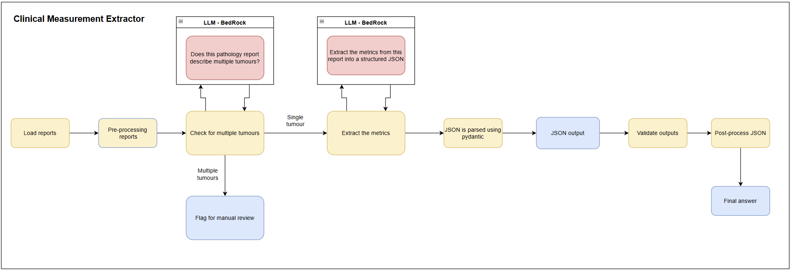
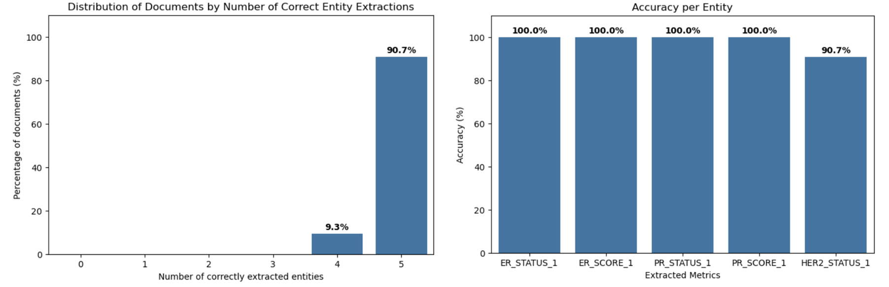
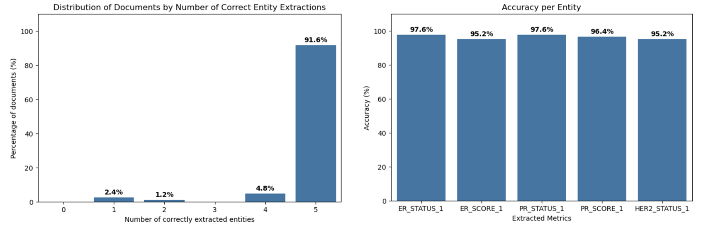

## About

The National Disease Registration Service (NDRS) processes hundreds of thousands of free text pathology reports every year where key metrics and information are manually recorded and logged. Given the increasing data quantities and lack of scalability of the current process, the use of Large Language Models to support the registration process could have a positive effect on efficiency and cost. By using an LLM for some of the more straight-forward information extraction tasks, registration staff time could be freed up to work on more complex cases, expand the range of metrics that are collected and reduce the time lag between receiving a report and information being logged.

This project is a proof-of-concept LLM-based named-entity extraction pipeline to extract clinical measurements from free-text pathology reports. This codebase is in Python, developed in Amazon SageMaker and uses Amazon BedRock to access LLMs.

This proof-of-concept project focusses on extracting measurements from breast cancer pathology reports. For simplicity we restricted the task to five metrics:

- ER Status
- ER Score
- PR Status
- PR Score
- HER2 Status

## Data

A sample of 500 breast cancer pathology reports were taken, with 300 reserved for prompt engineering and 200 set aside as an evaluation or hold-out set. The evaluation set consisted of data from two different time periods, the first 100 reports were from the same time range as the 300 records used in prompt engineering, the last 100 from a year later to assess how data drift may affect the results.

All data was anonymised by redacting all sensitive information such as names, locations and dates.

## Methodology

<figcaption>Figure 1: High-level steps of the LLM-based named-entity extraction pipeline</figcaption>

1. **Pre-processing reports**: Some simple cleaning steps on the free-text input data.
2. **Detecting multiple tumours**:
    * Prompt an LLM to identify reports that discuss multiple tumours.
    * Reports with multiple tumours don't progress further in the pipeline
3. **Entity-extraction**:
    * Prompt an LLM hosted on Bedrock to extract entities from free-text data:
        * Provide the model with the relevant guidelines and instructions to extract the metrics
        * Provide the model with the accepted values for each metric and the JSON structure to guide the response
        * Provide examples to the model to improve performance and to further guide the output structure
    * Parsing the output into a JSON/python dictionary and handling any incorrect structure accordingly
4. **Post-Processing**: 
    * Validating that the keys and values in the JSON structure are as expected
    * Certain values can be automatically mapped to the correct format
    * Some values can be inferred from other extracted metrics

## Evaluation Approach

We aim to evaluate the outputs of this work using multiple methods:

1. **Accuracy, Precision, Recall, and F1 Score** for each extracted entity, as well as each potential value from each metric to assess if performance differs across each one.
2. **Out-of-Distribution Performance Evaluation**: We will evaluate performance on a holdout set from both the same and a later time period to assess the impact of data drift.
3. **Ensemble/consensus approach**: We will get two different LLMs to do the same extraction and compare the agreement rate between them. We can then see if this approach improves the performance or provides more confidence in the final answer.

## Results

#### Performance achieved during prompt engineering:

| Dataset | Record count | Multi-tumour records flagged |
| ------ | -------- | -------- |
| Prompt engineering | 300 | 40 |

| Metric | % Correct |
| ------ | -------- |
| ER Status | 98.1 |
| ER Score | 98.5 |
| PR Status | 98.8 |
| PR Score | 100 |
| HER2 Status | 98.8 |

??? info "Graph View"

    
    <figcaption>Figure 2: Two bar charts showing the results from prompt engineering</figcaption>

#### Performance on evaluation datasets:

**Eval set 1:** Data from the same time period as the prompt engineering data  
**Eval set 2:** Data from a time period one year later than all other data

| Dataset | Record count | Multi-tumour records flagged |
| ------ | -------- | -------- |
| Eval set 1 | 100 | 14 |
| Eval set 2 | 100 | 17 |

| Metric | % Correct (eval set 1) | % Correct (eval set 2) |
| ------ | -------- | -------- |
| ER Status | 100 | 97.6 |
| ER Score | 100 | 95.2 |
| PR Status | 100 | 97.6 |
| PR Score | 100 | 96.4 |
| HER2 Status | 90.7 | 95.2 |

??? info "Graph View Evaluation Set 1"

    
    <figcaption>Two bar charts showing the results from the evaluation set (same time period as the prompt engineering data)</figcaption>

??? info "Graph View Evaluation Set 2"

    
    <figcaption>Two bar charts showing the results from the evaluation set (different time period)</figcaption>

### Outputs

| Output    | Link   |
| --------- | ------ |
| Public CME Repo   | [Github Repo](https://github.com/NHSE-NDRS/clinical_measurement_extractor_public)|

