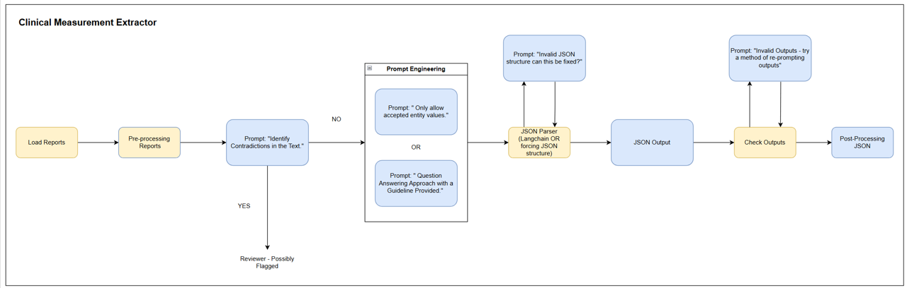

!!! warning

    This project is currently in development, and as such the following is subject to change.

## Aim

We are building an LLM-based named-entity extraction pipeline to extract clinical measurements from free-text data. This codebase is in Python, developed in SageMaker Notebooks, and is sending request to models hosted on BedRock.

## Methodology

<figcaption>Figure 1: High-level of the LLM-based named-entity extraction pipeline</figcaption>

1. **Pre-processing Reports**: Applying NLP techniques to reduce and clean free-text input data.
2. **Detecting Contradictions**:
    * Prompting an LLM to detect contradictions in free-text data.
    * Using NLP techniques to identify contradictions (STRETCH).
3. **Named-entity Recognition**:
    * Prompting an LLM hosted on Bedrock to extract entities from free-text data:
        * Providing the model with defined accepted values and proposed JSON structure to guide the response.
        * Using a question-answering approach guided by instructions to shape model behaviour.
        * Exploring the use of zero-shot and few-shot examples in prompts.
    * Parsing the output into a JSON structure.
4. **Post-Processing**: Validating that the keys and values in the JSON structure are as expected, and potentially applying further post-processing steps.

## Results

### Evaluation Approach

We aim to evaluate the outputs of this work using multiple methods:

1. **Accuracy, Precision, Recall, and F1 Score** for each extracted entity, as well as overall performance: This assesses the correctness of our approach. Ideally, we aim for high accuracy, followed by precision, then recall.
2. **Out-of-Distribution Performance Evaluation**: We will engineer prompts using a subset of free-text data from a specific time period, then evaluate performance on a holdout set from both the same and a later time period to assess the impact of data drift.
3. **Stratified Performance Evaluation**: We will analyse how metrics vary across different dimensions of the data to measure and mitigate potential biases introduced by the system.
4. **G-Eval**: Using an LLM to evaluate hallucinations, grounding of outputs, and to sense-check the correctness of extracted values.

### Outcome

TBD

#
