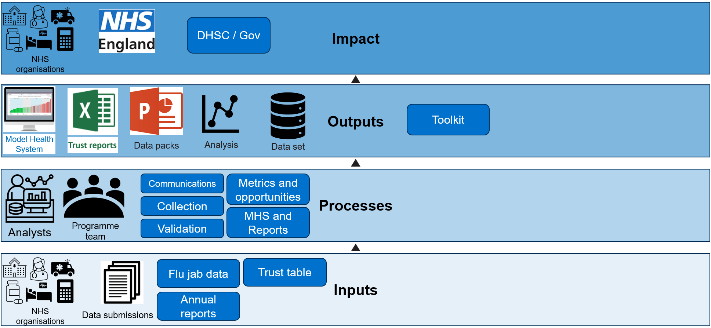

Proprietary (owned by a company) software can be valuable for data analysis tasks. It often comes with robust support, beginner-friendly interfaces and useful built-in features. However, it can be expensive, less flexible, and - most importantly - limits our ability to be transparent about our processes. 

Transparency is a key principle of the [Reproducible Analytical Pipeline (RAP)](https://nhsdigital.github.io/rap-community-of-practice/) guidelines promoted within NHS England. RAP encourages reproducibility, auditability, and openness in analytical work to build trust and support evidence-based decision-making.

In line with these principles, the analytical team supporting the Corporate Services programme engaged the Data Science team to help transition an existing automated process - previously built in proprietary software - into an open and transparent RAP-compliant pipeline.

Unlike typical RAP projects, which often involve replacing manual processes, this project focused on migrating a fully automated pipeline into an open-source environment. A key goal was to ensure the team could maintain and develop the pipeline independently going forward.

### Team Upskilling

To support this, upskilling the team was a central focus of the project. Group workshops were delivered using materials from the [Intro to Python Repository](https://github.com/nhsengland/rap_intro_to_python), developed by the Data Science RAP team to provide foundational Python skills. The workshops covered a range of topics, from terminal and Linux commands to loops, functions, and more advanced areas such as unit testing with `pytest` and editing Excel files using `openpyxl`.

Once confident, the team began work on a pipeline which ingested procurement data and turned it into usable metrics. Tasks were assigned using tickets, and team members worked in pairs to complete them, raising pull requests for peer review and making revisions based on feedback. This practical, hands-on approach allowed the team to apply new skills directly to real data and see immediate results. The pipeline built by the team is now live in production.

### Corporate Services Python Pipeline

The Corporate Services data pipeline processes data submitted by over 200 trusts on corporate functions such as HR, IT, and Legal. The data is validated, compiled, and used to calculate key metrics and benchmarks - including national medians and quartile-based opportunity values - based on the standardised distribution of values.

Once published, results are made available to trusts via the Model Health System, where outputs are visualised to support easy comparison and insights.

By the end of the project, the team will have a fully migrated data pipeline — covering extraction, validation, and analysis — and the skills to maintain and update it collaboratively. The reliance on proprietary software will have been removed, and in alignment with RAP principles, the project commits to publishing the pipeline code openly on the NHS England GitHub repository once complete.

### PowerPoint Pack Automation 

To support Regions and ICBs in accessing their data in a clear and consistent format, the team previously produced individual PowerPoint slide packs containing tailored tables and figures. This involved a time-consuming manual process of copying content from Excel to produce outputs for 8 Regions and 42 ICBs.

This task was automated using the `python-pptx` package, paired with a pre-formatted PowerPoint template. The automation fills in each slide with the correct data and formatting, significantly reducing manual workload and saving the team over a week of repetitive effort.

#
