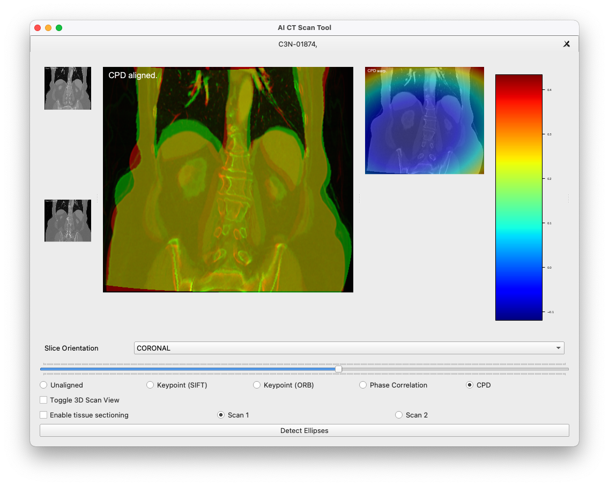

As the successful candidate from the AI Skunkworks problem-sourcing programme, CT Alignment and Lesion Detection was first picked as a pilot project for the AI Skunkworks team in April 2021.

## Results

A proof-of-concept demonstrator written in Python (user interface, classical computer vision models, notebooks with machine learning models).

## Case Study

This is a backup of the case study published [here](https://webarchive.nationalarchives.gov.uk/ukgwa/20241101055214/https://transform.england.nhs.uk/ai-lab/explore-all-resources/develop-ai/using-ai-to-identify-tissue-growth-from-ct-scans/) on the NHS England Transformation Directorate website.

George Eliot Hospital approached the NHS AI Lab Skunkworks team with an idea to use AI to speed up the analysis of computerised tomography (CT) scans.

CT scans are used in the detection and understanding of disease. Radiologists currently manually compare two CT scans, taken at different dates, to see whether a patient’s disease has improved, deteriorated or remained unchanged.

This 12-week project investigated the AI techniques that could be applied to the problem and sought to provide a proof of concept (a feasibility study) about whether it was possible to identify organs and growths, report on any changes and highlight areas of concern to the radiologist.

### Overview

There are a number of challenges for radiologists reviewing cancer patients by comparing CT scans:

- Review is time-consuming. It typically takes 30 to 40 minutes to assess scans for each patient.
- They must check if there has been growth through multiple dimensions, but can only check one dimension at a time. Growth changes that look minimal in one dimension may be significant if viewed in 3D.
- The manual alignment of images is not precise because of variations in the position of the patient’s body between scans.
- It is not easy to see small or developing growths, increasing the possibility of missed detection. In the abdomen, for example, radiologists are reportedly making differing interpretations in up to 37% of cases. (Siewert, 2008)

The NHS AI Lab Skunkworks funded and supported an AI investigation with the team at George Eliot Hospital, alongside Roke, an AI specialist supplier provided through the Home Office’s [Accelerated Capability Environment (ACE)](https://transform.england.nhs.uk/ai-lab/explore-all-resources/develop-ai/using-ai-to-identify-tissue-growth-from-ct-scans/#who).

The work looked at whether AI could be used to identify features in a CT scan and automatically align images to provide radiologists with a quick, trustworthy support tool that would improve early detection and diagnosis of growths and improve patient outcomes. The team aimed to:

- provide fast, automatic overlay of scans to enable tissue growth comparison in 2D and 3D
- successfully align scans despite changes in body shape (caused by breathing during scanning, or weight gain and loss between scans)
- identify different parts of the body (bone, organs and tissue growth)
- automatically measure tissue growth, in 2D and 3D
- detect anomalies (new growths or changes not present in previous scans)

### What we did

#### Tissue sectioning

Before detecting anomalies, the tool needs to separate the various types of tissue present in a scan (bone, fat, organs). The team first tried the recently released Facebook self-supervised learning method “DINO”, but found that this method was less accurate on CT scans than other approaches and required large amounts of memory to process. Instead, the team proceeded with a texton approach. Textons are micro-structures in images, or ‘groups’ of pixels, that can be recognised visually before the whole image is.

The process involved applying machine learning (where an algorithm gradually improves its accuracy through repeated exposure to new data like scans and images) to the use of textons. This method was able to identify and differentiate between different tissue types accurately and rapidly.

#### Anomaly detection

Much like the process humans take in distinguishing between objects, classifying them and sorting them by size, computer vision takes an image input and gives output in the form of information, for example on size or colour. To detect anomalies, the team tried two methods: ellipsoid detection and infill prediction.

Ellipsoid detection aims to isolate rounded 3D volumes of tissue, which were expected to correlate with lesions more strongly than other geometric shapes and identify those which differ from their surroundings. Infill prediction aims to learn what the parts of an image should look like in order to recognise anomalies that shouldn’t be there. A combination of the two methods was found to be the most accurate at detecting lesions, while manually ignoring anomalies that aren’t of concern, for example pockets of air inside the body.

#### Scan alignment

As well as automatically detecting lesions, the project was designed to keep a ‘human in the loop’ and act as a support for radiologists conducting examinations. To do this, three methods were tested for aligning two scans from the same patient, usually taken months apart, in 2D and 3D: keypoint alignment, phase correlation and coherent point drift. Phase correlation was found to be the most robust but did not deal with body shape changes, while coherent point drift was most effective for aligning scans while taking into account any body shape changes.

The tool allows the user to choose which of the three adjustment options provides the best alignment for each case.

### Outcomes and lessons learned

The hoped-for benefits of the project have had some partial successes:

#### Scan alignment

The team achieved both rigid and non-rigid 3D alignment that were an improvement on manual alignment but not perfect. The methods used to deal with difficulties caused by patients inhaling or exhaling during scanning were observed to work in most cases.

#### Overlay

Precise overlay of scans was achieved in the tool created both for 3D and 2D images, including when zooming, rotating or panning the image.

#### New tissue growth detection

Anomaly sizes were measured in 3D but more work is needed for robust correspondence between existing lesions to measure change.3D to successfully aid the identification of new growths.

#### Time saving

Further development and testing is required to establish a reduction in radiologists’ time, but the tool provides a process that is less manual for radiologists.

George Eliot Hospital provided anonymised CT scans from 100 patients with tissue growths, and a number of marked-up scans to be used as “ground truth” data. In order to progress this work further, greater numbers of scans are needed to provide quantitative metrics of success.

Integration of novel image processing techniques with existing scanner software also needs to be explored to minimise friction in the workflow for radiologists.

Further exploration is also needed to identify and compare techniques and approaches that have already been tried by the medical imaging community.

### What next?

George Eliot Hospital and Roke have submitted a joint application for further funding through the AI Award to further test the tool and establish a rigorous evaluation ahead of any regulatory work that will be required to use the software in clinical workflow.

The team are testing these techniques against the latest techniques demonstrated as part of the Medical Image Computing and Computer Assisted Intervention ([MICCAI](http://www.miccai.org/)) conferences.

### Who was involved?

This project is a collaboration between NHSX, [George Eliot Hospital](http://www.geh.nhs.uk/), and [Roke](https://www.roke.co.uk/) who were selected through the Home Office’s [Accelerated Capability Environment](https://www.gov.uk/government/groups/accelerated-capability-environment-ace) (ACE). The AI Lab Skunkworks exists within the NHS AI Lab to support the health and care community to rapidly progress ideas from the conceptual stage to a proof of concept.

The NHS AI Lab is working with the Home Office programme: Accelerated Capability Environment (ACE) to develop some of its skunkworks projects, providing access to a large pool of talented and experienced suppliers who pitch their own vision for the project.

Accelerated Capability Environment (ACE) is part of the Homeland Security Group within the Home Office. It provides access to more than 250 organisations from across industry, academia and the third sector who collaborate to bring the right blend of capabilities to a given challenge. Most of these are small and medium-sized enterprises (SMEs) offering cutting-edge specialist expertise.

ACE is designed to bring innovation at pace, accelerating the process from defining a problem to developing a solution and delivering practical impact to just 10 to 12 weeks.

Roke is a long-established science and engineering organisation, providing AI and machine learning expertise and lending technical capabilities to projects with NHS AI Lab Skunkworks.

Output|Link
---|---
Open Source Code & Documentation|[Github](https://github.com/nhsx/skunkworks-ct-alignment-lesion-detection)
Case Study|[Case Study](https://webarchive.nationalarchives.gov.uk/ukgwa/20241101055214/https://transform.england.nhs.uk/ai-lab/explore-all-resources/develop-ai/using-ai-to-identify-tissue-growth-from-ct-scans/)
Technical report|[PDF](https://github.com/nhsx/skunkworks-ct-alignment-lesion-detection/blob/main/docs/NHS_AI_Lab_Skunkworks_CT_Alignment_Lesion_Detection_Technical_Report.pdf)
Video walkthrough|[YouTube](http://www.youtube.com/watch?v=QygOnGLcszk)

[comment]: <> (The below header stops the title from being rendered (as mkdocs adds it to the page from the "title" attribute) - this way we can add it in the main.html, along with the summary.)
#
