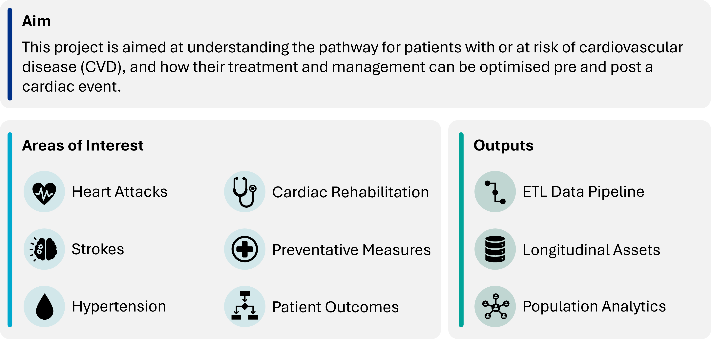
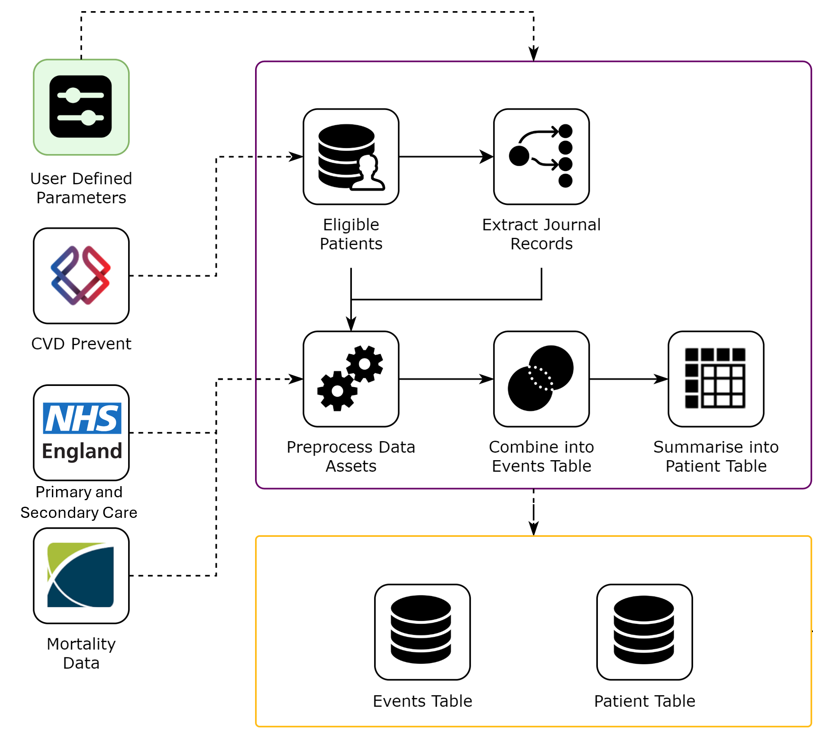
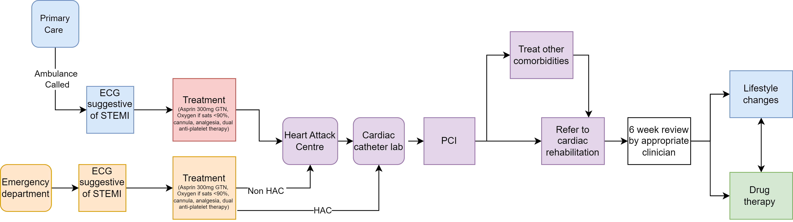

## About CVD Pathways

*Figure: Overview of the CVD Pathways project aims, areas of interest and outputs.*

Cardiovascular Disease (CVD) is a major health concern and has been identified in the [NHS Long Term Plan](https://www.longtermplan.nhs.uk/) as the single biggest condition where lives can be saved by the NHS over the next 10 years. Understanding the complete patient journey, from initial risk factors to outcomes, is required for effective prevention and treatment of CVD.

The CVD Pathways project addresses this by creating an Extract, Transform, Load (ETL) data pipeline, producing healthcare records for patients currently at-risk or having a high-risk of acquiring CVD. This pipeline links primary care data (from [CVDPREVENT](https://www.cvdprevent.nhs.uk/)) with secondary care data for over 16 million patients.

[CVDPREVENT](https://www.cvdprevent.nhs.uk/) is a national primary care audit focusing on six high-risk conditions for stroke, heart attack, and dementia:

* Atrial fibrillation (AF)
* High blood pressure
* High cholesterol
* Diabetes
* Non-diabetic hyperglycaemia
* Chronic kidney disease

This primary care data is then enhanced through linkage with key secondary care datasets, including:

* Mortality records
* Admitted patient care (hospitalisation episodes)
* Outpatient appointments
* A&E attendances
* Prescriptions dispensed in primary care
* Segmentation data (Bridges to Health)
* Specialised cardiac audits (e.g., [MINAP](https://www.nicor.org.uk/national-cardiac-audit-programme/heart-attack-audit-minap))

The result is an enriched, longitudinal view of patient health, paving the way for analytics in areas such as risk stratification, intervention effectiveness, and understanding multimorbidity in relation to CVD. This also builds upon the previous CVD Prevent Tool project ([cvd-prevent-tool](https://github.com/NHSDigital/cvd-prevent-tool/)), which feeds into the [insights generated as part of CVDPREVENT](https://data.cvdprevent.nhs.uk/insights) and the NHS Benchmarking teams.

Overall, this project aims to provide an enriched view of patient history, with the goal is to use these enriched assets to support further analytics, outlined in our “What’s next?” steps below.

## Why CVD Pathways?

Historically, analysing the complete patient journey for CVD has been challenging due to disparate data sources, and the lack of a "single source of truth" detailing a patient's history.

The CVD Pathways project was initiated to overcome this.

* **The problem:** Policymakers and clinicians needed a unified view of patient data to understand risk factors, track disease progression, evaluate interventions, and reduce the burden of CVD.
* **Our solution:** We developed a an ETL pipeline to create a linked asset, allowing for investigating and analysis to support clinical and policy decision makers.

This provides a powerful platform to:

* **Enhance Understanding:** Gain deeper insights into how CVD develops, how patients interact with the health system, and the impact on patient outcomes.
* **Inform Evidence-Based Decisions:** Equip clinical and policy teams with data to better understand prevention strategies and care pathways.
* **Improve Patient Outcomes:** By identifying high-risk groups and effective interventions earlier, we can contribute to reducing CVD-related mortality and morbidity.
* **Support National Health Priorities:** Directly align with NHS and Government goals to tackle cardiovascular disease, a leading cause of death and disability.

## What we did - ETL Data Pipeline

Our core work involved designing and implementing an ETL (Extract, Transform, Load) data pipeline. This automated process takes raw data from diverse sources and turns it into a structured, analysis-ready format.

### Data

As described above, we integrated data from the national **CVDPREVENT** audit (primary care) with secondary care datasets including hospital admissions, A&E events, outpatient appointments, mortality data, and prescriptions. This involved handling data for over 16 million individuals, linking together records spanning several years.

### Methods

A summary of our pipeline data-flow is shown in the figure below.

*Figure: Simplified overview of the CVD Pathways ETL data pipeline.*

The process involved several key stages:

1.  **Extraction:** Accessing and extracting pseudonymised data from the various source systems (e.g., CVDPREVENT, Civil registrations of deaths, SUS hospitalisations).
2.  **Transformation:** Processing of the raw primary and secondary care assets into patient events:
    * **Cleaning:** Standardising formats, handling missing values, and ensuring data quality.
    * **Linking:** Accurately linking records for the same patient across different datasets using pseudonymised identifiers. This creates the longitudinal patient record.
    * **Feature Engineering:** Deriving meaningful variables from the raw data. For example, calculating the time between specific events, or summarising a patient's history of certain conditions.
    * **Structuring:** Organising the transformed data into the analytical assets described below (Events Table and Patient Table).
3.  **Loading:** Producing the final analytical assets for use in further analytics.

We did this through the use of data engineering tools and techniques, primarily using Python/PySpark, Databricks and Azure. This was all done within NHS England's secure data environment, the Unified Data Access Layer (UDAL). The result of this is a scalable, reproducible pipeline. 

## Key Exploitable Results (KER) & Benefits

The primary output of this project is the creation of two powerful, linked analytical data assets. These assets are the foundation for a wide range of impactful analyses.

**Benefit 1: Longitudinal Patient Events and Records**

* **Output: The Events Table.** This long-format table details healthcare interactions and events for each patient chronologically (e.g., diagnosis, hospitalisation, prescriptions, death).
* **Impact:** For the first time, we can readily analyse end-to-end patient pathways, identify points for intevention and prevention, and understand sequences of events leading to CVD outcomes.

**Benefit 2: Enriched Patient-Level Profiles and Summaries**

* **Output: The Patient Table.** This wide-format table provides a single row per patient, summarising their demographic information, key characteristics, and aggregated history (e.g., total number of hospitalisations for stroke, presence of specific comorbidities).
* **Impact:** Enables risk stratification, identification of distinct patient cohorts, and analysis of factors associated with different CVD outcomes.

## Teams

This project is a collaboration between NHS England Data Science and CVDR Programme teams, in addition to the Office for Health Improvement & Disparities (OHID, part of Department of Health and Social Care).

## What's Next?

With the ETL pipeline and core data assets now established, the CVD Pathways project is moving into a phase of analytics. Key areas of focus will include:

*   **Risk Stratification:** Developing models to identify groups of patients at varying levels of risk for future cardiac events (e.g., heart attack, stroke).
*   **Time-to-First CVD Event Analysis:** Understanding the typical timeframe from a patient's first appearance in a high-risk cohort to their first major CVD event.
*   **Intervention and Prevention Analysis:** Comparing observed patient pathways against clinical guidelines to assess adherence to preventative measures and potential opportunities for improvement.
*   **CVD and Multimorbidity:** Investigating how co-existing conditions influence the development and progression of CVD.
*   **Survivability Analysis:** Analysing survival rates post-CVD event, stratified by risk factors and demographics.

As an example, we are analysing patient pathways, specifically looking at patient's who have had a ST-Elevation Myocardial Infarction (STEMI) heart attack. This is a type of heart attack that that affects the lower chambers, and is more severe and dangerous compared to other types of heart attack.

*Figure: Overview of clinical pathway for a patient who has a STEMI heart attack.*

These analyses aim to generate actionable insights for clinicians, policymakers, and public health initiatives to ultimately improve patient's cardiovascular health outcomes.We're also working on publishing our codebase as part of our guidelines around reproducibility and transparency.

## Links

Output|Link
---|---
Data Processing Pipeline (CVD Prevent Tool)|[GitHub](https://github.com/NHSDigital/cvd-prevent-tool/)

[comment]: <> (The below header stops the title from being rendered (as mkdocs adds it to the page from the "title" attribute) - this way we can add it in the main.html, along with the summary.)
#