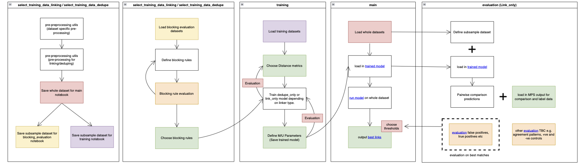

## Crafting a model that suits NHS England data linkage needs
This project aims at developing an alternative data linkage model to [MPS (Master Person Service)](./mps-handbook.md) by creating a [probabilistic linkage model](https://www.bristol.ac.uk/media-library/sites/cmm/migrated/documents/problinkage.pdf) using the package called  [Splink](https://moj-analytical-services.github.io/splink/index.html), which was developed by Ministry of Justice (MoJ) Data Science Team.

The linkage pipeline consists of a few steps:

- Pre-processing 
- Distance Metrics
- Blocking
- Training
- Prediction 
- Evaluation

Each of these steps requires research into linkage best practice, testing on samples of our data, feasibility studies of computational power required, and then thorough evaluation. We are working with an incremental improvement plan and a series of iterative MVPs to ensure that the pipeline has the highest quality we can achieve within our computational limits. 

We have also added additional configuration to the pipeline to allow for a deduplication task. This is in order to try and identify possible duplicate records in the [Personal Demographics Service (PDS)](https://digital.nhs.uk/services/personal-demographics-service).

Here is an overview of how our pipeline currently looks.

## Building a model with transparency in mind
Users of linked data have to rely on the accuracy of the process created by others as often the process of linking data is not under their control. That is why one of the main focus of the model we are building is transparency of the methods and explainability of the results.

[comment]: <> (The below header stops the title from being rendered (as mkdocs adds it to the page from the "title" attribute) - this way we can add it in the main.html, along with the summary.)
#

|Output | Link|
|---|---|
| Splink Linkage Pipeline * | [Github](https://github.com/NHSDigital/splink-linkage-pipeline) |

\* This is currently private and available for internal access only. 
