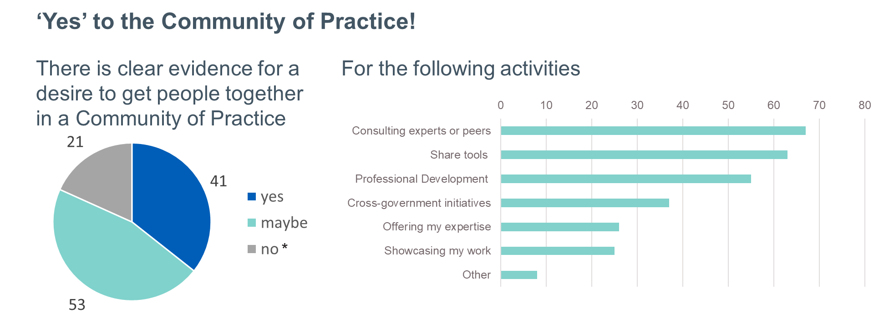

## Why do we want a Community of Practice?
In NHS England data linkage occurs at various stages of the data lifecycle, involving different stakeholders (from data engineers, to analysts) and happening across different platforms. There exist pockets of knowledge and expertise that operate independently of each others.
The Community of Practice wants to support Data Linkage stakeholders in NHS England to share their expertise and best practices with colleagues across the organisation. 
This is also in response to the Data Linkage Survey in which colleagues expressed a clear interest in cultivating a collaboration space.

## Data Linkage Community of Practice: Mission
The mission of our community of practice is to **facilitate collaboration and an exchange of knowledge, tools and innovative solutions** among data linkage stakeholders within NHS England and with and outlook onto other government and research institutions, enabling members to share and adopt effective practices. 

## How can I join?
You can request access by clicking [here](https://teams.microsoft.com/l/team/19%3A7AGd-QLqWT3CEPP2MGz_Zf7o4_aWQvIK2DoqjJm6L-01%40thread.tacv2/conversations?groupId=4fc6024c-60fe-4723-8aff-3d139f37b1ef&tenantId=37c354b2-85b0-47f5-b222-07b48d774ee3).
This Teams Channel is restricted to only NHS England employees.

## Data Linkage Champions Network
The CoP wants to connect closely with the Data Linkage Champions Network, a cross-government initiative created by the Government Data Quality Hub (DQ Hub) in the Office for National Statistics (ONS) to work better as a community to improve methods, their applications, and skills in the field of data linkage.
If you want to know more about this, go to the [Data Linkage Champions Network page](https://analysisfunction.civilservice.gov.uk/support/data-linkage/data-linkage-champion-network/).

[comment]: <> (The below header stops the title from being rendered (as mkdocs adds it to the page from the "title" attribute) - this way we can add it in the main.html, along with the summary.)
#
