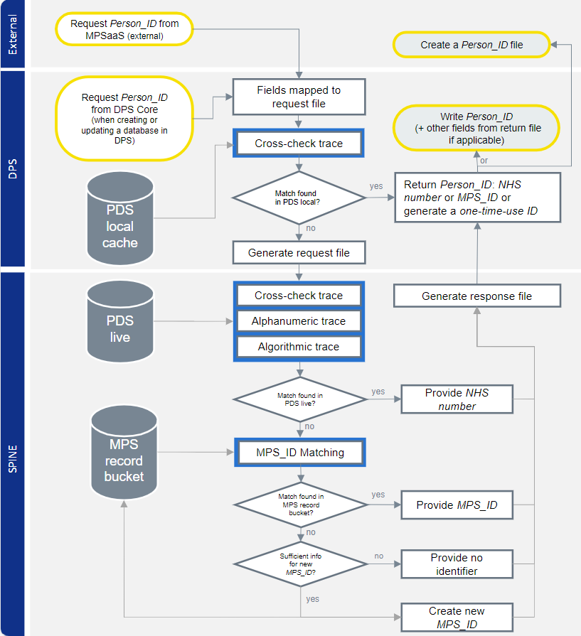

The Person_ID is a unique patient identifier used by NHS England with the objective of standardising the approach to patient-level data linkage across different data sets.
The Data Linkage team has produced a detailed documentation of the data linkage algorithm used to create the Person_ID, namely the Master Person Service (MPS).
The figure below is an overview of the process. The full documentation is available in [this NHS England site](https://digital.nhs.uk/services/personal-demographics-service/master-person-service/the-person_id-handbook). The MPS handbook particularly focuses on how this algorithm is applied to Hospital Episode Statistics (HES). 

To contact us about this work, email: [nhsdigital.personidquestions@nhs.net](mailto:nhsdigital.personidquestions@nhs.net)

|Output | Link|
|---|---|
MPS Diagnostics|[Github](https://github.com/NHSDigital/mps_diagnostics)
Person_ID Handbook | [NHS England Website](https://digital.nhs.uk/services/personal-demographics-service/master-person-service/the-person_id-handbook)

[comment]: <> (The below header stops the title from being rendered (as mkdocs adds it to the page from the "title" attribute) - this way we can add it in the main.html, along with the summary.)
#
