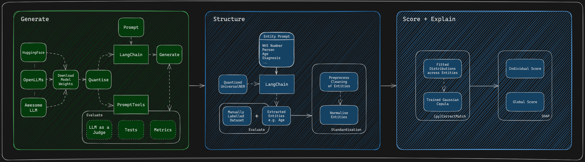

!!! warning

    This codebase is a proof of concept and is under constant development so should only be used for demonstration purposes within a controlled environment.

<figure markdown>

<figcaption>Figure 1: Diagram of the high-level overview of Privacy Fingerprint using open-source models. </figcaption>
</figure>

## Aim

To develop a modular tool to score the privacy risk of healthcare free-text data with open-source tools. 

## Background

This concept is built upon ["Building A Tool to Assess the Privacy Risk of Text Data"](./c399_privfinger.md) article, where ChatGPT-3.5 was used to generate synthetic unstructured data and [Amazon's AWS Comprehend Medical](https://aws.amazon.com/comprehend/medical/) was used to extract entitities contributing to re-idetification risk. 

In this project we use open source Large Language Models (LLMs) for generating synthetic unstructured data locally and open source named-entity reconginition (NER) models for extracting our entities. The next steps will be to develop a range of experiments so we can then assess the risk associated with various scenarios.

## Methodology

The current pipeline has been broken down into 6 components:

1. **Generating Synthetic Patient Data using Synthea**: Synthea-international is an expansion of [Synthea](https://github.com/synthetichealth/synthea), an open-source synthetic patient generator that produces de-identified health records for **synthetic** patients.
2. **Generating Synthetic Patient Medical Notes**: Utilizes [LLama2](https://llama.meta.com/) to generate **synthetic** medical notes.
3. **Re-extracting Entities from the Patient Medical Notes**: Utilizes [UniversalNER](https://universal-ner.github.io/), an open-source generative large language model, specifically trained to extract a range of entities when prompted with a list of entities you want to extract.
4. **Normalising Entities Extracted for Scoring**: This is a standardisation process to ensure that outputs coming out can be consistently assessed, i.e., dates are all formatted the same.
5. **Scores the Uniqueness of Standardised Entities Extracted**: [(Py)CorrectMatch](https://github.com/computationalprivacy/CorrectMatch.jl) is used to extract out information on the uniqueness of individual records, and the global uniquness across a whole dataset, by training a Gaussian Copula model on the data.
6. **Calculates SHAP Values from Tranformed Data generated from a Fitted Gaussian Copula Model**: SHAP (SHapley Additive exPlanations) is used to interpret and explain the results produced from (Py)CorrectMatch, which evaluates the uniqueness of data rows across a whole dataframe.

## Results

TBC

Output|Link
---|---
Open Source Code|<a href="https://github.com/nhsengland/privfp-experiments" target="_blank">Github</a>
Open Documentation|<a href="https://nhsengland.github.io/privfp-experiments/" target="_blank">Github.io</a>
Case Study| NA
Technical report|NA
Algorithmic Impact Assessment|NA
