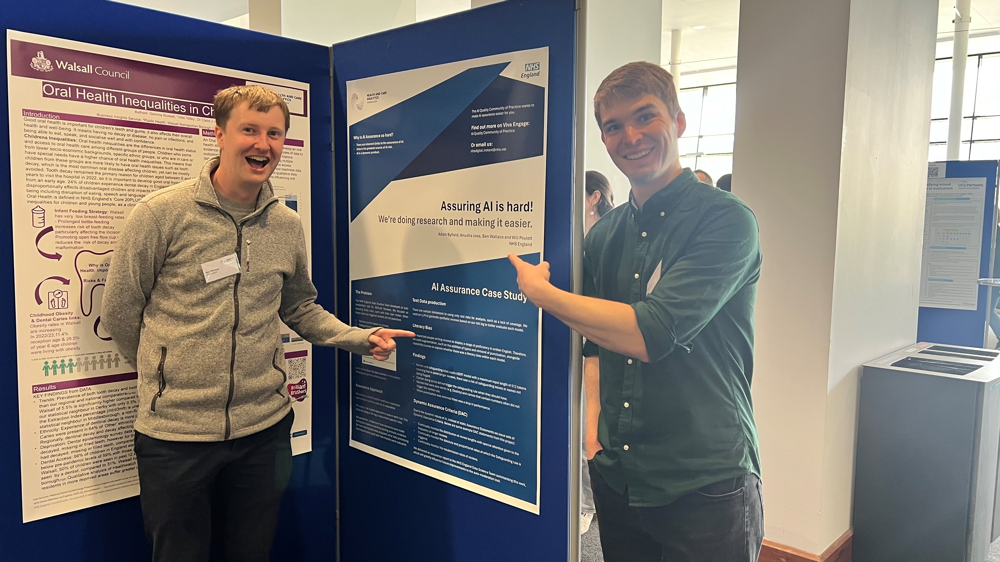

The NHS AI Quality Community of Practice (AIQ CoP) is a network of testing and assurance professionals dedicated to supporting the assurance of healthcare AI. While not an assurance function itself, the AIQ CoP provides guidance, resources, and advice to assist colleagues and organisations in navigating the complexities of AI assurance. While the project sits within NHS England, the remit of the AIQCOP is the whole of the NHS. 

The AIQCOP conducts cutting-edge research to address real-world challenges in AI assurance. Current research areas include boundary analysis in image classifiers, focusing on understanding and validating how AI models make classification decisions; bias in AI training data, investigating scenario and demographic biases to mitigate risks in model performance; literacy bias in chatbots and AI search systems, aiming to ensure equitable access for users with varying literacy levels; and exploring AI-driven automation of risk logs, test scripts, and test data generation. This work combines traditional assurance techniques with novel approaches to enhance the reliability and fairness of AI systems.

For years now the AIQCOP has relied on embedded Data Scientists from NHS England to help advise on the technical aspects of AI Assurance. 

Read our Mixup Assurance paper here:  - [Link to paper](https://arxiv.org/abs/2311.13978)

RISE is an experimental tool which can help assurers, data scientists and clinicians to evaluate Ai Classifiers, read more here: - [Link to blog ](https://nhsengland.github.io/datascience/articles/2024/12/12/RISE_tool/)  

*Will and Ben at the Health and Care Analytics Conference talking about AI Assurance*

Most information about the work in the Assurance Research Path appears on the AIQCOP sharepoint site, access may need to be requested to view.

[AI Quality Community of Practice](https://nhs.sharepoint.com/sites/X26_AssuranceCOE/SitePages/AI-&-Quality-Assurance.aspx?csf=1&web=1&e=HTahJY)

Alternatively you can always email us at: nhsdigital.instant@nhs.net

[comment]: <> (The below header stops the title from being rendered (as mkdocs adds it to the page from the "title" attribute) - this way we can add it in the main.html, along with the summary.)
#
