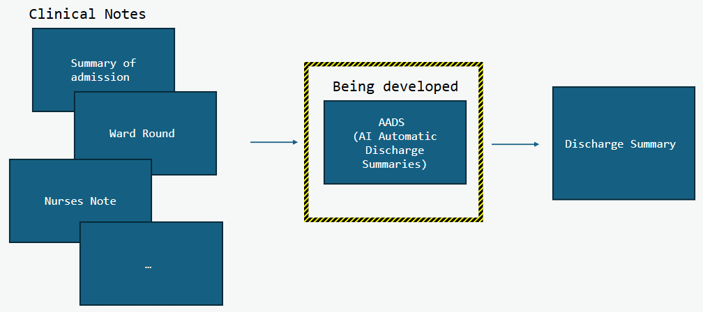
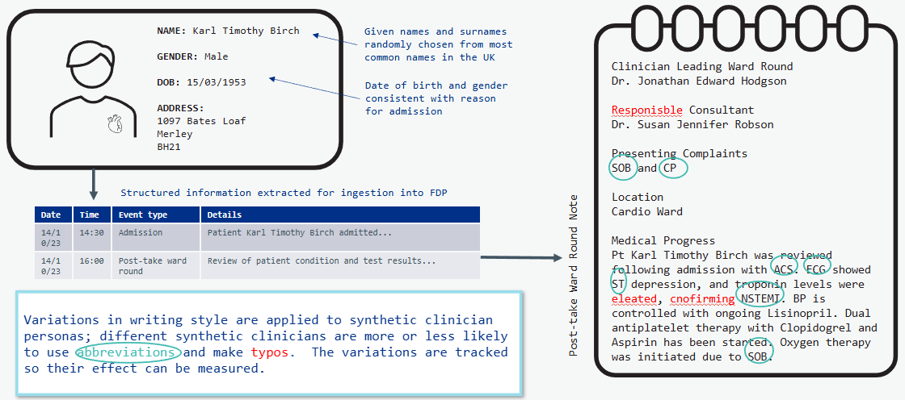

## What we are doing  

During a patient’s stay in hospital, various notes are written about them by the clinicians involved in their care. At the end of their stay, a clinician must write a discharge summary using these clinical notes. The summary communicates to the post-hospital care team what has happened to the patient during their hospital stay and their ongoing care plan.  

The manual process of writing this summary adds to clinicians’ workloads, and it can vary in quality. There is currently some work going on to develop an AI augmented discharge summary tool (AADS), which will automate some of this process using Large Language Models [LLMs]. 

Data governance processes have delayed the use of real data for the development of the AADS tool. The Synthetic Clinical Notes project aims to create a range of synthetic patient admissions and their corresponding clinical notes to facilitate the testing and development of AADS until the relevant data governance agreements are in place. The synthetic notes will continue to be used alongside real data once this is available.

## Why we are doing it 

Although there are open data sources containing anonymised clinical notes, they often have restrictive data usage agreements which exclude purposes other than scientific research. 

Furthermore, synthetic data allows us to introduce the kind of noise that might trip up the discharge summariser in the real world, but in a controlled way. Some examples of this kind of noise include typos, medical abbreviations, different writing styles, and contradicting diagnoses. 

Once the AADS tool is live, we can also convert real failure states into shareable synthetic test cases, giving us synthetic versions of real clinical notes which are challenging for the tool to adequately summarise. These synthetic versions could be compiled into an evaluation suite which could be shared between trusts alongside the AADS tool itself. 

The synthetic clinical notes are not intended for comprehensive assurance, and will be used in addition to real data, not as a replacement for it. 

## How we are doing it 

We have created a reusable pipeline within the NHS Federated Data Platform [FDP]. Our pipeline is made up of several useful building blocks: 

* To generate variation in patient demographics we reused our previous work on Developing Artificial Primary Care Records. This gives each of our fake patients a realistic name, gender and date of birth. 

* We use a list of common reasons for admission by age and gender to generate admission details for each synthetic patient. At this stage, we also generate some synthetic clinicians who will be involved in the patient’s care. 

* We insert the demographic and admission information into an LLM prompt and ask the LLM to generate a synthetic patient journey containing a series of events which are realistic for this type of admission. 

* For each event in the synthetic journey, we make a new LLM call to generate the clinical note corresponding to the event. We based the structure of the clinical notes on templates that are used by real clinicians. Depending on which synthetic clinician is writing the note, the LLM is given different style instructions (e.g. conciseness, use of bullet points, informal style etc). 

* To add further realistic noise to these notes, we insert typos and medical abbreviations. The rate of typos and medical abbreviations is dependent on which synthetic clinician is writing the note. 

* We validate the synthetic notes using additional validation LLM prompts. This is to ensure that the notes are faithful to the information contained in the synthetic patient journey. 

* We have also built an evaluation pipeline to facilitate iterative improvements to our clinical note generation pipeline. The evaluation makes use of several LLM-as-a-judge evaluators. 

## Results 

The diagram below shows an example synthetic patient called Karl Timothy Birch, admitted with chest pain and shortness of breath, and an example synthetic clinical note written about him by a synthetic clinician. If Karl were a real patient, this note would be fed into AADS along with others written about Karl during his hospital stay, and a clinician would use AADS to produce a semi-automated summary of the treatment Karl received. This summary would then be sent on to his GP and others involved in his onward care. We can use Karl’s synthetic clinical notes, alongside those of our other synthetic patients, to test AADS and uncover opportunities for improvement prior to testing on real data.

#