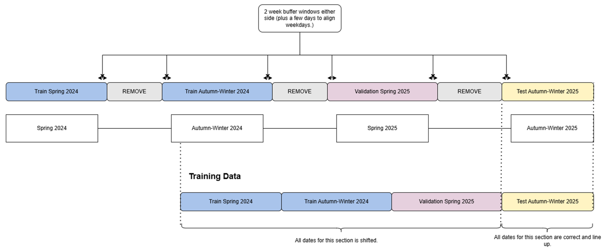
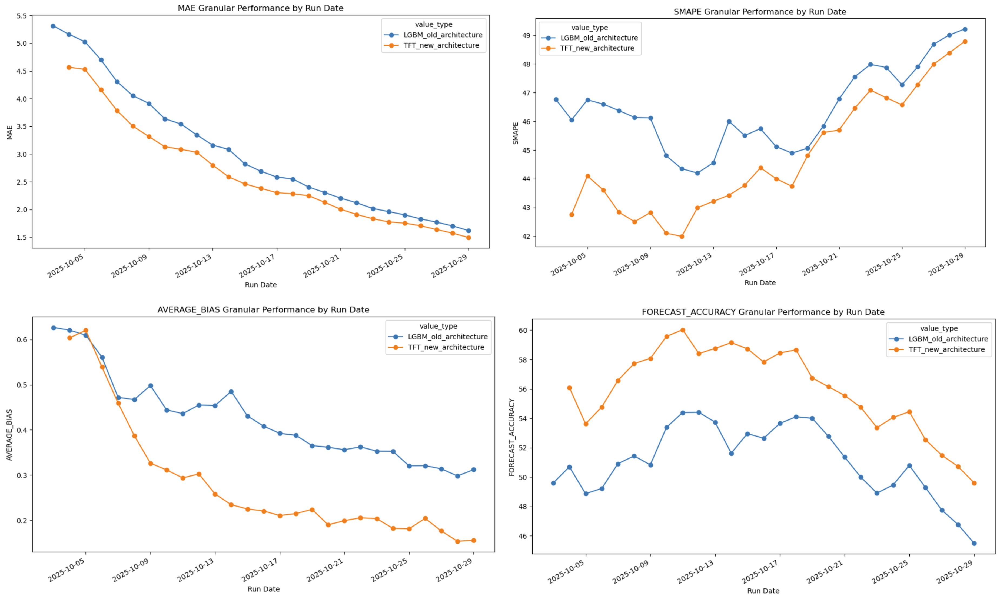
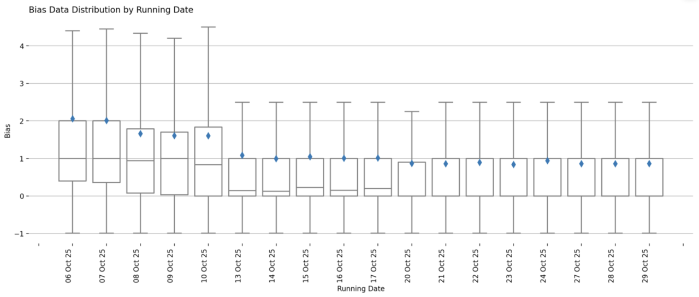

--- 

title: 'Forecasting Vaccination Demand' 

summary: 'Improving site-level demand forecasts within the Targeted Deployment Model (TDM) - a system that automates COVID-19 vaccine deliveries to 6,000 sites.' 

origin: 'NHS England' 

tags: ['FORECASTING', 'TIME SERIES', 'PUBLIC/POPULATION HEALTH', 'PYTHON' ,'MACHINE LEARNING', 'FDP', 'COMPLETE'] 

--- 

 

 

 

## About Forecasting Vaccination Demand 

 

This project focuses on improving site-level demand forecasting within the Targeted Deployment Model (TDM), a supply system used to automate the ordering and distribution of COVID-19 vaccines. 

 

NHS England funds COVID-19 vaccinations, creating a strong incentive to manage supply efficiently at a national level. The primary goal is to minimise wastage while ensuring that demand is consistently met with the right vaccine, at the right time with the correct quantity. Historically, many vaccination sites relied on manual ordering processes, which increased operational overhead and introduced variability in ordering decisions limiting the number of sites which can be onboarded.  

 

To address this, we enhanced the existing deterministic forecasting approach in TDM by developing a trained time series forecasting model. This new approach enables more accurate demand predictions and supports more efficient stock distribution. The project was delivered within the FDP Foundry platform, providing valuable experience to us as team in building and deploying time series models in this environment. 

 

The outcome of this work is a production-ready forecasting model that outperforms the previous deterministic method. The model has been implemented using Python within a Jupyter-based workflow and deployed in FDP. In addition, a monitoring dashboard built with Streamlit allows ongoing tracking of model performance, enabling data-driven decision-making and continuous improvement. 

 

--- 

 

## Problem 

 

The existing forecasting approach within TDM relied on deterministic logic, which limited its ability to adapt to changing demand patterns. 

 

A key limitation of this approach was its dependency on operational inputs such as booking data and slot capacity. This meant that if sites did not consistently provide this information, the model was unable to generate reliable demand forecasts. 

 

Overall, there was a need for a more flexible and scalable forecasting approach that could leverage historical vaccination behaviour to inform predictions. 

 

--- 

 

## Intended Benefit 

 

By introducing a trained time series forecasting model, this project aims to improve the accuracy of vaccine demand predictions at site level. This enables more precise allocation of stock, minimising vaccine wastage, and overall improving cost savings.  

 

Automating the forecasting and ordering process also reduces operational overhead, allowing teams to focus on higher-value activities and further system improvements. The inclusion of a monitoring dashboard provides transparency into model performance, supporting ongoing optimisation and informed decision-making. 

 

Overall, this work contributes to a more efficient, reliable, and scalable approach to vaccine distribution within the TDM framework. 

 

--- 

 

## Data 

 

The project uses data collected by the vaccination team. This dataset includes: 

 

1. **Vaccination events**: Number of vaccinations administered 

 

2. **Site ID:** The name of the site that recorded the vaccination events. 

 

3. **Date:** Date the vaccination events were recorded. 

 

4. **Booking signal information:** 

    * **booking_signal_flag:** A true or false value depending on whether a site provides booking information or not. 

    * **booking_signal_b_t+0 to booking_signal_b_t+14:** 15 columns on booking values known on a given date. For example, t+14 means for today what we know the booking value will be in 14 days time. 

    

5. **Slot Capacity:** The known capacity for the number of vaccinations a site can administer. 

 

6. **Date Information:** Weekday and presence of bank holidays 

 

7. **Days until the end of campaign:** The number of days until it's known that the campaign will end. 

 

--- 

 

## Methods 

 

We have trained a Temporal Fusion Transformer (TFT) model to predict vaccination events over a 15-day horizon (including the current day, and 14 days in the future.) The model was trained using a framework called [DARTs](https://unit8co.github.io/darts/generated_api/darts.models.forecasting.tft_model.html) which supports a range of time series forecasting models.  

 

### Features 

 

**Target** 

This is the value you are predicting for, so in this case it's vaccination events. The historical values of t-14 to t-1 will be fed into the model. 

 

**Past Covariates** 

These values are only known in the past. The number of inputs is determined by the input_chunk variable, so all values from t-14 to t-1 will be fed into the model.  

 

* booking_signal_flag. 

* booking_signal_b_t+0 to _t+14 

 

**Future Covariates** 

These values are known in both past and future. These inputs will be fed in from t-14 to t+14.  

 

* is_bank_holiday 

* weekday 

* days_until_end_campaign 

* slots_capacity 

 

### Train / Validation / Test Split 

 

The model is trained on vaccination events across ~6,000 sites during the spring and autumn-winter 2024 campaign, then validated on the spring 2025 campaign. The trained model is then tested on the autumn-winter 2025 campaign.  

 

Each year there are two campaigns that run for approximately three months, meaning there is minimal or no activity during the rest of the year. These inactive periods were removed to improve the signal, while retaining two weeks of data to support a smoother transition between campaigns. 

 

 

 

### Temporal Fusion Transformer Model 

 

A Temporal Fusion Transformer (TFT) is a deep learning model that combines recurrent networks and attention mechanisms to make accurate, interpretable predictions on complex time series data. For more information: [TFT paper](https://www.sciencedirect.com/science/article/pii/S0169207021000637). 

 

Our TFT model is trained in FDP using a GPU compute and our model params are set to: 

 

```json 

{ 

    "input_chunk_length": 15,  

    "output_chunk_length": 15, 

    "hidden_size": 128, 

    "lstm_layers": 2, 

    "num_attention_heads": 4, 

    "dropout": 0.15, 

    "batch_size": 512, 

    "n_epochs": 15, # We also have early stopping in the pipeline. 

    "optimizer_kwargs": {"lr": 1e-3}, 

    "likelihood": QuantileRegression([0.4, 0.5, 0.6]), 

    "random_state": 42, 

    "add_relative_index": True 

} 

``` 

 

This model is trained using a quantile loss function, allowing us to directly obtain prediction quantiles at 0.4, 0.5, and 0.6. It outputs continuous (floating-point) values, which are then rounded to the nearest integer, with any values below 0 clipped to 0. 

 

### Performance Metrics 

 

We assess model performance across four metrics. Historically, bias and forecast accuracy were used to evaluate the deterministic logic; we have now introduced MAE and SMAPE for the trained model. Since many actual values and predictions can be 0, we added +1 to both to ensure the metrics are more stable and balanced. Without this adjustment, metrics like SMAPE can give extreme values. For example, predicting 1 when the actual is 0 can result in a 200% error, causing small values to be overly penalised. 

 

  **Mean Absolute Error (MAE)** is the average magnitude of the errors between predicted and actual values. It tells you, on average, how far predictions deviate from the true values in the original units of measurement. It is calculated as: 

 

  $$ 
  \frac{\sum_{i = 1}^{n} |y_i - \hat{y}_i|}{n} 
  $$ 

 

  **Symmetric Mean Absolute Percentage Error (SMAPE)** measures the average percentage error relative to the magnitude of both actual and predicted values. It provides a scale-independent way to assess forecast accuracy. It is calculated as: 

 

  $$ 
  \frac{\sum_{i = 1}^{n} \frac{|y_i - \hat{y}_i|}{(y_i + \hat{y}_i) / 2}}{n} 
  $$ 

 

  **Average Bias** measures the average tendency of the forecast to overpredict or underpredict. Values close to zero indicate little to no systematic bias in the predictions. It is calculated as: 

 

  $$ 
  \frac{\sum_{i = 1}^{n} \frac{(y_i - \hat{y}_i)}{\hat{y}_i}}{n} 
  $$ 

 

  **Forecast Accuracy** measures the overall accuracy of the predictions by comparing predicted values to actual values. Higher values indicate better performance. It is calculated as: 

 

  $$ 
  1 - \sum_{i = 1}^{n} \frac{|y_i - \hat{y}_i|}{ y_i } 
  $$ 

 

### Performance Results 

 

We previously trained an LGBM model, and presented this work at [HACA 2025](https://www.youtube.com/watch?v=w4vn-QGjE0I), which had outperformed the previous deterministic logic used to predict vaccination events. 

 

Comparing the old LGBM model with the new TFT model we were able to see an improved performance on all four metrics: 

 

 

 

### Streamlit Dashboard 

 

We have also developed a Streamlit dashboard which is deployed in FDP. This dashboard helps us monitor the live deployment of the model during a campaign. 

 

We extract out both granular metrics (compare every single prediction and actual value across the whole forecast) and cumulative metrics (compare the sum of predictions and actual over the 15-day forecast.) 

   * **Summary dashboard:** shows the total difference between forecast and actual values for each run date, and then shows the median and range of values forecasted at a given horizon. (i.e. whether this value was predicted 14 days into the future or just 1 day.) 

   * **Cumulative or Granular performance:** shows performance of the latest seasonal campaign at a cumulative level OR granular level for each MAE, SMAPE, bias, and forecast accuracy. This can also be broken down by sites, ICB, and Regions. You can look at the distribution of values that contribute to the metric value, as well as compare values across site, ICB, or regions. 

    

**Bias Distribution of the live AW 2025 deployment** 

 

 

 

--- 

 

## Key Exploitable Results 

 

- **Improved Performance:** We showed an improved performance on MAE, SMAPE, Bias and Forecast Accuracy compared to the previous deterministic approach. This model will now be deployed live for the Spring 2026 campaign. 

- **Improved Monitoring:** We created a monitoring dashboard that allows you to compare more granular metrics, this will be extremely useful to understand what is happening at site level and will allow us to correct the forecast, i.e. increase quantile if necessary.  

- **FDP Lessons Learnt:** We were able to explore both how to train and deploy a model in FDP, as well as explore how to deploy a Streamlit app.  

 

--- 

 

## Teams 

 

This project is a collaboration between: 

 

- **NHS England Central Data Science and Applied AI Team** 

- **NHS England National Vaccine Deployment Programme** 

 

The collaboration brings together national data science expertise and local operational knowledge on vaccine deployment. 

 

--- 

 
## Project Status 

 

This project is **Completed**. 

 

# 

 

 