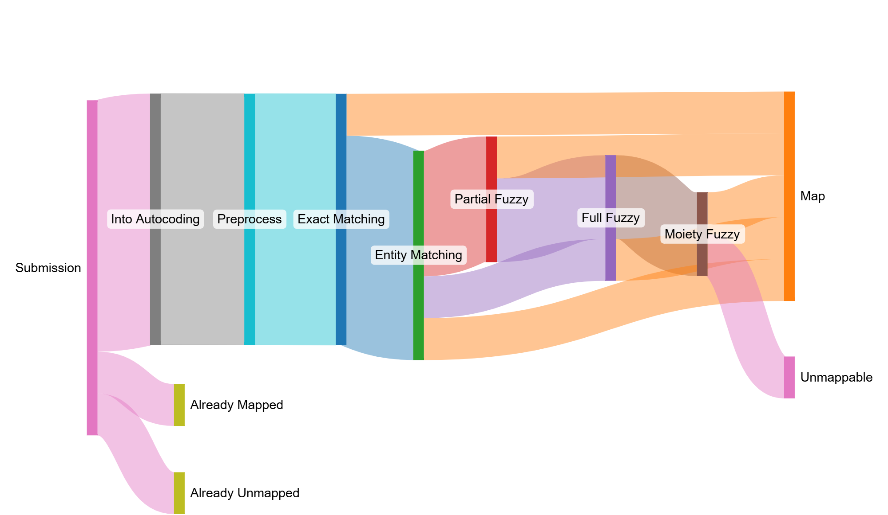

## The Problem
The ePMA (electronic prescribing and medicine administration) data collection is a person-level data asset containing information on what medication is prescribed and administered in secondary care settings. The ePMA data that hospitals submit contain a number of free text fields including: medication name, dosage, route and frequency. This creates some challenges when aiming to collect and eventually disseminate this data:

1. free text can potenitally contain PID (patient identifiable data) which is not permitted
2. free text descriptions of medication makes analysis hard because the same medication could be described in multiple ways 

## Our Solution
The ePMA auto-coding pipeline was created which maps the free text descriptions of medications to valid SNOMED codes using dm+d (dictionary of medicines and devices). The pipeline has a series of deterministic steps as follows (high level view only):

1. Preprocessing - convert to lowercase, replace words and punctuation
2. Read data - the input ePMA data, reference data from VTM, VMP and AMP tables
3. Exact matching - does the input exactly match any of the reference data?
4. Entity matching - split the medication description into moiety, unit, strength and dose form and attempt to match to reference data
5. Fuzzy matching - compare the input against the reference data using fuzzy logic

## Results

A review of the most common prescriptions and adminstrations found:

- 93% correct
- 4% wrong granularity - meaning extra information such as dose and form were provided but autocoding only mapped to the parent level
- 3% incorrect

Granularity:

| Level | Proportion |
|-----|------------|
| Virtual Theraputic Moiety (VTM) | 49.1% |
| Virtual Medicinal Product (VMP) | 42.6% |
| Actual Medicinal Product (AMP) | 8.3% |

General:

- Richer data more useful for analysis and other downstream applications
- Pipeline capable of processing many thousands of records at a time
- Rules are able to be modified when new supplier systems of ePMA data are submitting

## Outputs

| Output                             | Link                                                                 |
| ---------------------------------- | -------------------------------------------------------------------- |
| Published repo | [Github Repo](https://github.com/NHSDigital/medicines-text-mining-tool)|

[comment]: <> (The below header stops the title from being rendered (as mkdocs adds it to the page from the "title" attribute) - this way we can add it in the main.html, along with the summary.)
#
