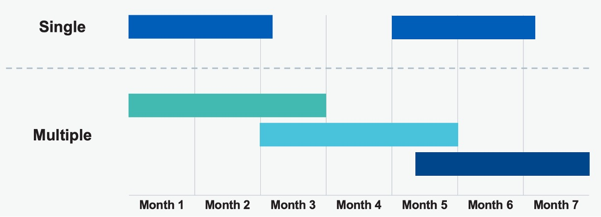
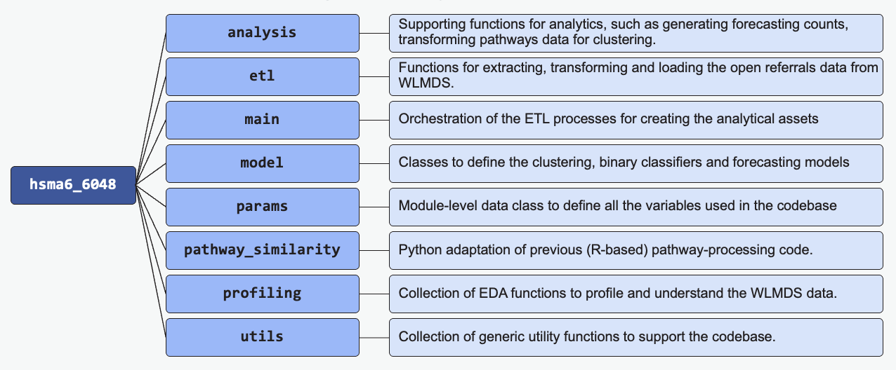

## Background

As part of the [Health Modelling Associates Programme (HSMA)](https://arc-swp.nihr.ac.uk/training-type/health-service-modelling-associates-programme-hsma/), you spend 9 months working on a project. A project that came out of the 2024 HSMA cohort was utilising the Waiting List Minimum Dataset (WLMDS), creating proof of concepts that evaluated the use of various data science techniques on this data. In particular, focusing on the differences of experience on the waiting list between people who are on one waiting list, versus people who may be on two or more waiting lists simultaneously (what we defined as "multiple pathways").

## Codebase

A codebase to process the data into a usable format for modelling is a significant output of this project. It can be found on [github](https://github.com/nhsengland/hsma6_6048_concurrent_rtt_pathways) (currently in a private repository but aiming to go public when a review is completed). This repository sets up an easy process for testing a range of data science techniques, and wrangling the dataset into a manageable asset for analytics. Below you can find an outline of the module for processing and analysis of WLMDS data

## Modelling Techniques

The first data science technique that a proof of concept was created for is clustering. Several clustering techniques were tested to try and identify whether there were clear groups of patients that were more likely to have single or multiple pathways, and if there were groupings, particularly for multiple pathways, identify whether some way of colocating services would be appropriate.

## Forecasting

We also tested the implementation of forecasting models, predicting single vs multiple pathways demand over a 12-week forecast using Prophet. This was a very basic proof of concept, but the architecture can be easily expanded if necessary.

## Binary Classifiers

In this proof of concept, the aim was to identify whether we can predict classes of patients that are more likely to end up on multiple pathways. We tested a Gradient Boosting Classifier, a Logistic Regression model, and an XGBoost Model. This was challenging due to a lack of a wide range of features we could use, and a massively imbalanced dataset (as many more patients are on only one pathway at a time as opposed to two or more). We ended up with a model with almost 60% accuracy, however with more time it has a great potential for improvement, and the pipeline is well set up to allow this.

| Output                             | Link                                                                 |
| ---------------------------------- | -------------------------------------------------------------------- |
| repo (currently private) | [Github Repo](https://github.com/nhsengland/hsma6_6048_concurrent_rtt_pathways)|
| HSMA website | [Website](https://hsma.co.uk/) |
| Blog post | [Blog](https://nhsengland.github.io/datascience/articles/2025/06/27/hsma-waiting-lists/) |

#
