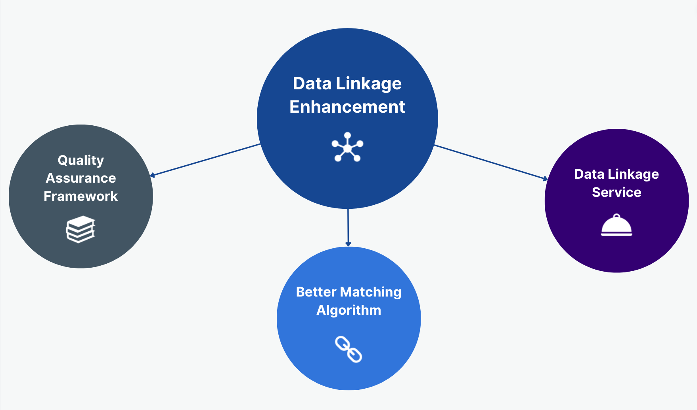

Data Linkage is a business-critical process within many government organisations, including NHS England. Being able to link patients across their care journey, making sure that underrepresented populations are not lost in the cracks, and ensuring compatibility when using several data sets for the same purpose is a pillar of why the Data Linkage Enhancement team exists. 

## **Work we do**
### Quality Assurance Framework
If we want to achieve a consistent and high quality approach to linking data, which allows for robust, transparent and auditable results, we also need a framework to operate within. Hence, this workstream aims at creating, testing and implementing in the business process a Quality Assurance Framework for Data Linkage.

### Better Matching Algorithm
We're currently working on implementing a [probabilistic linkage model](https://www.bristol.ac.uk/media-library/sites/cmm/migrated/documents/problinkage.pdf) using [Splink](https://moj-analytical-services.github.io/splink/index.html), in order to improve linkage outcomes, and by extension, patient outcomes. 

### Data Linkage as a service
This is the covering everything else we do. This stream of work encompasses:
- identifying points of collaboration with other government departments 
- mapping the stakeholders involved in data linkage - both internal and external
- feeding user needs into an overall Data Linkage vision

Part of this stream of work was also [documenting how the Person_ID is generated via the Master Person Service](https://digital.nhs.uk/services/personal-demographics-service/master-person-service/the-person_id-handbook), to make the current process of linking data in the NHS more transparent and easy to understand. 

[comment]: <> (The below header stops the title from being rendered (as mkdocs adds it to the page from the "title" attribute) - this way we can add it in the main.html, along with the summary.)
#

|Output | Link|
|---|---|
MPS Diagnostics|[Github](https://github.com/NHSDigital/mps_diagnostics)
Person_ID Handbook | [NHS England Website](https://digital.nhs.uk/services/personal-demographics-service/master-person-service/the-person_id-handbook)
 Quality Assurance Framework | [Work in Progress Link](https://musical-journey-mzj2woo.pages.github.io/) 