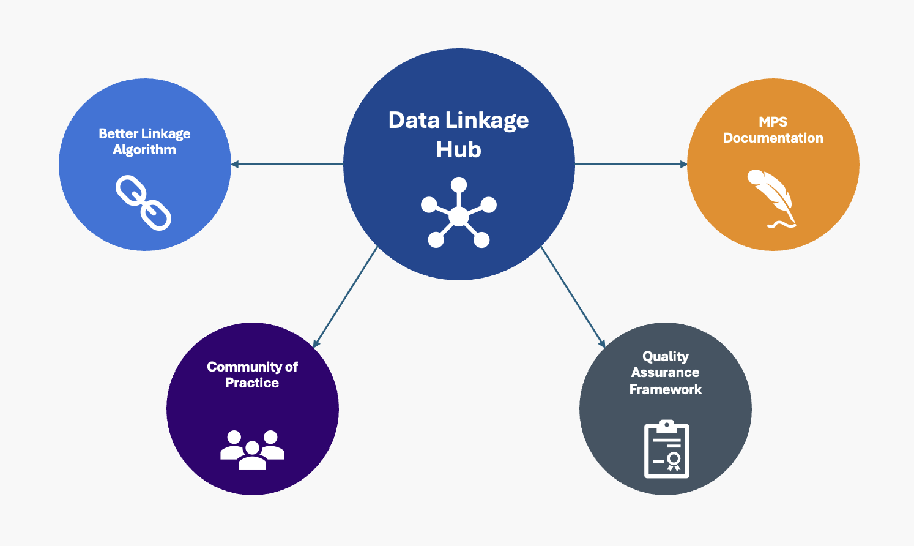

Data linkage is an essential part of being able to use data within any organisation, but in particular the NHS. Being able to trace patients across their care journey, making sure that underrepresented populations are not lost in the cracks, and ensuring compatibility when using several data sets for the same purpose is a pillar of why the data linkage team exists, and why we do what we do. 

## **Work we do**
### Quality Assurance Framework
A big part of what we do is how do we do linkage, but the underlying question is, how do we do linkage **well**. Creating a quality assurance framework for anyone within the NHS or externally to use who is wanting to link data is a big part of our goals. 

### Better Matching Algorithm
We have worked on [documenting how MPS works](https://digital.nhs.uk/services/personal-demographics-service/master-person-service/the-person_id-handbook), to make the current process of linking data in the NHS more transparent and easy to understand, giving colleagues to better understanding of the data they get back from MPS. We're also working on making MPS better, currently focussing on implementing a [probabilistic linkage model](https://www.bristol.ac.uk/media-library/sites/cmm/migrated/documents/problinkage.pdf), using [Splink](https://moj-analytical-services.github.io/splink/index.html) in order to improve linkage outcomes, and by extension, patient outcomes. 

### Data Linkage as a service
This is the umbrella covering everything else we do. We want to make linkage as easy as possible for teams within the NHS, but also help external researchers find the information about their patient cohorts that they require, and whilst the NHS number is a starting point for this, it isn't perfect and not all data sets even have NHS numbers for all patients! 

[comment]: <> (The below header stops the title from being rendered (as mkdocs adds it to the page from the "title" attribute) - this way we can add it in the main.html, along with the summary.)
#

|Output | Link|
|---|---|
MPS Diagnostics|[Github](https://github.com/NHSDigital/mps_diagnostics)
Person_ID Handbook | [NHS England Website](https://digital.nhs.uk/services/personal-demographics-service/master-person-service/the-person_id-handbook)
 Quality Assurance Framework | [Work in Progress Link](https://musical-journey-mzj2woo.pages.github.io/) 