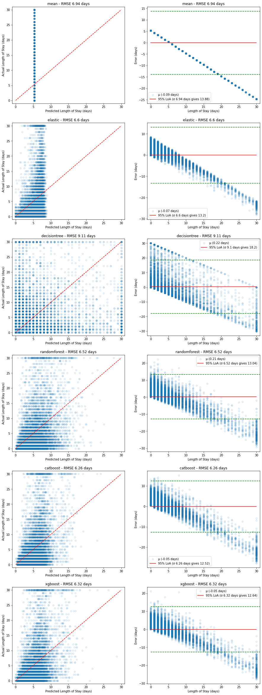
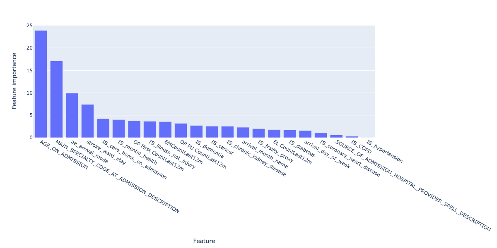
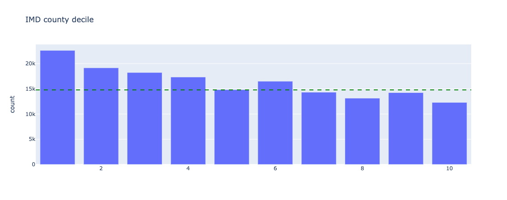
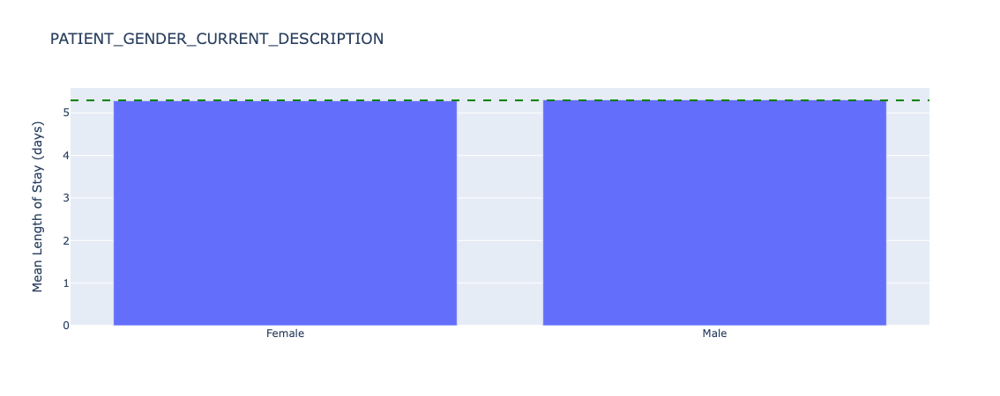

Long Stayer risk stratification baseline models was selected as a project to run in tandem with the [Long Stayer Risk Stratification](long-stay.md) project, and started in March 2022.

Baseline models provide a mechanism to generate baseline metrics to assess the performance of more complex models, and establish the effectiveness of simple approaches.

!!! Warning "Intended Audience"
    This report has been written for analysts and data scientists at NHS Trusts/ALBs

A series of Jupyter Notebooks used to generate this report are available on [Github](https://github.com/nhsx/skunkworks-long-stayer-risk-stratification-baseline/tree/main/notebooks).

## 1. Background

Hospital long stayers, those with a <a href='https://www.england.nhs.uk/urgent-emergency-care/reducing-length-of-stay/' target='_blank'>length of stay (LoS) of 21 days or longer</a>, have significantly worse medical and social outcomes than other patients. Long-stayers are often medically optimised (fit for discharge) many days before their actual discharge. Moreover, there are a complex mixture of medical, cultural and socioeconomic factors which contribute to the causes of unnecessary long stays.

This project aims to complement [previous work](long-stay.md) by generating simple baseline regression and classification models that could be replicated at other hospital trusts, and is divided into two phases:

1. Series of Jupyter Notebooks containing baseline model code
2. [Reproducible Analytical Pipeline](https://github.com/NHSDigital/rap-community-of-practice) including data pipelines

Currently, this project has completed **Phase 1**.

## 2. Approach

The aim of this project is to perform the simplest possible feature engineering and modelling to arrive at a reasonable baseline model, for more advanced feature engineering and modelling to be compared against.

The approach involved:

1. Defining the population and data cleaning
2. Feature engineering, focussing on basic numerical and categorical features
3. Simple baseline models implemented using commonly available packages including [scikit-learn 1.1.1](https://scikit-learn.org/), [CatBoost 1.0.6](https://catboost.ai) and [XGBoost 1.3.3](https://xgboost.readthedocs.io/en/stable/)
4. Analysis of model performance by demographic
5. A comparison of regression-based and classification-based risk stratification models
6. A set of extensions for future work

## 3. Data ingest and processing

GHNHSFT performed a SQL export from their EPR system containing ~770,000 records across 99 columns, with significant sparsity across several columns and a section of rows, as visualised by light coloured blocks (null values) in the below image:


*Figure 1. Plot of data sparsity of raw data. Null values are light coloured blocks. (_Note that not all columns are labelled_)*

The population for this study was defined as non-elective, major cases as recorded in the `IS_MAJOR` and `elective_or_non_elective` fields.

Filtering the dataset to this definition resulted in a reduction of ~770,000 rows to ~170,000 rows (78% reduction):


*Figure 2. Plot of data sparsity of "major" cases. Null values are light coloured blocks. (_Note that not all columns are labelled_)*

Data was processed by:

1. Converting datetime columns into the correct data type
2. Ordering records by `START_DATE_TIME_HOSPITAL_PROVIDER_SPELL`
3. Removing fields not available at admission
4. Removing empty and redundant (e.g. `LENGTH_OF_STAY_IN_MINUTES` duplicates `LENGTH_OF_STAY`) columns
5. Removing duplicate rows
6. Removing local identifiers
7. Imputing `stroke_ward_stay` as `N` if not specified
8. Binary encoding `stroke_ward_stay`, `IS_care_home_on_admission`, `IS_care_home_on_discharge` and `IS_illness_not_injury`

This resulted in ~170,000 rows across ~50 columns as visualised in the below image:


*Figure 3. Plot of data sparsity of clean data. Null values are light coloured blocks. (_Note that not all columns are labelled_)*

The resulting data dictionary is available [here](https://github.com/nhsx/skunkworks-long-stayer-risk-stratification-baseline/blob/main/docs/data-dictionary.csv).

Additionally, Length of Stay was capped to 30 days, due to a long tail of long stayers over ~15 days and the definition of long stayer being over 21 days. The effect of capping can be visualised by comparing box plots of the distribution of length of stay on the raw data (left image, y scale up to 300 days) and the capped data (right image, y scale up to 30 days):


*Figure 4. Plot of the distribution of long stayers in the raw (left) data and capped (right) data. Note different y scales.*

The resulting distribution of length of stays shows a ~bimodal distribution caused by the capping - the majority of stays are short (&lt;5 days), which a long tail and population of long stayers:


*Figure 5. Plot of density of length of stay for capped data.*

## 4. Feature engineering

After discussion with GHNHSFT, the following decisions were made in feature selection:

1. Select the following features for inclusion in the model, which are available on admission:

    ```python
    "ae_arrival_mode",
    "AGE_ON_ADMISSION",
    "EL CountLast12m",
    "EMCountLast12m",
    "IS_illness_not_injury",
    "IS_cancer",
    "IS_care_home_on_admission",
    "IS_chronic_kidney_disease",
    "IS_COPD",
    "IS_coronary_heart_disease",
    "IS_dementia",
    "IS_diabetes",
    "IS_frailty_proxy",
    "IS_hypertension",
    "IS_mental_health",
    "MAIN_SPECIALTY_CODE_AT_ADMISSION_DESCRIPTION",
    "OP First CountLast12m",
    "OP FU CountLast12m",
    "SOURCE_OF_ADMISSION_HOSPITAL_PROVIDER_SPELL_DESCRIPTION",
    "stroke_ward_stay",
    "LENGTH_OF_STAY",
    "arrival_day_of_week",
    "arrival_month_name"
    ```

2. Exclude the following features, but retain for later analysis of model fairness:

    ```python
    "ETHNIC_CATEGORY_CODE_DESCRIPTION",
    "IMD county decile",
    "OAC Group Name",
    "OAC Subgroup Name",
    "OAC Supergroup Name",
    "PATIENT_GENDER_CURRENT_DESCRIPTION",
    "POST_CODE_AT_ADMISSION_DATE_DISTRICT",
    "Rural urban classification"
    ```

3. Generate `arrival_day_of_week` and `arrival_month_name` recalculated from `START_DATE_TIME_HOSPITAL_PROVIDER_SPELL`

This resulted in a dataset of **~170,000 rows across 30 columns**.

One-hot encoding was performed for categorical variables, but non-one-hot encoded features were also kept for models like CatBoost which [manage categorical variables themselves](https://catboost.ai/en/docs/features/categorical-features).

### 5. Statistical analysis

In order to select appropriate modelling approaches, some basic statistical analysis was conducted to understand normality and inter-correlation of the selected features.

#### Correlation analysis

Correlation analysis confirmed presence of significant **collinearity** between different features.

Top 20 one-hot encoded features correlated with `LENGTH_OF_STAY`, ranked by absolute correlation, were:


*Figure 6. Plot of top 20 correlated features with `LENGTH_OF_STAY`. Blue columns are positively correlated (ie. increase length of stay) and red columns are negatively correlated (ie. reduce length of stay).*

These indicate that age and age-related illness, as well as arrival mode are strong factors in determining length of stay.

#### Variation inflation factors

Variation inflation factors (VIF) confirmed the presence of multi-colinearity between a number of features (VIF > 10).

#### Homoescadisticity

A basic ordinary least squares (OLS) regression model was fitted to the full feature set, then residuals calculated.

Residuals failed Shapiro-Wilk, Kolmogorov-Smirnov and Anderson-Darling tests for normality, as well as visual inspection:


*Figure 7. Plot of residuals (errors) in an OLS model of length of stay for all data.*

OLS methods were therefore excluded from modelling.

## 6. Modelling

The machine learning modelling approach was as follows:

1. Split the data into a training (70%), validation (15%) and test (15%) data set
2. Check the data splits do not introduce selection bias for length of stay, age, sex, or ethnicity
3. Train baseline models with default parameters on the training set
4. Evaluate baseline models on the validation test
5. Select the best performing model
6. Tune the best performing model using cross-validation on the training and validation set
7. Report the final performance of the model using the test set


*Figure 8. Summary of machine learning approach used in this project.*

Training, validation and test splits were representative of the population and did not introduce selection bias:

**Length of stay**


**Age**


**Sex**

Proportion of `male`, `female` patients in each split:

```yaml
train: [0.53, 0.47]
validate: [0.51, 0.49]
test: [0.53, 0.47]
```

**Ethnicity**

Proportions of each ethnicity for each split:

```yaml
train: [0.87, 0.05, 0.02, 0.02, 0.01, 0.01, 0.01, 0.0, ...]
validate: [0.88, 0.05, 0.03, 0.02, 0.01, 0.01, 0.01, 0.0, ...]
test: [0.87, 0.05, 0.02, 0.02, 0.01, 0.01, 0.0, 0.0, ...]
```

### 6.1 Regression models

A range of baseline regression models were selected:

Model|Rationale
---|---
[Mean](https://scikit-learn.org/stable/modules/generated/sklearn.dummy.DummyRegressor.html)|The simplest baseline, uses the mean length of stay as the prediction in all cases
[ElasticNet](https://scikit-learn.org/stable/modules/generated/sklearn.linear_model.ElasticNet.html)|A regularised implementation of linear regression that can be used for multi-colinear datasets such as in this dataset
[DecisionTreeRegressor](https://scikit-learn.org/stable/modules/generated/sklearn.tree.DecisionTreeRegressor.html)|A simple, single tree regressor that is highly explainable
[RandomForestRegressor](https://scikit-learn.org/stable/modules/generated/sklearn.ensemble.RandomForestRegressor.html)|An ensemble of decision trees with potentially better performance than a single tree
[XGBRegressor](https://xgboost.readthedocs.io/en/stable/python/python_api.html#xgboost.XGBRegressor)|A boosted tree technique that can improve on ensemble techniques such as RandomForest
[CatBoostRegressor](https://catboost.ai/en/docs/concepts/python-reference_catboostregressor)|A boosted tree technique designed specifically for datasets with high levels of categorical features as in this dataset

Each model was trained with default parameters, and evaluated using root mean squared error (RMSE) on both the training set and then on the (unseen) validation set:

Model|Training RMSE (days)|Validation RMSE (days)
---|---|---
Mean|6.89|6.94
ElasticNet|6.55|6.60
DecisionTree|0.55|9.11
RandomForest|2.46|6.52
XGBoost|5.97|6.32
CatBoost|6.13|6.26

The best performing baseline model was Catboost with an RMSE of 6.26 days. Both DecisionTree and RandomForest models overfit the training data, as seen with low training RMSE resulting in much higher validation RMSE.

A single metric (e.g. RMSE) does not capture the behaviour of each model, so we visualise both the Predicted vs Actual plots as well as the corresponding relative error for both the training set and the validation set:

**Training performance:**


*Figure 11. Plots of predicted vs actual (left, red dashed line shows ideal model) and corresponding relative errors (right, red solid line shows mean error with 95% limits of agreement in green dashed lines) on the training dataset.*

The RandomForest model appears to fit the training data well, but when compared with the performance on the validation set below, we can see this is due to overfitting on the training data set:

**Validation performance:**



*Figure 12. Plots of predicted vs actual (left, red dashed line shows ideal model) and corresponding relative errors (right, red solid line shows mean error with 95% limits of agreement in green dashed lines) on the validation dataset.*

In all cases, the poor predictive power at higher length of stays is evident - there appears to be a linear increase in error caused by the models' inability to predict higher length of stays.

This is likely due to the bimodal nature of the underlying length of stay values - most stayers are short, while there is a significant portion of long stayers.

Further tuning of the CatBoost model using GridSearch and cross-validation led to the following results:

Parameter|Optimal value
---|---
`depth`|6
`l2_leaf_reg`|9
`learning_rate`|0.1

with

Model|Training RMSE (days)|Validation RMSE (days)|Test RMSE (days)|Test MAE (days)
---|---|---|---|---
CatBoost (tuned)|6.24|6.18|6.06|4.12

The test MAE of 4.12 days compares reasonably well to the previous work using a convolutional neural network which achieved a MAE of 3.8 days.

However, a plot of predicted vs actual using the test dataset shows again the model's inability to capture long stayers:


*Figure 13. Plots of predicted vs actual (left, red dashed line shows ideal model) and corresponding relative errors (right, red solid line shows mean error with 95% limits of agreement in green dashed lines) on the test dataset for the final model.*

We can still explore the most important features that make up the prediction by plotting feature importances of the final model:



*Figure 14. Feature importances for the final regression model.*

These broadly align with the correlated features explored earlier on - namely, age, arrival mode, serious illness but also include the number of previous visits, which can be considered a proxy for serious illness itself.

Because the final model, using CatBoost, does not include one-hot encoding of the categorical data as CatBoost deals with this internally, we don't have further granularity on admission mode and arrival mode to compare.

### 6.2 Demographic analysis

While the model is not performant enough to deploy into production, it is still important to understand whether or not the model incorporates bias into its predictions.

There are many kinds of bias in machine learning projects, and here we are looking at representation bias:

> Does the model perform better or worse for specific categories of people across sex, ethnicity and other demographics?

The specific categories are:

```python
"ETHNIC_CATEGORY_CODE_DESCRIPTION", "IMD county decile", "OAC Group Name", "OAC Subgroup Name", "OAC Supergroup Name", "PATIENT_GENDER_CURRENT_DESCRIPTION", "POST_CODE_AT_ADMISSION_DATE_DISTRICT", "Rural urban classification"
```

Before looking at model performance, we need to understand how represented each category is, before drawing conclusions on categories with small sample size (note that for brevity we will only share results from `"ETHNIC_CATEGORY_CODE_DESCRIPTION", "IMD county decile","PATIENT_GENDER_CURRENT_DESCRIPTION"`):


*Figure 15. Underlying counts for ethnicity - all data.*

We can see that for `ETHNIC_CATEGORY_CODE_DESCRIPTION`, the overwhelming majority of patients report `British`. We should be careful what conclusions we draw in further analysis about smaller categories, as the sample size will be very small and likely not statistically representative.


*Figure 16. Underlying counts for sex - all data.*

Sex is broadly equal, with slightly more female than male patients in this dataset.



*Figure 17. Underlying counts for index of multiple deprivation - all data*

Index of Multiple Deprivation (IMD) deciles are skewed to the lower end, ie. there are more deprived patients present in this dataset than not.

Now we can look at the distribution of length of stay for the above categories:


*Figure 18. Underlying length of stay by ethnicity - all data.*

There is significant variation of length of stay for different ethnic groups, for example with White and black Caribbean patients having a length of stay of 2.6 days on average, versus 6.0 days for Irish patients. However, as discussed previously, the count of these groups is 560 and 892 individuals respectively so further statistical hypothesis tests need to be conducted to understand if the distributions are truly different (e.g. a two-sided Kolmogorov-Smirnov test).


*Figure 19. Underlying length of stay by sex - all data.*

Mean length of stay is almost identical across patient sex.


*Figure 20. Underlying length of stay by index of multiple deprivation - all data.*

There are small variations in length of stay across IMD deciles, although more tests need to be conducted to understand if these differences are statistically significant.

Because we are interested in if the model performs differently by category, we will plot the error of the predictions of the test dataset relative to the overall (mean) error for all categories. This will help identify potential discrimination in model performance.


*Figure 21. Relative error in length of stay predictions for different ethnic groups - test data.*

The model appears to perform significantly worse for Caribbean (overestimating length of stay by 2.7 days compared to the mean error) and Any other mixed background (underestimating length of stay by 1.8 days compared to the mean error). Sample sizes are 719 and 536 patients respectively. As discussed the small sample sizes need further investigation and/or additional data collection to establish the statistical significance of this performance difference.


*Figure 22. Relative error in length of stay predictions for different sex - test data.*

Sex has almost no (0.002 days) error from the average.


*Figure 23. Relative error in length of stay predictions for different index of multiple deprivations deciles - test data.*

The lowest IMD county decile (1) has an error of 0.5 days underestimating from the mean error, which at under a day may not lead to any difference in treatment if this prediction is used in clinical practice (ie. a length of stay of 1.5 days is the same as a length of stay of 2.0 days - both would count as 2 whole days).

We also know that length of stay varies by group, so further plots of the ratio of MAE to length of stay are generated in the notebooks, but not included here for brevity.

The final model generated did not adequately capture length of stay across the population. Some sample sizes of demographic groups were too small to draw conclusions, but the process of exploring the underlying distribution of the target feature (length of stay), count (n) and model performance were important and should remain part of future work.

### 6.3 Classification models

In addition to predicting the length of stay in days, we are also interested in stratifying the risk of a patient becoming a long stayer. This can be inferred from their predicted length of stay (see [model comparison](#modelcomparison)), but we can also train a classification model to do this directly.

The agreed stratification of risk of long stay is defined as:

Risk Category|Day Range for Risk Category
-----|------
1 - Very low risk|0-6
2 - Low risk|7-10
3 - Normal risk|11-13
4 - Elevated risk|14-15
5 - High risk|>15

We keep the training features the same as in the regression models, and encode risk from the actual length of stay as the target feature.

> Postscript: classification models based on increasing risk (1-5) are ordinal in nature, and an appropriate model should be used where different classes are not treated as independent as per the examples in this implementation.

The classification equivalents of the regression models were selected:

Model|Regression version|Classification version
---|---|---
Dummy|[Mean](https://scikit-learn.org/stable/modules/generated/sklearn.dummy.DummyRegressor.html)|[Prior](https://scikit-learn.org/stable/modules/generated/sklearn.dummy.DummyClassifier.html)
ElasticNet|[ElasticNet](https://scikit-learn.org/stable/modules/generated/sklearn.linear_model.ElasticNet.html)|[LogisticRegression](https://scikit-learn.org/stable/modules/generated/sklearn.linear_model.LogisticRegression.html)
Decision Tree|[DecisionTreeRegressor](https://scikit-learn.org/stable/modules/generated/sklearn.tree.DecisionTreeRegressor.html)|[DecisionTreeClassifier](https://scikit-learn.org/stable/modules/generated/sklearn.tree.DecisionTreeClassifier.html)
Random Forest|[RandomForestRegressor](https://scikit-learn.org/stable/modules/generated/sklearn.ensemble.RandomForestRegressor.html)|[RandomForestClassifier](https://scikit-learn.org/stable/modules/generated/sklearn.ensemble.RandomForestClassifier.html)
XGBoost|[XGBRegressor](https://xgboost.readthedocs.io/en/stable/python/python_api.html#xgboost.XGBRegressor)|[XGBClassifier](https://xgboost.readthedocs.io/en/stable/python/python_api.html#xgboost.XGBClassifier)
CatBoost|[CatBoostRegressor](https://catboost.ai/en/docs/concepts/python-reference_catboostregressor)|[CatBoostClassifier](https://catboost.ai/en/docs/concepts/python-reference_catboostclassifier)

The training, validation and test regime was the same as for the regression models.

**Class imbalance**

In the training set, we observe the following class imbalance:

Risk score|Number of patients|% of total patients
---|---|---
1|89711|74.0
2|12634|10.4
3|5226|9.1
4|2613|4.3
5|10990|2.2

ie. the majority of patients are low risk, and the highest risk group is only 2.2% of the population.

Class and/or sample weights were calculated using the above training imbalances and passed into all models.

Models were trained using default parameters, and evaluated using the [weighted F1 score](https://scikit-learn.org/stable/modules/generated/sklearn.metrics.f1_score.html) which represents the balance between precision and recall, and accounts for class imbalance. F1 scores range from 0 to 1 (where 1 is "ideal" or maximum).

Model|Training weighted F1 score|Validation weighted F1 score
---|---|---
Prior|0.63|0.62
ElasticNet|0.54|0.53
DecisionTree|1.00|0.59
RandomForest|1.00|0.64
XGBoost|0.57|0.54
CatBoost|0.57|0.54

While the RandomForest model obtained the highest validation weighted F1 score (0.64), it also overfit the training data (weighted F1 score of 1.00).

A visual inspection of model performance, plotting both total counts of risk categories in actual vs predicted cases, as well as the proportion of actual risk in each predicted category, are shown below for both the training and validation data sets:

**Training performance:**


*Figure 24. Plots of predicted vs actual risks on the training dataset. Left image shows count of actual and predicted risks for each category. Right image shows proportion of actual risk that makes up each predicted risk category.*

We can see that both the DecisionTree and RandomForest models severely overfit the training data.

We also see that none of the models are able to capture the nature of the highest risk categories, with every risk category containing a large (>50%) proportion of the lowest risk level (level 1). This is despite weighting the models to account for class imbalance.

**Validation performance:**


*Figure 25. Plots of predicted vs actual risks on the validation dataset. Left image shows count of actual and predicted risks for each category. Right image shows proportion of actual risk that makes up each predicted risk category.*

The RandomForest model has an anomaly in its predictions for risk category 4 where it is missing any of the highest risk category 5 compared to other predictions. This is likely due to the overfitting observed in the previous plot.

Both CatBoost and XGBoost have similar levels of predictive power, defined by the lower proportion of very low risk in the predictions for high risk, although at ~50% these are still too high.

Both CatBoost and XGBoost over-predict higher risk categories, while under-predicting the lowest risk category. This will lead both to false positives where very low risk cases are shown as high risk, and false negatives where high risk cases are shown as lower risk.

CatBoost was selected as the final model due to the lack of significant difference in performance with XGBoost, and for consistency with the final regression model. Further tuning of the CatBoost model using GridSearch (with a smaller parameter space than with regression due to compute time) and cross-validation led to the following results:

Parameter|Optimal value
---|---
`depth`|10
`l2_leaf_reg`|1
`learning_rate`|0.1

with

Model|Training weighted F1 score|Validation weighted F1 score|Test weighted F1 score|Test balanced accuracy|Test AUC (OVR, weighted)
---|---|---|---|---|---
CatBoost (tuned)|0.61|0.75|0.60|0.27|0.70

Balanced accuracy was determined as 0.27, a poor result for accurately predicting the correct class. The overall Area Under the receiving operator characteristic Curve (AUC), which was calculated as a weighted one-versus-rest metric, was 0.70.


*Figure 26. Plots of predicted vs actual risks on the test dataset for the final model. Left image shows count of actual and predicted risks for each category. Right image shows proportion of actual risk that makes up each predicted risk category.*

The final model still assigns over 50% of the lower risk class (the most populated class) to every predicted class, which would lead to a high number of false positives. It also fails to capture the highest risk class adequately, leading to a high number of false negatives.

Despite the poor performance, we can still explore the most important features that make up the prediction by plotting feature importances of the final model:


*Figure 27. Feature importances for the final regression model.*

In this case, `arrival_month_name` and `arrival_day_of_week` are the two most important features, which differs from the regression model and correlation analysis. This may be why the false positive and false negative rates for the model are so high, and needs further exploration.

Demographic analysis of the risk stratification model was not conducted as the model performance did not justify exploring whether there was representation bias at this stage.

### 6.4 Model comparison

As a final modelling step, we can compare both the regression models and classification models, by encoding the predicted length of stay from the regression model as a corresponding risk.

This comparison may help us understand whether a classification or regression approach is more suitable for this type of data.


*Figure 28. Comparison of both models. Left image shows proportion of actual risk for each predicted risk category for the classification model. Right image shows proportion of actual risk for each equivalent predicted risk category derived from the regression model.*

Here we can see that the regression model, encoded as a risk stratification model, performs much better than the classification approach:

* The number of very low risk patients is much lower for higher risk patients, under 20% in the case of high risk. This means lower false positives.
* The proportion of high risk patients is higher in the predicted higher risk categories. This means lower false negatives.

If risk stratification is the key desired output, then further refining the regression model may be the better approach to improving the overall performance of the system.

## 7. Conclusions

A number of baseline machine learning models were trained on EPR data from GHNHSFT.

The best performing regression model achieved a Mean Absolute Error of 4.1 days, compared to 3.8 days for previous work using a convolutional neural network.

Simpler baseline models benefit from enhanced explainability and less compute resources for training. In this case the most important features were related to age and serious illness.

The overall performance of the best regression model was still poor - despite an MAE of 4.1 days, the model failed to capture long stayers and requires further work before use.

The best performing classification model achieved a weighted F1 score of 0.6.

The overall performance of the best classification model was poor - the model failed to capture high risk and assigned a high proportion (&gt;50%) of very low risk patients to higher risk groups.

Using the regression model to calculate equivalent risk scores led to a better risk stratification model, where only ~20% of very low risk patients were assigned to the high risk group.

Demographic analysis showed that the model performed differently for different ethnicities and indices of multiple deprivation, but both model performance needs to be improved and sample sizes need to be increased in order to draw any meaning from these initial findings.

There is opportunity for much future work, which should be balanced with the utility of these predictions in the clinical context.

## 8. Future work

### Modelling improvements

1. Feature engineering of free text fields. Early on we decided to focus on simple numerical and categorical features for this project. A huge amount of rich data is present in fields such as `presenting_complaint` and `reason_for_admission`.
2. Including features available after admission. Fields such as `all_diagnoses` and `all_treatments` will provide clinically important information, and may improve the performance of the predictions.
3. Focussing on a smaller number of features. Once the most important features are identified, a model using the top e.g. 10 features could be trained and tested.
4. Building two models - one for short stay and one for long stay. This may help capture the bimodal nature of the underlying dataset.
5. Including `MINOR` cases. This project focussed on `MAJOR`, `non-elective` cases. 70%+ of the original data belonged to minor cases, and in combination with the above, including this data could lead to an improvement in model performance.
6. Treating Length of Stay as a discrete variable and applying poisson distribution appropriate approaches to modelling.
7. Exploring Generalised Linear Models using e.g. [pyGAM](https://pygam.readthedocs.io/en/latest/index.html).
8. Exploring Bayesian approaches.
9. Exploring the addition of latent variable(s).

### Demographic analysis improvements

1. Statistical testing of fairness. Once model performance reaches a sufficient level, further statistical tests of model performance across demographics should be conducted using e.g. a two-sided Kolmogorov-Smirnov test.
2. Combine smaller groups. For example, grouping `British` and `Non-British` ethnicities would allow statistical comparisons to be made between the majority group and other groups.

### Technical improvements

1. Move from Notebooks to python scripts. Jupyter Notebooks are an excellent exploratory tool, but do not work well with version control or automated testing.
2. Implement a [Reproducible Analytical Pipeline](https://github.com/NHSDigital/rap-community-of-practice). This will allow reuse of the approaches here and improve overall code quality.
3. Abstract visualisation code into functions. This will improve readability of the code.

#### Acknowledgments

1. Joe Green, GHNHSFT for presenting the challenge to Skunkworks and supporting problem definition/data selection
2. Tom Lane, GHNHSFT for support in final stages
3. Brad Pearce and Peter Coetzee, Polygeist, for the original CNN-based model
4. Jennifer Hall, Matthew Cooper and Sanson Poon, NHS AI Lab Skunkworks for guidance, code and report review
5. Chris Mainey, NHSE, for suggestions of additional modelling improvements

Output|Link
---|---
Open Source Code & Documentation|[Github](https://github.com/nhsx/skunkworks-long-stayer-risk-stratification-baseline)

[comment]: <> (The below header stops the title from being rendered (as mkdocs adds it to the page from the "title" attribute) - this way we can add it in the main.html, along with the summary.)
#
