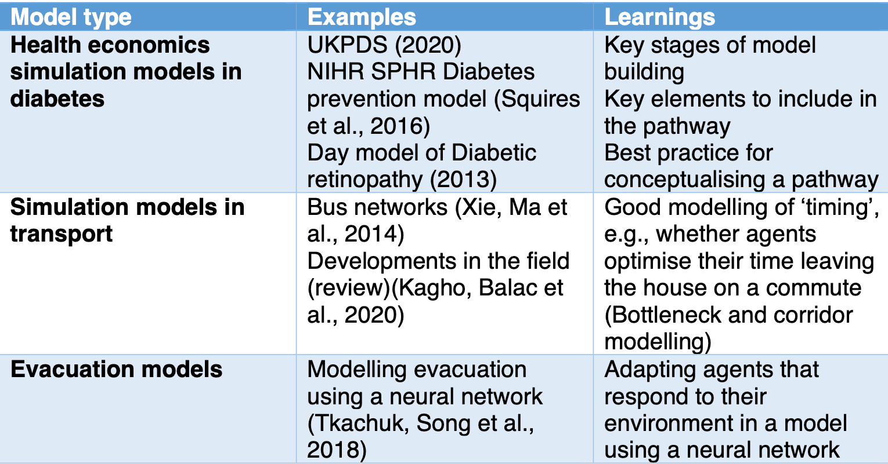

<figure markdown>

<figcaption>Figure 1: Table of learning algorithms considered for the simulation inteligence layer </figcaption>
</figure>

Using the SynPath framework we created a diabetes simulation for 800 patients.  These patients could interact within a fictional local area with hospitals providing outpatient and inpatient services, GP practices and community healthcare services.

## Results

The project showed how to develop a set of environments, interactions and patients from academic literature, policy, and clinical resources. The model currently runs a simulation that prints outputs of patient records into the console.

Future collaboration around validation and how to apply learning algorithms are being pursued.

| Output | Link |
| ---- | ---- |
| Open Source Code & Documentation | [Github](https://github.com/nhsx/SynPath_Diabetes) |
| Case Study | Awaiting Sign-Off |
| Technical report | [Here](https://github.com/nhsx/SynPath_Diabetes/blob/main/t2dm/reports/Technical%20Report%20(SynPath%20Diabetes)%20v1.pdf) |

[comment]: <> (The below header stops the title from being rendered (as mkdocs adds it to the page from the "title" attribute) - this way we can add it in the main.html, along with the summary.)
#
