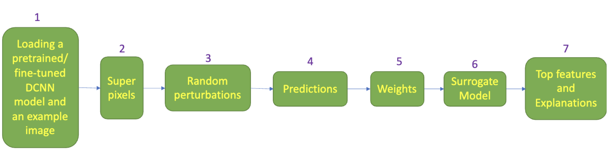

*Figure 1: An illustration of LIME workflow*

A work experience project investigating the application of a [Local Interpretable Model-agnostic Explanations (LIME)](https://arxiv.org/abs/1602.04938) technique to an image classification task around identifying Rosacea.  A binary classification model was trained on the normal and Rosacea faces to generate the LIME explanation for Rosacea faces. Secondly, the fine-tuned model was integrated into the LIME pipeline to generate explanations based on the crucial features on which predictions were made in the classification model. Hence the experimentations helped in understanding the features the classification model took.

## Results

Image pre-processing (through contrast enhancement) improved the LIME by increasing the number of superpixels for the given input image so that some broad features such as discolouration and rashes were identified.   However, the coarseness of the superpixels generated through the pipeline was not sufficient to pick up the  features which would discern between different types of Rosacea.  It may require domain/ imaging modality-specific pre-processing tasks to enhance the quality of explanation by improving the distinctiveness of the features that may help pick the right number of superpixels.

| Output | Link |
| ---- | ---- |
| Open Source Code & Documentation | [Github](https://github.com/nhsx/LIME-XAI-Facial-Disease-Classification) |
| Case Study | n/a |
| Technical report | [Here](https://github.com/nhsx/LIME-XAI-Facial-Disease-Classification/blob/main/reports/report_AM.pdf) |

[comment]: <> (The below header stops the title from being rendered (as mkdocs adds it to the page from the "title" attribute) - this way we can add it in the main.html, along with the summary.)
#
