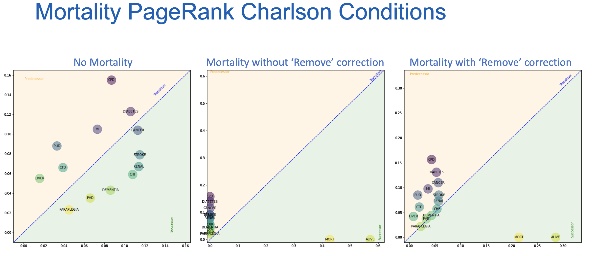

<figure markdown>

</figure>
<figcaption>View of different charleston conditions highlight if there are more commonly predesecors or successors.  When moralitiy is included this skews the results unless correction is implemented.</figcaption>

This project investigated an approach to analysing disease set patterns using hypergraphs and multimorbidity data. Hypergraphs provide a powerful framework for modelling complex relationships among diseases, and their integration with multimorbidity data offers a comprehensive understanding of the co-occurrence of multiple diseases within patient populations. Additionally, this work extends on the previous work by incorporating mortality information into the hypergraphs and exploring the concept of temporality as hyperarc weights. The inclusion of mortality data enhances the analysis by considering the impact of diseases on patient outcomes, whilst temporality enables the inclusion of irregular time intervals which captures the dynamic nature of multimorbidity patterns over time.

## Results
To facilitate the understanding of hypergraphs and their applications in the multimorbidity domain, an interactive applet has been developed. This serves as an educational tool and visualisation device, teaching users about undirected and directed hypergraphs and demonstrating their usefulness in analysing complex disease relationships. We hope that our applet and the code bases we have created will promote the dissemination of knowledge about hypergraphs and their applications, empowering individuals to explore and comprehend complex healthcare data in the multimorbidity domain.

See the full report for detailed results around the addition of mortality into this work.

| Output | Link |
| ---- | ---- |
| Open Source Code & Documentation | [GitHub](https://github.com/nhsx/hypergraph-mm) |
| Case Study | Awaiting Sign-Off |
| Technical report | [Report](https://github.com/nhsx/hypergraph-mm/blob/zh-hypergraph-mm-mort/reports/Hypergraph_mm_mort_report_ZH.pdf) |
| Demonstration | [Streamlit](https://nhsx-hypergraphical-streamlit-hypergraphs-hklixt.streamlit.app/) |

[comment]: <> (The below header stops the title from being rendered (as mkdocs adds it to the page from the "title" attribute) - this way we can add it in the main.html, along with the summary.)
#
