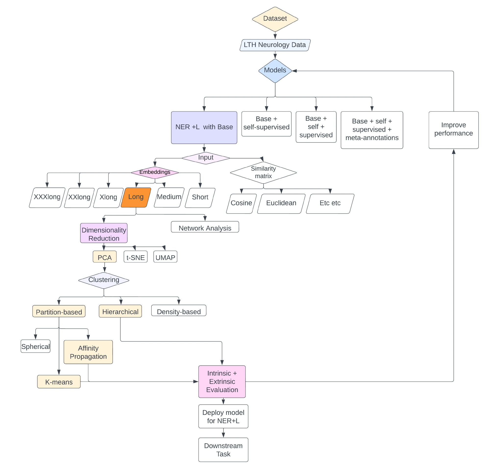

Neurology and other clinical specialities are awash with clinical data. However, these are generally not structured and lack the characteristics to allow straightforward automatic extraction of clinically relevant concepts. Software tools do exist that can recognise clinical terms in unstructured clinical data (e.g. clinic letters) and link them to other concepts. These are called ‘named entity recognition and linking’ (NER+L) tools. But many such tools require prior ‘labelling’ by a domain expert (i.e. person with specialty knowledge) of the relevant clinical concepts. MedCAT is a NER+L tool that can work without this prior labelling as it contains an algorithm that is aligned with a customisable knowledge database (ontology). This works in two stages: 1) linking unambiguous portions of texts (entities) to unique terms in the ontology then 2) linking ambiguous entities to terms in the ontology with the most similar contexts. 

However, evaluation of the MedCAT models which inform the NER+L process has only been performed on labelled data, and the learned numerical representations of concepts (embeddings) has not been assessed before.  The contributions of this project were: 

1. evaluation of three separate MedCAT models, 
2. comparison of three different clustering techniques as evaluation methods in the absence of labelled data, 
3. evaluation of MedCAT’s learned concept embeddings, 
4. comparison of intrinsic and extrinsic evaluation metrics and 
5. comparison of qualitative and quantitative evaluation approaches. 

<figure markdown>

</figure>
<figcaption>Schmatic representation of the MedCAT workflow</figcaption>

## Results
We found that all three models produced NER+L results which are not consistent with clinical understanding. Clustering can enable deeper examination of learned embeddings, but further work needs to be done on finding the best input data and clustering approach. Intrinsic evaluation metrics are only meaningful in the presence of extrinsic measures and further research needs to be done to identify the most informative set of metrics. Quantitative assessment must be supplemented by qualitative inspection. The work performed here forms the first phase in evaluation of MedCAT models’ performance. Once optimal evaluation strategies have been identified, the next phase can be focused on improving MedCAT models. This will ultimately enable extraction of clinical terms that can be used for multiple downstream tasks such as automated clinical coding, research, monitoring of interventions, audits as well as service improvements.

| Output | Link |
| ---- | ---- |
| Open Source Code & Documentation | [Github](https://github.com/nhsengland) |
| Case Study | Awaiting Sign-Off |
| Technical report | [Report](https://github.com/nhsengland/P43_LTHMedCat/blob/main/report/MedCAT_Neurology_Report.pdf) |

[comment]: <> (The below header stops the title from being rendered (as mkdocs adds it to the page from the "title" attribute) - this way we can add it in the main.html, along with the summary.)
#
