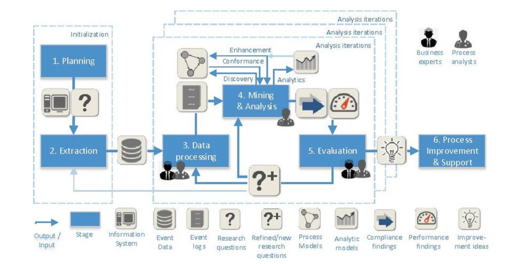
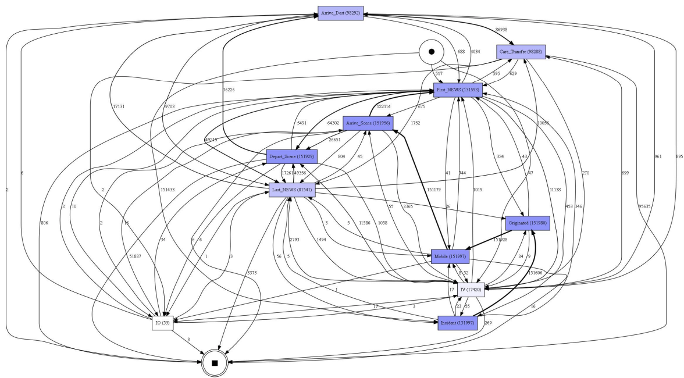

Process Mining is the term given to a family of techniques that have been developed to analyse process flows through the recording of an event log. Process Mining has three main application areas: discovery, conformance checking, and enhancement. In **process discovery**, the output is a fact-based process model based on the recorded events in the database. Discovery is the most common process mining investigation, where the discovered process model is often not expected by the supervisor of the process. In **conformance checking** we measure how well the recorded processes fits a pre-defined process model. Conformance-checking techniques can therefore be used to check whether certain rules and policies are being abided by within an organisation. Finally, **enhancement** is focused on improving the existing process models by analysing how additional attributes affect the throughput times and frequencies of activities in the process.

For this work we converted ambulance data into an event log and applied process mining techniques using the [PM4Py library](https://pypi.org/project/pm4py/).  We used the PM2 methodologies to conduct the process mining project.

<figure markdown>

</figure>
<figcaption>PM2 Framework</figcaption>

## Results

Most of the project time was spent designing appropriate business rules to be applied to the data in order to create the event log.  Directly Follows Graphs (DFGs) were then created to represent the highest occurring processes. Conformance techniques were used to measure how well the mined process models fitted the event log data. However, the variation in the treatment activities also caused the mined models to allow events including the call for an ambulance to happen in a sequence counterintuitive to real ambulance job cycles.

<figure markdown>

</figure>
<figcaption>A simple spaghetti diagram showing the process flow through activities captured in the event log</figcaption>

A succession of further process mining techniques were then applied to the data. A majority of these involved enriching the data and the iterative process around adding data to the event log to find out more about it. This is especially important with event logs where two processes account for such a high percentage of cases, (99% in our case).  Enrichment here meant attaching IMD information to postcodes or areas in the data as well as retrieving additional data about each patient, for example, age, sex, ethnicity, and adding that back into the event log.  Enrichment also meant feature engineering - transforming variables into either binary, or time of day into categorical, e.g. to morning, afternoon and night.

Lastly, machine learning was applied to see if outcomes could be predicted. Please see the report or case study for full details.

| Output | Link |
| ---- | ---- |
| Open Source Code & Documentation | [github](https://github.com/nhsengland/ProcessMining) |
| Case Study | Awaiting Sign-Off |
| Technical report | [Report](https://github.com/nhsengland/ProcessMining/blob/main/Process_Mining_to_Generate_Healthcare_Pathways.pdf) |

[comment]: <> (The below header stops the title from being rendered (as mkdocs adds it to the page from the "title" attribute) - this way we can add it in the main.html, along with the summary.)
#
