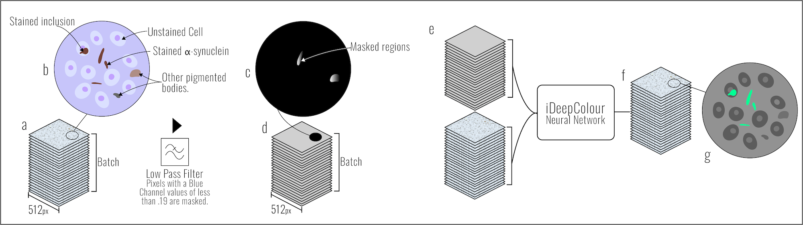

"Parkinson's Disease Pathology Prediction" was selected as a project in 2022 following a successful pitch to the AI Skunkworks problem-sourcing programme.

## Results

A proof-of-concept demonstrator written in Python (machine learning models, command line interface (CLI), Jupyter Notebooks).

Output|Link
---|---
Open Source Code & Documentation|[Github](https://github.com/nhsx/skunkworks-parkinsons-detection/)
Technical report|[biorxiv.org](https://www.biorxiv.org/content/10.1101/2022.08.30.505459v1)
Case Study|[Case Study](https://transform.england.nhs.uk/ai-lab/explore-all-resources/develop-ai/identifying-and-quantifying-parkinsons-disease-using-ai-on-brain-slices/)