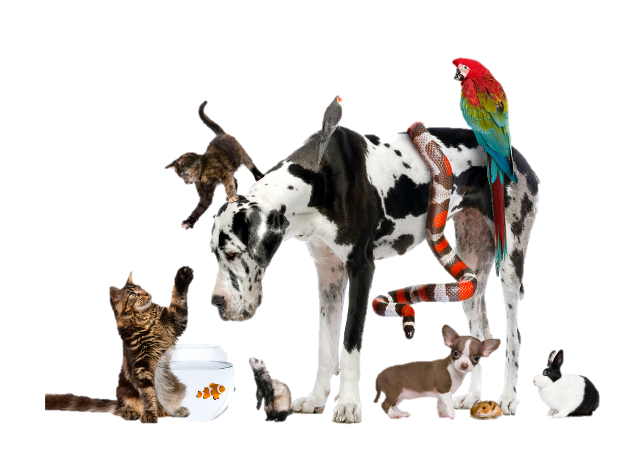

Privacy Enhancing Technologies (PETs) are an emerging set of technologies and approaches that enable the derivation of useful results from data without providing full access to the data.   Whilst traditional de-identification of data reduces the utility as the privacy increases, PETs aim to keep the privacy very high whilst gaining a high enough level of utility that complex functions can be applied to the data.  

To achieve a high confidence in the privacy of data we can either turn to a hardware approach or alternatively explore different statistical algorithms.   The hardware approach includes the use of trusted execution environments or enclaves which have absolute control on all the inputs and outputs into a space and thus can be used for secure controlled computation.   The algorithmic approach aims to allow certain operations on the accessible data which can be proven to have absolute or very high privacy.   These include Homomorphic Encryption and Secure Multi-Party Computation.   In addition output privacy can also be increase through the use of differential privacy to add a statistically significant level of noise making raw data inference impossible.  See the [CDEIUK PETs](https://cdeiuk.github.io/pets-adoption-guide/what-are-pets) adoption guide for more details.

<figure markdown>

</figure>
<figcaption>Not this sort of PET</figcaption>

The Royal society report *“From privacy to partnership The role of privacy enhancing technologies in data governance and collaborative analysis”* [1](https://royalsociety.org/-/media/policy/projects/privacy-enhancing-technologies/From-Privacy-to-Partnership.pdf?la=en-GB&hash=4769FEB5C984089FAB52FE7E22F379D6) states that

> “Recent advances in medical imaging, audio and AI have led to unprecedented possibilities in healthcare and research. This is especially true of the UK, where the public health system is replete with population-scale electronic patient records. These conditions, coupled with strong academic and research programmes, mean that the UK is well positioned to deliver timely and impactful health research and its translation to offer more effective treatments, track and prevent public health risks, utilising health data to improve and save lives [2](https://www.gov.uk/government/publications/lifesciences-industrial-strategy-update).

> Anonymous data is not covered by current data protection law in the UK and EU. However, it is difficult to be certain that health data is anonymous, particularly in biometric and other non-textual data. Health data is subject to specific legal requirements in the UK, as well as the common law duty of confidentiality.”**

There is therefore a large need to investigate different ways of understanding and increasing privacy of data in healthcare in order to be confident of patient privacy and compliant. 

Three high level example use-cases of using PETs are:

- One-off Access for Research & Analysis (such as federated learning across several trust secure data stores)
- Continual Access to User (such as synthetic data in secure data environment or regular API requests to data with a privacy accountant)
- Auto workflow (built with biometric data flows) (such as homomorphic encryption of biometric data to a central processing enclave)

## Results

Our work supported the [UK-US PETs Prize Challenge](https://petsprizechallenges.com/) which brought together various teams competing to combine different PETs to allow AI models to learn to make better predictions without exposing any sensitive data with a prize pool of £1.3m.

Please see the challenge site for the winners.   

A variety of solutions were put forwards including:

- Bloom filters with hashing encryption to allow privacy preserving feature mining ([Scarlet-PETs GitHub](https://github.com/idsla/Scarlet-PETs))
- Synthetic Data using a variational autoencoder with differential privacy.   Adversarial attacks are then simulated at gateways to ensure privacy.  The synthetic data is then used with secure aggregation to develop a global model
- Differential Privacy with FedAvg [kenziyuliu GitHub](https://github.com/kenziyuliu/pets-challenge)
- Differential Privacy with Homomorphic Encryption to pass the data to a secure aggregator [Muscat Github](https://github.com/hhcho/muscat)

Other open source examples can be see [here](https://github.com/usnistgov/PrivacyEngCollabSpace/tree/master/tools/de-identification))

| Output | Link |
| ---- | ---- |
| Open Source Code & Documentation | [Challenge Website](https://petsprizechallenges.com/) |
| Case Study | Awaiting Sign-Off |
| Technical report | Coming Soon |

[comment]: <> (The below header stops the title from being rendered (as mkdocs adds it to the page from the "title" attribute) - this way we can add it in the main.html, along with the summary.)
#
