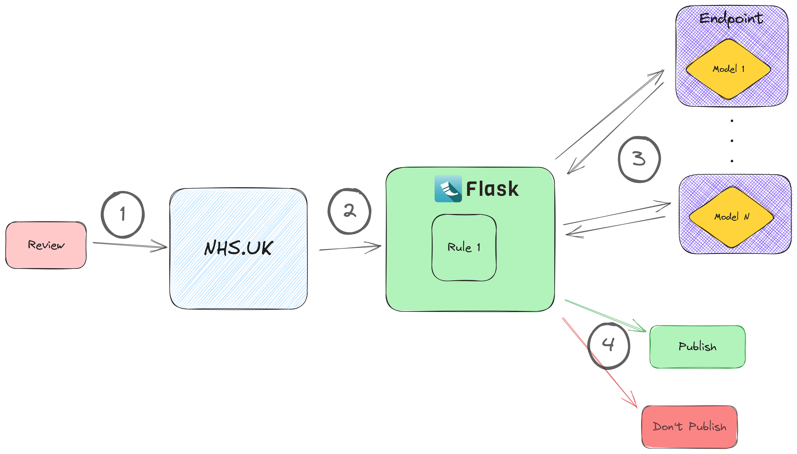

The NHS.UK website receives around a hundred thousand of review every year. These reviews need moderating -- there's [a set of NHS policies which need to be applied to these](https://www.nhs.uk/our-policies/comments-policy/#:~:text=Users%20should%20only%20post%20one,service%20will%20not%20be%20published.) before they can be published.

This project automates much of that work. We use machine learning models - some built by us, some open-source - to make decisions about the different rules which need to be enforced. This reduces the average moderation time from days to seconds, makes for more reliable and consistent moderation, and creates a much more scaleable service.

When compared to expert moderators, our models match or out-perform the moderation accuracy of the people who used to do the moderation[^1]. If a user disagrees with a decision our AI makes, there's still a human-in-the-loop who can make a final moderation decision.

[^1]: Prior to this project, the moderation work was done manually by a third-party company, hired on a fixed-term contract. No NHS employee lost work as a result of this project.

The flow follows four stages:

1. The review text is submitted to the website.
2. The Flask app contains the logic of the rules which are to be applied. Some of these rules are applied directly, on the Flask app compute.

3. More complicated rules (such as detecting safeguarding concerns) are applied by models which are deployed independently of the Flask app. Here the Flask app sends queries to each of these, they evaluate the text, and send a response.

4. The Flask app now has an answer for each of the rules which are to be applied, and can send a final response to the NHS.UK website.

If the review doesn't violate any of these, the app will tell NHS.UK that the review is all good, and it will be published. If there's anything amiss, the website will take a response which depends upon which rule wasn't met. This ranges from asking the reviewer to remove something (such as a name) from a review, to directing them to resources specific to the content of their review. For more information on these pathways, see !!!!INSERT LINK!!!.
[The reviews policy is here.](https://www.nhs.uk/our-policies/comments-policy/)

## Results

- Reduced moderation time from days to seconds.
- Service is much more scaleable now - no longer constrained by moderation capacity.
- All models match or out-perform the way the work was done before.
- First AI product to gain clinical approval within NHS.UK.

## Outputs

| Output                             | Link                                                                 |
| ---------------------------------- | -------------------------------------------------------------------- |
| Published Repo for Flask app       | [Github Repo](PUT LINK HEREhttps://github.com/nhsengland/nhsuk.moderation-api)   |
| Published repo for creating models | [Github Repo](PUT LINK HERE) |

!NOTE! The second link in this table isn't filled in yet because we haven't published the AMLS repo yet
[comment]: <> (The below header stops the title from being rendered (as mkdocs adds it to the page from the "title" attribute) - this way we can add it in the main.html, along with the summary.)
