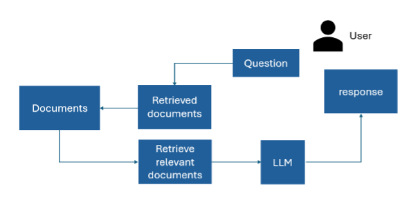

We supported the Redbox Copilot work as part of a cross-departmental team through the 10DS Cover Scheme (via the [Evidence House]( https://www.civil-service-careers.gov.uk/evidence-house/) community).
You can learn more about the work that was done and the app itself at the [AI.GOV.UK website](https://ai.gov.uk/projects/redbox-copilot/) 

## Results
The app used a “Retrieval Augmented Generation” pipeline based on Langchain and used the LLM “Claude”. The app allowed the user to ask questions about documents – the pipeline would retrieve relevant document chunks which were then passed to the LLM which would generate a response.

Our main contributions were in ensuring this response gave references for its statements, and ensuring these came through correctly (getting LLMs to provide structured responses can require a bit of prompt engineering). We also assisted in the evaluation of the pipelines performance.

The prototype was successful, and work on it has continued within 10DS and i.AI.

| Output                             | Link                                                                 |
| ---------------------------------- | -------------------------------------------------------------------- |
Open Source Code & Documentation | [Github]( https://github.com/i-dot-ai/redbox-copilot)
Case Study | [Redbox Copilot](https://ai.gov.uk/projects/redbox-copilot/)

[comment]: <> (The below header stops the title from being rendered (as mkdocs adds it to the page from the "title" attribute) - this way we can add it in the main.html, along with the summary.)
#