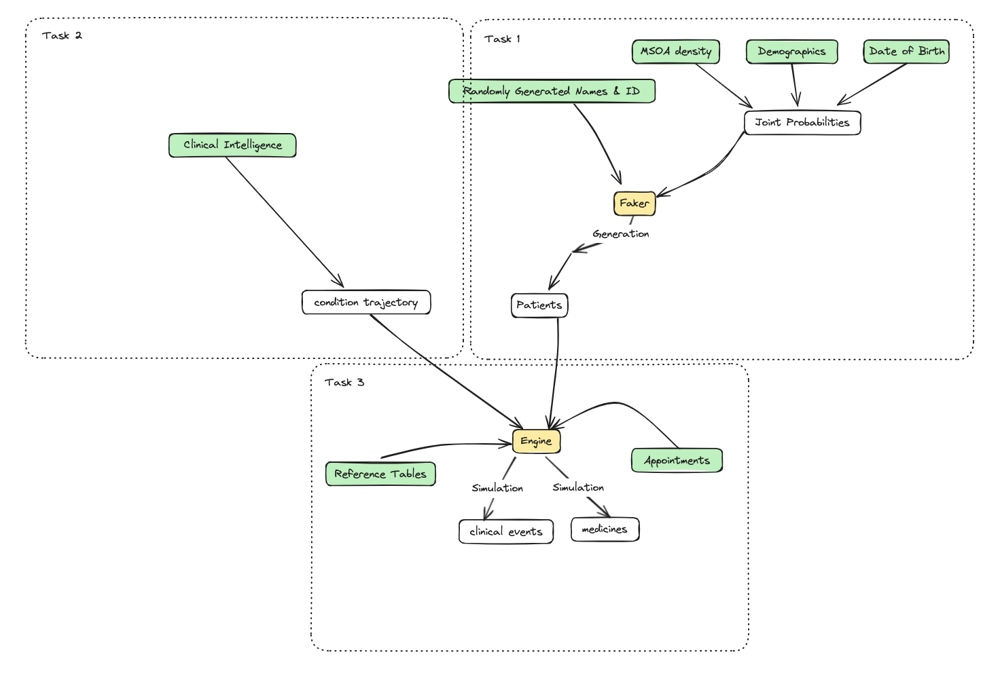
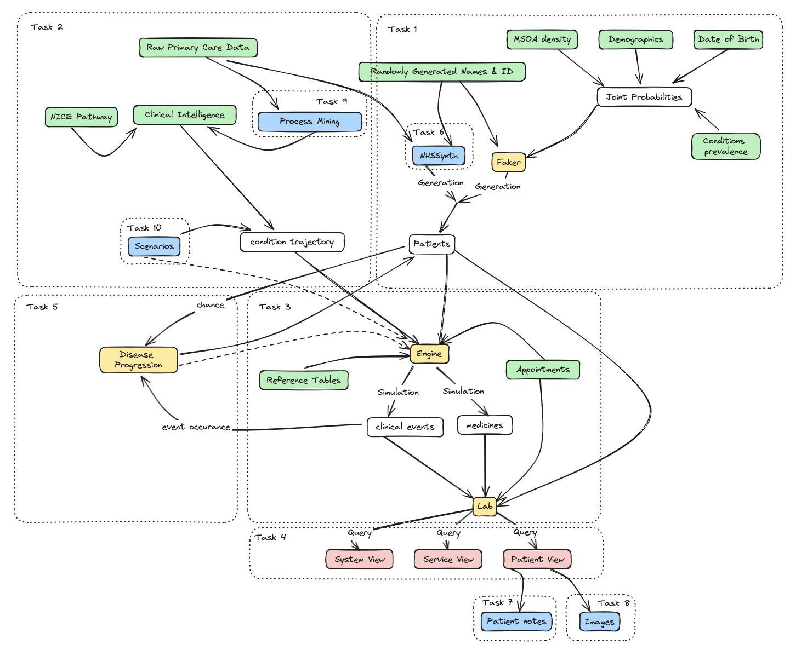

Primary care records are crucial for understanding healthcare interactions at both the population and individual levels. However, these records are difficult to obtain and integrate with other services, hindering innovation due to data unavailability and privacy concerns.

Our project aims to address this by developing a code base to generate primary care electronic health records. We start by creating a synthetic population that mirrors a region in England, and then adapt the US-based tool [Synthea](https://github.com/synthetichealth/synthea) for the English NHS context.

*Figure 1: High-level schematic of the different components of the project. Population level relationships are derived from the raw data and feed through a simple synthetic data generator to create a population. Clinical knowledge is captured as a clinical reference pathway (CRP) and fed into the engine. This engine takes the synthetic population and processes them through the CRPs. This results in records being created and adapted for the synthetic individuals which can then be viewed at a patient (EHR), service (GP system) or System (regional) levels.*

## Project Overview 

### Task 1: Creating a Synthetic Population with Faker.

We begin by generating a table of fake but realistic individuals using a combination of the [Faker](https://faker.readthedocs.io/en/master/) and [random](https://python.readthedocs.io/en/latest/library/random.html#module-random) libraries, based on demographic profiles and disease prevalence probabilities. These records are validated against the OneDevon dataset to ensure accuracy and privacy.

### Task 2: Digitizing Clinical Pathways 

To simulate real-world patient interactions, we translate clinical knowledge into digital formats. Using Synthea's graphical interface, we create JSON files representing clinical pathways, starting with the Hypertension and Hypertension Medication modules. This involves adapting US modules to match English drug names, values, and logic starting by aligning to the [NICE guidelines](https://www.nice.org.uk/guidance/NG136).

### Task 3: Customizing Synthea for the English NHS 

Whilst the adaption of [synthea for international](https://github.com/synthetichealth/synthea-international) contexts is well established in their site, this results in records which still have many US elements. Adapting Synthea for the English NHS involves removing obsolete US elements like insurance logic and updating regional specifics such as town names and vaccination schedules. We are progressively modifying demographic, geographic, and societal health determinants to fit the English context.

??? "Details of the Synthea Adaption"
    **Stage 1: Removing non-English NHS functions and simplifying the Java to an MVP**
   
    Functions relating to:

    * Flexporter (functionality which could be brought back later)
    * Payers and related managers
    * Insurance plans
    * Claims (mostly for medications)
    * Income, healthcare expenses and coverage
    * Cost
    * Exporting as DSTU2 or STU3
    * Cardiovascular disease module (as this is a US-based calculator)
    * ASCVD, Framingam and C19 Immunizations (as these are all US-based and not applicable)
    * CMSStateCodeMapper

    These functions have all been commented using a `UKAdp` tag to keep an audit trail. These adaptions result in 113 sections of code commented out across 16 files (all within the `src/main/java/org/mitre/synthea/`).

    **Stage 2: Adapting Resource files for UK South West Region context**

    * Replace demographics.csv with South West towns and cities
    * Replace fipscodes.csv with County GSS codes
    * Update social determinants of health (sdoh.csv) file with food insecurity, severe housing cost burdens, unemployment, and vehicle access values correct for the UK regions.
    * Replace timezones.csv with GMT
    * Replace zipcodes.csv with uk based postcodes
    * Keep birthweights.csv as US version (for the moment)
    * Keep bmi_correlations.json as US version (for the moment)
    * Keep cdc_growth_charts.json as US version (for the moment)
    * Keep gbd_disability_weigths.csv as US version (for the moment)
    * Update immunization_scheldule.json to vaccine schedules used in the UK
    * Update synthea.properties to remove unused exporter and payer functionality and amend inputs for South West Region.
    * Reduce the care settings down to hospitals, primary care and urgent care, and update these to have South West facilities.

    There are still many US-based nuances that need to be dealt with such as payer columns still appearing in the outputs.
  
    **Stage 3: Nuances**

    Coming. At the end of this stage we aim for a fully UK-base version.

## Next Steps 
Our work is ongoing, with updates available on our GitHub repository. Future plans are outlined in Figure 2, showcasing various potential directions for this project.

Stay tuned for progress updates and check out our code development on GitHub.

*Figure 2: Diagram of the potential to expand the tooling in a vairety of ways to increase fidelity of the generated records and include additional modalities.*

Output|Link
---|---
Open Source Code & Documentation|[Github](https://github.com/nhsengland/swpc_synthea) - WIP
Case Study| Awaiting Sign-off

[comment]: <> (The below header stops the title from being rendered (as mkdocs adds it to the page from the "title" attribute) - this way we can add it in the main.html, along with the summary.)
#