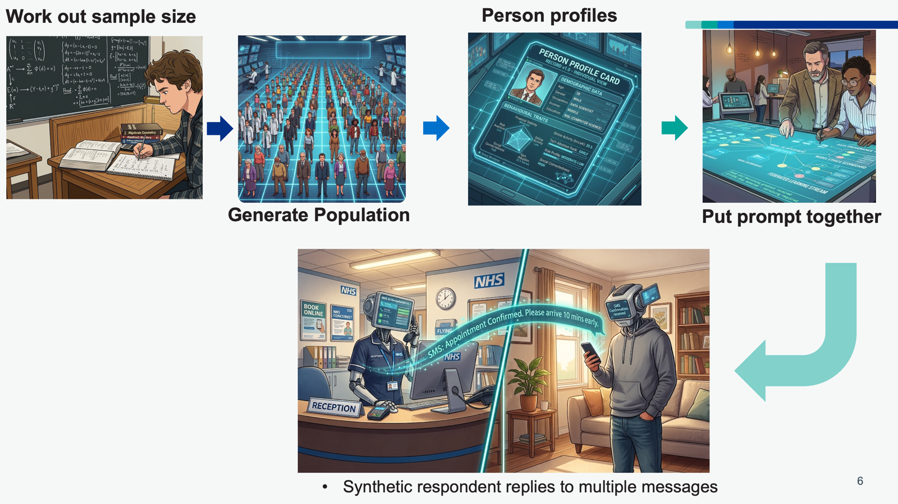

## Problem 

The NHS sends millions of text messages, letters, and digital notifications to patients every year. Small differences in wording affect whether patients respond, book appointments, or take up services.  Behavioural scientists work to improve the wording on these text messages, but usually come up with too many ideas to feasibly test them all on a real patient population, which is expensive and slow. Randomised controlled trials take months and require large sample sizes. Teams often launch messages or smaller randomised controlled trials without any idea on whether the messages they have chosen to test are the best options.  

  

## Solution 

This tool generates synthetic patient panels using large language models. Each synthetic patient has a demographic profile (age, gender, ethnicity, deprivation level) sampled from real Census 2021 distributions at the LSOA level. Patients also receive behavioural traits (health literacy, digital confidence, trust in healthcare) drawn from configurable distributions. 

 

The pipeline works in four stages: 

1. Generate a panel of N synthetic patients with realistic demographic and behavioural profiles. 
2. Present each patient with multiple message variants and ask a structured question (e.g. "How likely would you be to click on the link provided?"). 
3. Collect responses on a Likert scale or as free-text reasoning, then compare response patterns across message variants and demographic subgroups. 
4. Run an automated bias judge that flags reasoning containing stereotyping, essentialism, or protected-trait dependence. 

The tool supports built-in statistical power analysis. It calculates whether the sample size is large enough to detect meaningful differences between message variants and automatically increases the panel size if needed. 

Users configure experiments through a Streamlit interface or command-line scripts.  

## Results 

 The team is currently working to determine the accuracy, usefulness and ethical implications of this tool and whether it should even be used. This is exploratory work at the moment and is not being used for any real decision making.

## Outputs & Links

Output | Link
---|---
Code (Currently Private) | [Link](https://github.com/nhsengland/synthetic_panels)

[comment]: <> (The below header stops the title from being rendered (as mkdocs adds it to the page from the "title" attribute) - this way we can add it in the main.html, along with the summary.)
#
