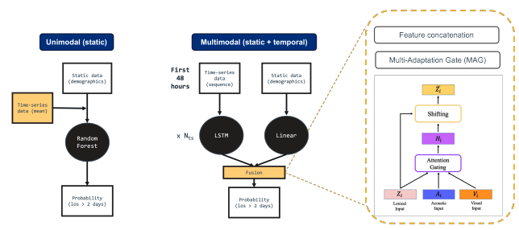

Explainability, fairness, and bias identification and mitigation are all essential components for the
integration of artificial intelligence (AI) solutions in high-stake decision making processes such as in
healthcare. Whilst there have been developments in strategies to generate explanations and various
fairness criteria across models, there is a need to better understand how multimodal methods impact
these behaviours. Multimodal AI (MMAI) provides opportunities to improve performance and gain
insights by modelling correlations and representations of data of different types. 

These approaches are incredibly powerful for the analysis of healthcare data, where the integration of data sources is key
for gaining a holistic view of individual patients (personalised medicine) or evaluating models across
different patient profiles to ensure safe and ethical use (population health). However, MMAI presents
an unique challenges when deciding how best to incorporate and fuse information, maintaining an
understanding of how data is processed (explainability), and ensuring bias is not amplified as a result.

Here, we explore a case study, Multimodal Fusion of Electronic Health Data for Length-of-Stay
Prediction, with a focus on treating time-series and static electronic health data as distinct modalities.
We evaluate and compare different methods for fusing data in terms of predictive performance and
various fairness metrics. Additionally, we apply SHAP to highlight the influence of specific features
and explore how such explanations can be used to reveal or confirm bias in the underlying data. Our
results showcase the importance of modelling time-series data, and an overall robustness to bias
compared to unimodal approaches across various fairness metrics. We also describe exploratory
analysis which can be conducted and developed further to mitigate bias post-hoc, or gain further
insights into the relative importance of specific modalities from multimodal models.

<figure markdown>

</figure>
<figcaption>Overview of the models: unimodal, multimodal with two fusion methods: concatenation and a multiadaptation gate (MAG)</figcaption>
## Results

We found a reassuring consistency in feature importance across different fusion methods.  Both fusion methods produced fairer models with respect to insurance type (the most unfair variable in the unimodal case) with concatenation providing the lowest equalised odds.

Further work is planned to expand this pipeline to other modalities and datasets to solidify our understanding of the interplay of model choices on fiarness.

## Outputs & Links

Output | Link
---|---
Link to something fun | [Link](https://www.google.com/search?sca_esv=a39744d3bd92150d&sxsrf=ANbL-n4XtWgR-RKsPmCYFF7odreptG99bQ:1778675815689&udm=2&fbs=ADc_l-aN0CWEZBOHjofHoaMMDiKpaEWjvZ2Py1XXV8d8KvlI3o6iwGk6Iv1tRbZIBNIVs-5-bUj3iBl-UxHsANYwOkWWQqZAJJdwuRaSoLHfELMHARurXwtwWmcdG4V-LDFDd8ecoEtHpZSRelVfCRq2UKwcWKG3jZWtDKY1abjUi6atsGFRNpwlmGKAQF9AXbF8wg8fYd5JIFkWAi8Mz75HFguCKRmBxQ&q=dog&sa=X&ved=2ahUKEwjgsqjho7aUAxW4VkEAHWMBE04QtKgLegQIFBAB&biw=1920&bih=934&dpr=1#sv=CAMSVhoyKhBlLWxlbnJtUHVnOS1Sek5NMg5sZW5ybVB1ZzktUnpOTToOZzJSNG9VUXRNbUNNaU0gBCocCgZtb3NhaWMSEGUtbGVucm1QdWc5LVJ6Tk0YADABGAcguOjTfEoIEAEYASABKAE)

[comment]: <> (The below header stops the title from being rendered (as mkdocs adds it to the page from the "title" attribute) - this way we can add it in the main.html, along with the summary.)
#
