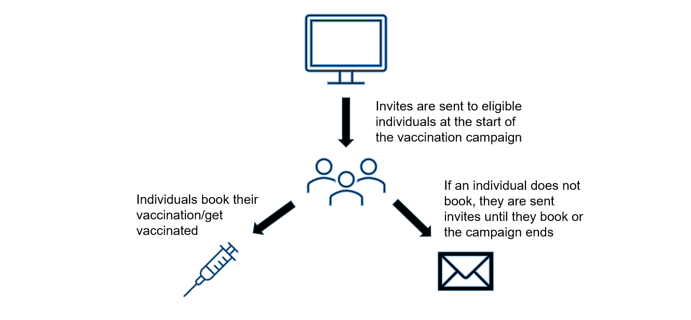
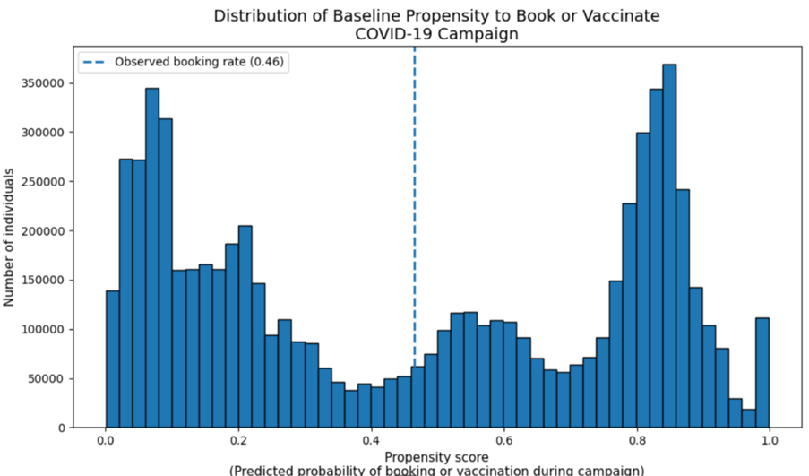
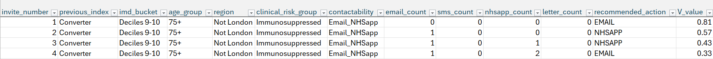
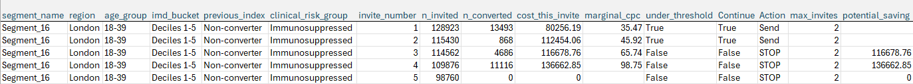

Seasonal vaccination campaigns rely on repeated invitations delivered across multiple communication channels (Email, SMS, Letter, NHS App). These channels differ substantially in cost, reach and observed effectiveness, and invitations are typically sent in sequence when patients do not respond until the campaign ends. At national scale, this creates a complex decision problem: which channel should be used next, for which patient, and when should invitations stop, in order to maximise uptake while minimising cost and avoiding inequitable outcomes. 

We conducted longitudinal analysis of historical campaign data to observe sustained behavioural patterns across multiple campaigns and how it differs across demographic and socio-economic groups. 

We found that individuals tend to fall into 3 categories:

+ Some individuals consistently vaccinate when invited
+ Others respond only after prompting
+ A subset rarely converts (books a vaccination/receives a vaccination), even after multiple reminders 

Across age, clinical risk status, region, ethnicity and deprivation levels, vaccination behaviour exhibits consistent and persistent patterns. Individuals who vaccinate tend to do so repeatedly; individuals who do not vaccinate rarely change behaviour across successive vaccines.

The current uniform invitation strategy assumes homogenous behaviour, our analysis indicates otherwise. To optimise communication sequencing we accounted for varying behavioural patterns across different population segments and developed two solutions:

+ Full Optimisation using Markov Decision Processes
+ Early Stopping Rule 

## Methods

PySpark was used to build the data assets. Pandas and Matplotlib were used to conduct the exploratory analysis, with Pandas also used to develop the proposed solutions.

Descriptive analysis showed that most conversions occur early in the invitation sequence. However, this pattern is not uniform across the population. To understand how vaccination behaviour varies across the population, we analysed individuals who were eligible to receive four Covid vaccines in the last two years and examined the number of vaccines actually received (0 to 4) and analysed patterns across age, clinical risk status, region, ethnicity and deprivation (IMD). 

**Baseline Propensity**

To further understand how likely an individual is to 'convert' (i.e. receive a vaccine or make a booking after after receiving an invite) a propensity model was developed. This model was trained on different features, including:

+ Prior campaign behaviour
+ Age, IMD, Ethnicity
+ Clinical risk status
+ Digital contactability status 

The resulting model demonstrated strong discrimination (AUC ≈ 0.82), and the distribution of predicted probabilities revealed three natural segments: low, medium, and high propensity patients.

Crucially, prior seasonal vaccination behaviour emerged as the strongest predictor, followed by age (particularly super-elder status), deprivation, and digital contactability (see the image below). 

As a result of these findings, population segments were created to optimise communication sequencing and to account for the persistent behavioural patterns across different demographic and socio-economic groups. 

**Full Optimisation using Markov Decision Processes**

This solution evaluates each patient's characteristics (such as previous uptake behaviour, deprivation, clinical risk and digital access) together with their current position in the invite journey, and selects the next action (Email, SMS, App, Letter or Stop) that best balances expected uptake and cost.

For each invite state, the model suggest the action (Email, SMS, App, Letter or Stop) that maximises the expected value per individual. 
It considers:

+ Previous behaviour (how many vaccines have they received in the past)
+ Segment characteristics 
+ Channel cost
+ Channel-specific uplift (first baseline propensities to vaccinate were calculated and then estimating the incremental effect each channel has on the total booking probability)
+ Contactability constraints

The model estimates:

+ How likely the person is to vaccinate if we use that channel, and
+ how much it will cost.

It then selects the action that creates the highest expected value with the option to stop inviting if further outreach is unlikely to add value.

This process repeats at each stage until we have a complete policy giving us the recommended next action per segment at different invitation stages, see the image below for an example policy extract **(this is for illustrative purposes only and does not contain any real data)**.

**Early Stopping Rule**

This approach caps the number of invites for a given segment once the cost per conversion (CPC) exceeds a pre-defined threshold. The CPC is the cost of sending a group of invitations divided by the number of conversions that those invitations resulted in. At each invite for a given segment, the CPC associated with the invite number is calculated and either recommends the issuance of the next invite or stopping depending on whether this CPC threshold has been exceeded. 

The image below is an example scenario where all segments receive a minimum of 2 invites. The policy recommends in this case that no more invites are sent beyond the second invite for this particular segment as the CPC exceeds the minimum set threshold **(this is for illustrative purposes only and does not contain any real data)**.

This approach does not optimise channel choice and therefore captures fewer efficiency gains than MDP but still, early stopping can result in cost savings while preserving total conversions.

**Note: both approaches included embedded guardrails to ensure equity. Such as, everyone receives at least one invitation and only reachable channels are considered.** 

## Results

A simulation of the MDP policy has shown an estimated saving of 75% and and additional 144,426 number of individuals 'converted'.

With the implementation of the Early Stopping Rule we estimate that we can eliminate over half the spend on further invites while preserving ~97.5% of total conversions. 

Findings were presented to the stakeholders who are now looking into the implementation process of the proposed solutions. Further detail will be added after implementation. 

## Key Messages

+ To optimise invite sequencing for future Covid vaccine campaigns two viable approaches were suggested: MDP full optimisation or rule-based early stopping.​
+ Both these approaches shift us from uniform prompting of individual to **evidence-led allocation**.
+ Savings generated from the implementation of either approach creates an opportunity to reinvest in understanding those individuals who persistently never vaccinate/never book.

[comment]: <> (The below header stops the title from being rendered (as mkdocs adds it to the page from the "title" attribute) - this way we can add it in the main.html, along with the summary.)
#
